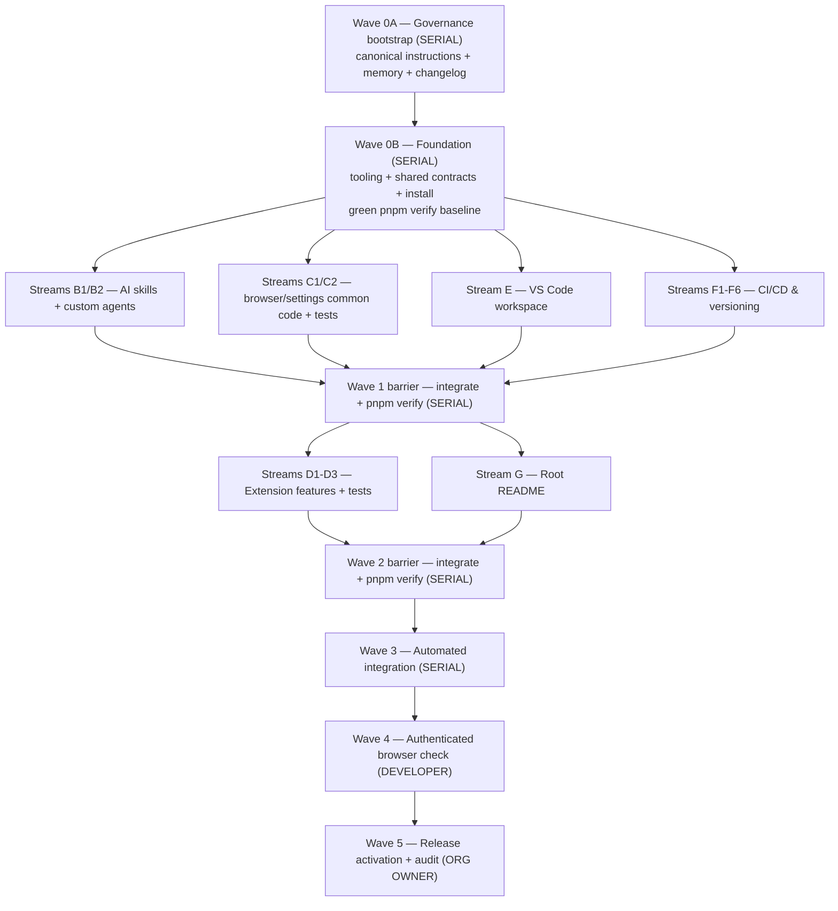

# AwesomeADO — Extension Scaffolding Plan (Phase 1: Infrastructure)

> **Purpose of this document.** A precise, self-contained build plan for scaffolding the
> **AwesomeADO** browser extension (Chrome + Edge). It is written so a _small model_
> (e.g. Haiku) can execute each task with little ambiguity, and so that independent tasks
> can be run **in parallel by multiple subagents**. Every task lists its exact files,
> reference content/specs, dependencies, and acceptance criteria.
>
> **Scope of Phase 1.** Infrastructure only: AI instructions + memory bank, a barebone
> MV3 extension that blanks Azure DevOps Query pages using one browser-synced setting,
> full test coverage (≥ 85%), linting/formatting, VS Code run/debug tasks, and a CI/CD
> build+release pipeline with changelog-validated versioning. No product features beyond the
> blank-page proof of concept.

---

## 0. Context & key decisions

These decisions are **fixed** for the implementer. Do not deviate without an explicit reason.

| Topic            | Decision                                                                                                         | Rationale                                                                 |
| ---------------- | ---------------------------------------------------------------------------------------------------------------- | ------------------------------------------------------------------------- |
| Target browsers  | Chrome + Edge (both Chromium, Manifest V3)                                                                       | Single build serves both stores.                                          |
| Language         | TypeScript (strict)                                                                                              | Type safety per requirement.                                              |
| Runtime          | **Node 24**                                                                                                      | Matches the verified local runtime and current GitHub Actions runtimes.   |
| Package manager  | **pnpm 10.34.5**                                                                                                 | Current stable pnpm release compatible with Node 24.                      |
| Bundler          | **esbuild** via a small `scripts/build.mjs`                                                                      | "Most barebone"; transparent, no framework magic.                         |
| Test runner      | **Vitest** + `@vitest/coverage-v8`, `jsdom` env                                                                  | First-class TS + coverage thresholds that fail the build.                 |
| Lint / format    | **ESLint 10 (flat config)** + **Prettier** + **jscpd** (copy/paste detector)                                     | Enforces style + the "no duplicated code" rule.                           |
| Git hooks        | **husky** + **lint-staged**                                                                                      | Enforces the "not done until verify passes" repository rule locally.      |
| Hosting / CI     | **GitHub Actions** (repo is `github.com/RazMake/AwesomeAdo`)                                                     | Matches the remote; store secrets live in a protected GitHub environment. |
| Store publishing | `chrome-webstore-upload-cli` v4 (Chrome Web Store API v2) + Edge Add-ons API v1.1, gated on complete secret sets | Automated official releases plus guarded manual replay.                   |

All target paths in this plan are relative to the existing workspace root
`C:\Users\razvanp\My-Code\AwesomeADO`. The product is **AwesomeADO**; the remote repository slug is
intentionally `RazMake/AwesomeAdo`. Remote casing does not rename the local workspace. Workers must
create the children listed in §2 directly in the current workspace and must not create a nested
`AwesomeADO` or `AwesomeAdo` project directory.

### Assumptions the developer can override later

- Inject on `https://dev.azure.com/*` and `https://*.visualstudio.com/*`, then enable blanking only
  when the parsed URL contains an exact `_queries` path segment. Host-wide injection is required to
  handle same-document ADO SPA navigation into and out of Query pages. (On-prem Azure DevOps Server
  hosts are **not** matched in Phase 1 — see §6.)
- Initial version base is **`0.1`** (Major.Minor). The build number is appended by CI.
- Extension icons are **omitted** in Phase 1 so the unpacked extension loads without binary
  assets; adding icons is a developer task (see §6).

---

## 1. Prerequisites & environment (Windows / PowerShell)

The implementing agent must assume this environment (already verified for this workspace):

- **Node is not on PATH by default.** Prepend it in every terminal session before running node/pnpm:
  ```powershell
  $env:Path = "C:\Program Files\nodejs;$env:APPDATA\npm;$env:Path"
  ```
- **Git is not on PATH by default.** Prepend it when needed:
  ```powershell
  $env:Path = "C:\Program Files\Git\cmd;$env:Path"
  ```
- Node **v24** and npm **11** are installed. The workspace currently has pnpm 9.15.9; Wave 0B
  upgrades it once to the plan's pinned pnpm version:
  ```powershell
  npm install --global pnpm@10.34.5
  pnpm --version
  ```
  The second command must print `10.34.5`. **Do not use corepack** (it cannot write shims here —
  EPERM). Use the npm-installed pnpm directly.
- npm registry is the Microsoft feed proxy (`https://packagefeedproxy.microsoft.io/npm/`).
  Installs succeed even though `npm ping` may 404. Do not switch registries.
- Install **Chrome for Testing** and keep its `chrome.exe` path available for Wave 4. Official
  branded Chrome 137+ no longer honors `--load-extension`; Chrome for Testing does. Edge remains
  the branded-browser validation target.
- **Prefer single-line PowerShell commands joined with `;`** — multi-line here-strings get garbled
  in this shell.
- GitHub CLI is installed and authenticated for `RazMake/AwesomeAdo`. The protected-environment
  preflight in §6.1 uses `gh api`; its read-only check currently returns `404`, so the environment
  must be created and configured before store credentials are added.
- PowerShell spells the Node installation as `C:\Program Files\nodejs`; Git Bash spells that same
  installation as `/c/Program Files/nodejs`. These are shell-specific forms of one path, not two
  Node installations.

---

## 2. Target repository structure

Create exactly this layout under the current workspace root. Folders with a `README.md` requirement
are noted.

```
./
├─ .agents/
│  ├─ skills/                            # Cross-agent skills use the shared .agents convention
│  │  ├─ extension-architecture/SKILL.md
│  │  ├─ testing-standards/SKILL.md
│  │  ├─ code-style/SKILL.md
│  │  └─ changelog-versioning/SKILL.md
│  └─ memory-bank/                       # Project memory bank, shared by ALL agents
│     ├─ README.md
│     ├─ projectbrief.md
│     ├─ productContext.md
│     ├─ techContext.md
│     ├─ systemPatterns.md
│     ├─ activeContext.md
│     ├─ progress.md
│     └─ decisions.md
├─ .github/
│  ├─ CODEOWNERS                          # Privileged release paths require owner-team review
│  ├─ release-baseline.json               # Reviewed release activation marker
│  ├─ agents/                            # VS Code/GitHub Copilot discovery location
│  │  ├─ reviewer.agent.md
│  │  └─ test-author.agent.md
│  ├─ workflows/
│  │  ├─ ci.yml
│  │  └─ release.yml
│  └─ copilot-instructions.md            # Shell → AGENTS.md
├─ .husky/
│  ├─ pre-commit
│  └─ pre-push
├─ .vscode/
│  ├─ tasks.json
│  ├─ launch.json
│  ├─ settings.json
│  └─ extensions.json
├─ scripts/
│  ├─ schemas/
│  │  └─ github-workflow.json            # immutable vendored SchemaStore schema
│  ├─ build.mjs
│  ├─ package.mjs
│  ├─ package.test.mjs
│  ├─ publish-github-release.mjs
│  ├─ publish-github-release.test.mjs
│  ├─ publish-edge.mjs
│  ├─ publish-edge.test.mjs
│  ├─ validate-release.mjs
│  ├─ validate-release.test.mjs
│  ├─ validate-workflows.mjs
│  ├─ validate-workflows.test.mjs
│  ├─ validate-workflows.release.test.mjs # created at the serial Wave 1 barrier
│  ├─ compute-version.mjs
│  ├─ compute-version.test.mjs
│  ├─ version.mjs
│  └─ version.test.mjs
├─ src/
│  ├─ manifest.json
│  ├─ common/                            # Shared extension runtime code
│  │  ├─ browser/                        # README.md required
│  │  │  ├─ IBrowserSyncStorage.ts
│  │  │  ├─ ChromeSyncStorage.ts
│  │  │  ├─ ChromeSyncStorage.test.ts
│  │  │  └─ README.md
│  │  ├─ navigation/                     # README.md required
│  │  │  ├─ AdoQueryRoute.ts
│  │  │  ├─ AdoQueryRoute.test.ts
│  │  │  ├─ NavigationNotifier.ts
│  │  │  ├─ NavigationNotifier.test.ts
│  │  │  └─ README.md
│  │  └─ settings/                       # README.md required
│  │     ├─ ExtensionSettings.ts
│  │     ├─ ExtensionSettings.test.ts
│  │     ├─ ISettingsStore.ts
│  │     ├─ BrowserSyncSettingsStore.ts
│  │     ├─ BrowserSyncSettingsStore.test.ts
│  │     ├─ createSettingsStore.ts       # composition factory
│  │     └─ README.md
│  ├─ background/
│  │  └─ index.ts                        # service worker entry (composition only)
│  ├─ content/
│  │  ├─ PageBlanker.ts
│  │  ├─ PageBlanker.test.ts
│  │  ├─ QueryPageController.ts
│  │  ├─ QueryPageController.test.ts
│  │  └─ index.ts                        # content entry (composition only)
│  └─ options/
│     ├─ options.html
│     ├─ OptionsController.ts
│     ├─ OptionsController.test.ts
│     └─ index.ts                        # options entry (composition only)
├─ store-assets/                         # Marketplace listing files (developer-provided)
│  └─ README.md
├─ AGENTS.md                             # Canonical instructions for all agents
├─ CLAUDE.md                             # Shell → AGENTS.md
├─ ChangeLog.md
├─ README.md
├─ package.json
├─ pnpm-lock.yaml                        # generated by install
├─ tsconfig.json
├─ eslint.config.js
├─ .prettierrc.json
├─ .prettierignore
├─ vitest.config.ts
├─ .jscpd.json
├─ .editorconfig
└─ .gitignore
```

**Folder rules (enforced by review):**

- `./` is the existing workspace root, not a directory to create. Never add an extra project-root
  folder around this tree.
- A **component** means a cohesive feature area such as `browser`, `settings`, `content`, or
  `options`, not each class within that area. Any component with **more than one file** lives in its
  own subfolder; closely coupled contracts, implementations, and tests may share that folder.
- Every subfolder under `src/common/**` has a `README.md` describing **how to use it** (public
  API + intent), _not_ internal architecture (that belongs in the memory bank).
- Entry files named `index.ts` contain **only composition/wiring** (the "composition root") and are
  excluded from coverage thresholds.

---

## 3. Conventions to enforce (construction source for `AGENTS.md`)

This section supplies the initial text for `AGENTS.md`. Once Wave 0A creates that file,
`AGENTS.md` is the **single repository source of truth**; skills link to it and add workflow detail
without copying its rule bodies.

### 3.1 SOLID principles (spell them out — required)

- **S — Single Responsibility.** Each class/module has exactly one reason to change.
  Example mapping in this codebase: `ChromeSyncStorage` only talks to `chrome.storage.sync`;
  `BrowserSyncSettingsStore` only maps settings ↔ storage; `PageBlanker` only mutates the DOM;
  `OptionsController` only binds the options UI to the store.
- **O — Open/Closed.** Consumers depend on interfaces (`ISettingsStore`, `IBrowserSyncStorage`).
  New storage backends can be added without editing consumers.
- **L — Liskov Substitution.** Any `IBrowserSyncStorage` implementation (real Chrome or a test
  fake) is interchangeable everywhere the interface is used.
- **I — Interface Segregation.** Keep interfaces small and focused (separate storage from settings);
  never create a "god" interface.
- **D — Dependency Inversion.** High-level code (features) depends on abstractions. Concrete
  browser APIs are injected **only** at the composition root (`createSettingsStore()` and the
  `index.ts` entry files).

### 3.2 DRY & the `common` folder

- **No duplicated code.** Extension runtime logic used by more than one feature lives under
  `src/common/**`. Build/release automation is not bundled into the extension; shared automation
  helpers such as `scripts/version.mjs` remain under `scripts/**`.
- Duplication is checked automatically by **jscpd** (`pnpm duplication`). A failing duplication
  check blocks "done".

### 3.3 Naming & readability

- Write code for humans. Use **clear, short** names for variables, methods, and classes.
- Names state intent (`blankQueryPage`, `PageBlanker.apply`, `readSettings`) and avoid unclear
  abbreviations. The `I` prefix on the two injected interfaces `ISettingsStore` and
  `IBrowserSyncStorage` is the sole project-wide type-encoding exception; do not add Hungarian
  notation or encode types in any other name.

### 3.4 Documentation — the "why", not the "what"

- Comments explain **why** a decision was made, trade-offs, and non-obvious constraints.
- Do **not** narrate what the code literally does. Bad: `// increment i`. Good:
  `// A document-level rule also covers content ADO renders after initial load.`
- Public shared components (`src/common/**`) are documented for **usage** in their folder `README.md`.

### 3.5 Testing rules (non-negotiable)

- **Coverage ≥ 85%** for `src/**` (lines, functions, branches, statements). Below threshold =
  build failure.
- **No flaky tests.** Tests must be deterministic: no real timers, no network, no reliance on
  wall-clock ordering. Use injected fakes and `jsdom`.
- **A failing test is never acceptable.** Never `skip`/`todo`/`only` a failing test to "get green",
  and never mark a test as an allowed/known failure. Vitest is configured with `retry: 0` so
  flakiness cannot be masked by re-runs. Fix the code or the test.

### 3.6 The repository "definition of done" rule

> **No change is complete until `pnpm verify` passes**, i.e. formatting is aligned with workspace
> rules, ESLint passes, TypeScript type-checks, there is no duplicated code, and **all** unit tests
> pass with coverage ≥ 85%.

`pnpm verify` = `format:check` → `lint` → `typecheck` → `duplication` → `test:scripts` →
`test:coverage` → `validate:workflows`.
This is enforced locally by the `pre-push` hook and remotely by CI.

### 3.7 Memory bank protocol (all agents)

- **At the start of every task**, read all files under `.agents/memory-bank/`.
- Parallel workers **never edit shared memory files**. Each worker returns a concise
  `Memory-bank delta` containing completed work, remaining work, and decisions.
- At each serial wave barrier, the coordinator applies those deltas to `activeContext.md`,
  `progress.md`, and (for notable decisions) `decisions.md`, then runs the repository-wide gate.
- Wave 0A is the only bootstrap exception: it creates the memory bank before later agents can read
  it.
- The memory bank is the home for **internal architecture** and rationale; component `README.md`
  files are for **usage** only.

### 3.8 Versioning & changelog rules (all agents)

- The developer owns **Major.Minor** and `versionBuildOffset`; CI computes
  `Build = github.run_number - versionBuildOffset` → `Major.Minor.Build`.
- Every logical change proposes a bullet for **`## Next Version`**. Parallel workers return the
  bullet in their result; the serial coordinator consolidates and writes bullets at wave barriers.
- When the developer bumps Major or Minor, they set `versionBuildOffset` to the latest **CI workflow
  run number** visible before the bump, rename `## Next Version` to `## X.Y`, and add a fresh empty
  `## Next Version`. CI requires that matching `## X.Y` section before it can create the first
  official `vX.Y` release. This resets the effective build component while preserving monotonic
  Chromium versions. A base supports at most 65,535 CI runs; bump it before that limit.

---

## 4. Work breakdown & parallel execution map

Work is grouped into **waves**. Within a wave, streams have disjoint owned files and may be run by
**separate subagents in parallel**. Workers run only their listed local checks. After all workers
in a wave stop writing, one serial coordinator applies memory/changelog deltas, runs `pnpm verify`,
and fixes integration failures before the next wave starts. A worker must never run a global check
while sibling workers are still editing.



| Wave | Stream            | Subagent focus                                                                                                    | Depends on     | Can run in parallel with |
| ---- | ----------------- | ----------------------------------------------------------------------------------------------------------------- | -------------- | ------------------------ |
| 0A   | **Governance**    | canonical instructions, memory bank, changelog                                                                    | —              | (serial)                 |
| 0B   | **Foundation**    | root config files, shared contracts, install, green baseline                                                      | 0A             | (serial)                 |
| 1    | **B**             | `.agents/skills/**`, `.github/agents/**`                                                                          | 0B             | C, E, F                  |
| 1    | **C**             | `src/common/browser/**` and `src/common/settings/**` implementations, tests, READMEs                              | 0B (contracts) | B, E, F                  |
| 1    | **E**             | `.vscode/**`, `.husky/**`                                                                                         | 0B             | B, C, F                  |
| 1    | **F**             | workflows, version/package/publish scripts + script tests, store-assets README                                    | 0B             | B, C, E                  |
| 2    | **D**             | `src/content/**`, `src/common/navigation/**`, `src/options/**`, `src/background/**`, finalize `src/manifest.json` | Wave 1 barrier | G                        |
| 2    | **G**             | root `README.md` only                                                                                             | Wave 1 barrier | D                        |
| 3    | **Integration**   | apply worker deltas; verify, build, package, inspect artifacts                                                    | all workers    | (serial)                 |
| 4    | **Browser check** | Edge + Chrome for Testing debug; branded Chrome manual load                                                       | 3              | developer-owned          |
| 5    | **Activation**    | owner controls, access audit, reviewed marker activation, immediate audit                                         | 4              | organization-owner-owned |

**Why Waves 0A/0B are serial:** 0A creates the instructions and shared coordination files that all
later agents must read. Exactly one 0B agent then owns `package.json` + `pnpm install`, producing one
lockfile and dependency graph. It also creates the stable contracts that C and D import.

### 4.1 Worker completion contract

Every parallel worker response must contain exactly these headings:

1. `Files changed` — only files assigned to that stream.
2. `Local validation` — commands run and pass/fail results.
3. `Memory-bank delta` — completed work, remaining work, and decisions; `None` is valid.
4. `Changelog bullet` — one proposed bullet or `None` for non-user-visible work.

Use this exact shape for the third heading so a coordinator can apply it without interpretation:

```markdown
## Memory-bank delta

- Completed: <concise facts or None>
- Remaining: <concise pending work or None>
- Decisions: <notable decisions or None>
```

Worker acceptance criteria are intentionally local. Repository-wide `pnpm verify`, packaging,
release, authenticated browser behavior, and final memory updates belong to serial barriers named
explicitly below.

---

## 5. Detailed task specifications

> Reference file contents below are **ready to use**. A small model should copy them and adjust only
> where a `// spec:` or _"Spec:"_ note asks for behavior. Keep names and public signatures exactly as
> given so parallel streams stay compatible.

### 5.0A Wave 0A — Governance bootstrap (SERIAL, single agent)

**Goal:** create the instructions and shared coordination files before any parallel worker starts.

#### Owned files

- `AGENTS.md`, `CLAUDE.md`, `.github/copilot-instructions.md`
- `.agents/memory-bank/{README,projectbrief,productContext,techContext,systemPatterns,activeContext,progress,decisions}.md`
- `ChangeLog.md`

#### Instructions

1. Create `AGENTS.md` using §3 as its construction source, in this order: project overview; how to
   work in the repo; memory/coordinator protocol; definition-of-done gate; SOLID, DRY, naming,
   documentation, and testing standards; folder/README conventions; versioning/changelog rules;
   skills index; full `package.json` command table; and the worker completion contract from §4.1.
   Once written, `AGENTS.md` becomes the canonical repository instruction file.
2. Create `CLAUDE.md` with this exact content:

```markdown
# CLAUDE.md

This project's instructions are maintained in a single canonical file so every AI agent
(Claude Code, Codex, GitHub Copilot) follows the same rules.

**Read and follow [AGENTS.md](./AGENTS.md).**

@AGENTS.md
@.agents/memory-bank/activeContext.md
```

3. Create `.github/copilot-instructions.md` with this exact content:

```markdown
# Copilot instructions

All repository instructions live in [AGENTS.md](../AGENTS.md). Follow it.

Non-negotiables (see AGENTS.md for detail):

- No change is complete until `pnpm verify` passes at the serial wave barrier.
- Shared extension runtime code lives under `src/common/**`; follow SOLID; comment the "why",
  not the "what".
- Read `.agents/memory-bank/` before starting. Parallel workers return memory and changelog
  deltas; only the serial coordinator edits those shared files.
```

4. Create the memory-bank files with concise content:

- `README.md`: protocol and one-line purpose of every memory file.
- `projectbrief.md`: north star, Phase 1 scope, and non-goals.
- `productContext.md`: problem, audience, and desired UX.
- `techContext.md`: §0 stack and §1 environment.
- `systemPatterns.md`: storage/settings layers, composition roots, concrete SOLID mapping, and
  coverage-exclusion rationale.
- `activeContext.md`: `Phase 1 scaffolding in progress` plus the revised §4 waves.
- `progress.md`: the §7 checklist, initially unchecked.
- `decisions.md`: the fixed §0 decisions as a concise ADR-style list.

5. Create `ChangeLog.md` with:

```markdown
# Changelog

All notable changes are recorded here. The build system combines the developer-owned
Major.Minor with a CI build number to form Major.Minor.Build.

## Next Version

- Initial Phase 1 scaffolding for the AwesomeADO MV3 extension.
```

#### Local acceptance (0A)

- Every owned file exists and all links use the target paths from §2.
- The memory protocol says workers return deltas and the serial coordinator writes shared files.
- No package command is required yet because `package.json` is owned by Wave 0B.

---

### 5.0B Wave 0B — Foundation (SERIAL, single agent)

**Goal:** install one dependency graph and establish a genuinely green `pnpm verify` baseline.

#### Files & contents

**`package.json`**

```json
{
  "name": "awesome-ado",
  "version": "0.1.0",
  "description": "Browser extension that enhances Azure DevOps Query pages.",
  "private": true,
  "type": "module",
  "versionBuildOffset": 0,
  "engines": { "node": ">=24" },
  "packageManager": "pnpm@10.34.5",
  "scripts": {
    "build": "node scripts/build.mjs",
    "build:watch": "node scripts/build.mjs --watch",
    "typecheck": "tsc --noEmit",
    "lint": "eslint .",
    "lint:fix": "eslint . --fix",
    "format": "prettier --write .",
    "format:check": "prettier --check .",
    "duplication": "jscpd src scripts",
    "test": "vitest run",
    "test:scripts": "node --test scripts/*.test.mjs",
    "test:watch": "vitest",
    "test:coverage": "vitest run --coverage",
    "package": "node scripts/package.mjs",
    "validate:workflows": "node scripts/validate-workflows.mjs",
    "verify": "pnpm format:check && pnpm lint && pnpm typecheck && pnpm duplication && pnpm test:scripts && pnpm test:coverage && pnpm validate:workflows",
    "prepare": "husky"
  },
  "devDependencies": {
    "@eslint/js": "^10.0.1",
    "@types/adm-zip": "^0.5.8",
    "@types/archiver": "^8.0.0",
    "@types/chrome": "^0.2.2",
    "@types/node": "^24.13.3",
    "@vitest/coverage-v8": "^4.1.10",
    "adm-zip": "^0.6.0",
    "ajv": "^8.20.0",
    "archiver": "^8.0.0",
    "chrome-webstore-upload-cli": "^4.0.1",
    "esbuild": "^0.28.1",
    "eslint": "^10.7.0",
    "eslint-config-prettier": "^10.1.8",
    "eslint-plugin-import-x": "^4.17.1",
    "globals": "^17.7.0",
    "husky": "^9.1.7",
    "jscpd": "^5.0.12",
    "jsdom": "^29.1.1",
    "lint-staged": "^17.0.8",
    "prettier": "^3.9.5",
    "typescript": "^5.9.3",
    "typescript-eslint": "^8.63.0",
    "vitest": "^4.1.10",
    "yaml": "^2.9.0"
  },
  "lint-staged": {
    "*.{ts,js,mjs}": ["eslint --fix", "prettier --write"],
    "*.{json,md,yml,yaml,html}": "prettier --write"
  },
  "pnpm": {
    "onlyBuiltDependencies": ["esbuild"]
  }
}
```

> These are the newest stable compatible versions resolved on 2026-07-20. The maintained
> `eslint-plugin-import-x` replacement allows ESLint 10. TypeScript stays on 5.9 because
> `typescript-eslint@8.63.0` does not support TypeScript 7. Preserve peer-compatible major ranges.
> If the feed proxy lacks a version, select the newest version satisfying all declared peer ranges
> and return the exception as a memory-bank decision.
>
> Workflow schema validation uses AJV against a checked-in copy of SchemaStore's draft-07
> `github-workflow.json` from commit `7c910423df8b6b68a9ec85cd7ee5fb5d508c4953`. Wave 0B downloads
> `https://raw.githubusercontent.com/SchemaStore/schemastore/7c910423df8b6b68a9ec85cd7ee5fb5d508c4953/src/schemas/json/github-workflow.json`
> once, verifies lowercase SHA-256
> `7a952fdb7c1b130732e40ccea9db9bced906c1198e97834f8a49ae3b411f3161`, and only then writes the
> verified bytes to `scripts/schemas/github-workflow.json`. A missing or mismatched download fails
> Wave 0B. Normal install, test, and verification commands are offline with respect to the schema:
> they read only the checked-in file and never fetch a moving schema URL.

**`tsconfig.json`**

```json
{
  "compilerOptions": {
    "target": "ES2022",
    "module": "ESNext",
    "moduleResolution": "Bundler",
    "lib": ["ES2022", "DOM", "DOM.Iterable"],
    "types": ["chrome", "node"],
    "strict": true,
    "noUncheckedIndexedAccess": true,
    "noImplicitOverride": true,
    "verbatimModuleSyntax": true,
    "isolatedModules": true,
    "skipLibCheck": true,
    "esModuleInterop": true,
    "forceConsistentCasingInFileNames": true,
    "resolveJsonModule": true,
    "allowJs": true,
    "checkJs": true,
    "noEmit": true,
    "outDir": "dist"
  },
  "include": ["src", "scripts", "*.config.ts"]
}
```

**`eslint.config.js`**

```js
import js from "@eslint/js";
import prettier from "eslint-config-prettier";
import importPlugin from "eslint-plugin-import-x";
import globals from "globals";
import tseslint from "typescript-eslint";

export default tseslint.config(
  {
    ignores: ["dist/**", "coverage/**", "artifacts/**", ".debug-profiles/**", "node_modules/**"],
  },
  js.configs.recommended,
  ...tseslint.configs.recommended,
  {
    files: ["scripts/**/*.mjs", "*.config.{js,mjs,ts}"],
    languageOptions: { globals: globals.node },
  },
  {
    plugins: { "import-x": importPlugin },
    rules: {
      "import-x/order": ["error", { alphabetize: { order: "asc" }, "newlines-between": "always" }],
      eqeqeq: "error",
      complexity: ["warn", 10],
      "max-lines-per-function": ["warn", 80],
      "no-console": ["warn", { allow: ["warn", "error"] }],
    },
  },
  prettier,
);
```

**`.prettierrc.json`**

```json
{
  "semi": true,
  "singleQuote": false,
  "printWidth": 100,
  "trailingComma": "all",
  "arrowParens": "always"
}
```

**`.prettierignore`**

```
dist
coverage
artifacts
.debug-profiles
pnpm-lock.yaml
scripts/schemas/github-workflow.json
```

**`vitest.config.ts`**

```ts
import { defineConfig } from "vitest/config";

export default defineConfig({
  test: {
    globals: true,
    environment: "jsdom",
    include: ["src/**/*.test.ts"],
    // retry: 0 prevents automatic retries from masking intermittent failures.
    retry: 0,
    restoreMocks: true,
    clearMocks: true,
    coverage: {
      provider: "v8",
      reporter: ["text", "html", "lcov"],
      include: ["src/**/*.ts"],
      // Composition roots and static assets carry no branching logic worth unit-testing;
      // they are exercised by manual load / future e2e, so exclude them from the gate.
      exclude: [
        "src/**/*.test.ts",
        "src/**/index.ts",
        "src/common/settings/createSettingsStore.ts",
        "**/*.d.ts",
      ],
      thresholds: {
        lines: 85,
        functions: 85,
        branches: 85,
        statements: 85,
      },
    },
  },
});
```

**`.jscpd.json`**

```json
{
  "threshold": 0,
  "reporters": ["console"],
  "gitignore": true,
  "ignore": ["**/*.test.ts", "**/*.test.mjs", "scripts/schemas/**"]
}
```

> `createSettingsStore.ts` is excluded from coverage for the same reason as `index.ts`: it only
> wires concrete dependencies and is exercised by build/browser integration. Production extension
> and automation code both enter jscpd; tests and the vendored schema are excluded because repeated
> fixtures/schema text are not production duplication. `threshold: 0` means any clone detected at
> or above jscpd's minimum token window fails the check.
> It does not prove that no shorter duplication exists. If a false positive appears, refactor into
> `common/`; do not raise the threshold without recording why in `decisions.md`.

**`.editorconfig`**

```ini
root = true

[*]
charset = utf-8
end_of_line = lf
insert_final_newline = true
indent_style = space
indent_size = 2
trim_trailing_whitespace = true
```

**`.gitignore`**

```
node_modules/
dist/
coverage/
artifacts/
.debug-profiles/
*.log
.DS_Store
```

#### Shared type contracts (create now so C and D can both import them)

**`src/common/settings/ExtensionSettings.ts`**

```ts
/**
 * The complete set of user-configurable options for the extension.
 *
 * Phase 1 intentionally has a single toggle. Keeping it an object (not a bare boolean)
 * means new settings can be added later without changing the storage contract.
 */
export interface ExtensionSettings {
  /** When true, the extension blanks the Azure DevOps Query page. */
  blankQueryPage: boolean;
}

export const DEFAULT_SETTINGS: ExtensionSettings = {
  blankQueryPage: true,
};

/**
 * Convert an unknown value read from storage into a valid ExtensionSettings.
 *
 * Storage can hold anything (first run = undefined; older builds = partial shapes), so every
 * consumer must go through this single normalizer instead of trusting the raw value.
 */
export function normalizeSettings(raw: unknown): ExtensionSettings {
  if (typeof raw !== "object" || raw === null) {
    return { ...DEFAULT_SETTINGS };
  }
  const candidate = raw as Partial<Record<keyof ExtensionSettings, unknown>>;
  return {
    blankQueryPage:
      typeof candidate.blankQueryPage === "boolean"
        ? candidate.blankQueryPage
        : DEFAULT_SETTINGS.blankQueryPage,
  };
}
```

**`src/common/settings/ISettingsStore.ts`**

```ts
import type { ExtensionSettings } from "./ExtensionSettings";

/**
 * Abstraction over persisted, browser-synced settings.
 *
 * Features depend on THIS, never on chrome.storage directly (Dependency Inversion),
 * which is what makes them unit-testable with a fake store.
 */
export interface ISettingsStore {
  /** Read the current settings, normalized to a complete object. */
  read(): Promise<ExtensionSettings>;

  /** Persist a partial update; unspecified fields keep their stored value. */
  write(update: Partial<ExtensionSettings>): Promise<void>;

  /**
   * Subscribe before reading, then emit the initial snapshot unless a newer event wins the race.
   * `unsubscribe` is available immediately; `ready` rejects if the initial read fails.
   */
  observe(listener: (settings: ExtensionSettings) => void): {
    ready: Promise<void>;
    unsubscribe: () => void;
  };
}
```

**`src/common/browser/IBrowserSyncStorage.ts`**

```ts
/**
 * Minimal, promise-based abstraction over the browser's synced key/value storage.
 *
 * Segregated from ISettingsStore on purpose (Interface Segregation): this layer knows nothing
 * about settings shapes — only about reading/writing/observing a single key.
 */
export interface IBrowserSyncStorage {
  get(key: string): Promise<unknown>;
  set(key: string, value: unknown): Promise<void>;
  /** Observe changes to a key; returns an unsubscribe function. */
  subscribe(key: string, listener: (value: unknown) => void): () => void;
}
```

#### Complete foundation tests

The foundation gate is real, not a placeholder. Create all of these tests now:

**`src/common/settings/ExtensionSettings.test.ts`**

```ts
import { describe, expect, it } from "vitest";

import { DEFAULT_SETTINGS, normalizeSettings } from "./ExtensionSettings";

describe("normalizeSettings", () => {
  it.each([undefined, null, false, 42, "settings"])(
    "returns defaults for non-object input %#",
    (raw) => {
      expect(normalizeSettings(raw)).toEqual(DEFAULT_SETTINGS);
    },
  );

  it("uses the default when the field is missing", () => {
    expect(normalizeSettings({})).toEqual(DEFAULT_SETTINGS);
  });

  it("uses the default when the field has the wrong type", () => {
    expect(normalizeSettings({ blankQueryPage: "yes" })).toEqual(DEFAULT_SETTINGS);
  });

  it.each([true, false])("preserves a valid boolean value", (blankQueryPage) => {
    expect(normalizeSettings({ blankQueryPage })).toEqual({ blankQueryPage });
  });
});
```

**`scripts/version.mjs`** — the single version source used by all later scripts:

```js
export const MAX_VERSION_PART = 65_535;

/**
 * @typedef {object} PackageMetadata
 * @property {string} version
 * @property {number} [versionBuildOffset]
 */

/**
 * @param {PackageMetadata} packageMetadata
 * @param {string | number | undefined} [rawCiBuildNumber]
 * @returns {{ base: string, build: string, full: string }}
 */
export function createVersion(packageMetadata, rawCiBuildNumber) {
  const match = /^(\d+)\.(\d+)\.\d+$/.exec(packageMetadata.version);
  if (!match) {
    throw new Error(`package.json version must be Major.Minor.Patch: ${packageMetadata.version}`);
  }

  const rawMajor = match[1];
  const rawMinor = match[2];
  if (rawMajor === undefined || rawMinor === undefined) {
    throw new Error(`package.json version is incomplete: ${packageMetadata.version}`);
  }
  const major = parsePart(rawMajor, "major");
  const minor = parsePart(rawMinor, "minor");
  const offset = parseCounter(packageMetadata.versionBuildOffset ?? 0, "versionBuildOffset");
  const ciBuild = parseCounter(rawCiBuildNumber ?? offset, "CI build number");
  const build = ciBuild - offset;
  if (build < 0 || build > MAX_VERSION_PART) {
    throw new Error(`effective build must be between 0 and ${MAX_VERSION_PART}: ${build}`);
  }
  const base = `${major}.${minor}`;
  return { base, build: String(build), full: `${base}.${build}` };
}

/** @param {string} raw @param {string} name */
function parsePart(raw, name) {
  if (!/^\d+$/.test(raw)) {
    throw new Error(`${name} version part must be an integer: ${raw}`);
  }
  const value = Number(raw);
  if (!Number.isSafeInteger(value) || value > MAX_VERSION_PART) {
    throw new Error(`${name} version part must be between 0 and ${MAX_VERSION_PART}: ${raw}`);
  }
  return value;
}

/** @param {unknown} raw @param {string} name */
function parseCounter(raw, name) {
  if (!/^\d+$/.test(String(raw))) {
    throw new Error(`${name} must be a non-negative integer: ${raw}`);
  }
  const value = Number(raw);
  if (!Number.isSafeInteger(value)) {
    throw new Error(`${name} must be a safe integer: ${raw}`);
  }
  return value;
}
```

**`scripts/version.test.mjs`** — use `node:test` and `node:assert/strict`; assert normal version
construction, local build `0` when no CI number is supplied, offset subtraction, leading-zero
normalization, malformed package versions, negative counters, CI numbers below the offset, and
every effective manifest component above `65535`. This protects the Chromium manifest limit.

**`scripts/validate-workflows.mjs` + test.** At module initialization, locate the schema with
`new URL("./schemas/github-workflow.json", import.meta.url)`, read and parse it as JSON, and compile
it exactly once with `new Ajv({ allErrors: true, strict: false }).compile(schema)`. Export
`validateWorkflowSchema(document)`, which calls that compiled function and immediately returns
`{ valid, errors: [...(compiled.errors ?? [])] }` so a later validation cannot mutate the captured
errors. Also export `validateWorkflowFiles(options)` and guard CLI execution. Its options may inject
`exists`, `readText`, and a `validateSchema(document)` function with that exact return shape; default
them to the Node filesystem functions and `validateWorkflowSchema` so unit tests can use in-memory
workflow files. Parse every workflow once with `yaml.parse`, pass that parsed value to schema and
repository-policy checks, and never inspect unparsed YAML text. Normalize each schema error to one
deterministic line containing the workflow path, `instancePath` (use `/` when empty), `keyword`, and
`message` (use `validation failed` when absent); sort the normalized lines before throwing so output
is stable. A YAML parse failure must identify the workflow path and parser message. The only valid
file states are:

- Neither `.github/workflows/ci.yml` nor `release.yml` exists: fail by default. Succeed with a
  bootstrap message only when the injected `allowBootstrap` option is exactly `true`. The guarded
  CLI maps only `ALLOW_WORKFLOW_BOOTSTRAP=1` to that option; every other value is false.
- Both exist, parse as YAML, pass the compiled schema, and pass every structural policy: succeed.

If exactly one exists, throw. Once both files exist, also require these structural policies:

- Every `uses` value is `<approved-action>@<approved-40-hex-commit>` from F4's immutable table.
- CI orders install → `pnpm verify` → package → upload; its push-only `attest` job depends on
  `verify`, has the exact permissions from F4, and downloads only the producer-owned artifact name
  exported by `verify` through `needs.verify.outputs.artifact_name`. After attesting both zips plus
  metadata, its final step uploads those same three files as
  `attested-extension-${{ github.run_id }}-${{ github.run_attempt }}`. This bridge lets a
  failed-job-only rerun consume the earlier successful producer while exposing one artifact for the
  current completed attempt. Both CI jobs use the literal scalar runner `ubuntu-24.04`.
- Release has only the two jobs `validate_release` and `publish_stores`; validation has the exact
  same-repository successful-main-push/manual-main guard, exact automatic-or-recovery CI-attempt
  resolution, explicit cross-run artifact inputs,
  runner-temp custody before checkout, `persist-credentials: false`, and no build/package command
  or release-tag checkout. `validate_release` uses literal `ubuntu-24.04` with exactly
  `actions: read`, `attestations: read`, and `contents: read`; `publish_stores` uses the same runner
  with exactly `actions: read`, `attestations: read`, and `contents: read`. Reject runner
  expressions, arrays, self-hosted labels, and every missing or extra permission.
- CI recovery accepts only canonical positive-decimal `ci_run_id` and `ci_run_attempt`, fetches that
  exact attempt through the workflow-run attempt API, and applies the same CI name/path, successful
  same-repository main-push, source-SHA, and attested-bridge checks as automatic mode. Official
  replay rejects CI inputs; CI modes reject official/store inputs. Automatic and recovery Release
  download only
  `attested-extension-${{ steps.release_context.outputs.ci_run_id }}-${{ steps.release_context.outputs.ci_run_attempt }}`.
  Every pre-checkout download, bridge download, attestation input, and validator artifact directory
  is an absolute path below `${{ runner.temp }}/artifacts`; reject `$GITHUB_WORKSPACE`, relative
  `artifacts/`, a default download path, or any checkout that targets the artifact directory.
- The automatic `compute_version` step binds `BUILD_NUMBER` and `RELEASE_SHA` exactly as F5
  specifies from `release_context`, and downstream expressions consume its exact `base`, `build`,
  `full`, `is_new_official`, and `should_release_official` outputs. Release has no workflow-level
  concurrency. Both `validate_release` and `publish_stores` have exact job-level concurrency
  `{ group: awesomeado-release-publication, queue: max }`, so official and store publication share
  one authority boundary. Reject cancellation, a missing/different group or queue on either job,
  any other concurrency, or any claim that this bounded 100-job queue is lossless.
- Before checkout or custom code, Release requires organization variable
  `RELEASE_BASELINE_VERSION` to equal `immutable-owner-empty-namespace-reviewed-main-app-tags-v1`, requires
  `RELEASE_BASELINE_SHA` to be lowercase 40-hex, and after checkout proves both source and tooling
  SHAs descend from it. Before dependency installation or App-token creation, require the checked-out
  `.github/release-baseline.json` to be a non-symlink regular file and require the Git tree at the
  baseline, source, and tooling SHAs to contain that path as a regular `100644` blob. Parse each as
  JSON and require exactly keys `format`, `state`, and `version`, with values `1`, `established`, and
  `immutable-owner-empty-namespace-reviewed-main-app-tags-v1`. Require every copy to be exactly 118
  UTF-8 bytes with SHA-256
  `a472bfa356c5b4e52ca42fae5c91b69b53627c48c734ee51ba771acf4783a0d0`. The validator requires those
  exact variable references, marker checks, ordering, and ancestry checks.
- After ancestry and marker validation but before dependency installation or App-token creation,
  Release uses only `GH_TOKEN: ${{ github.token }}` to fetch inherited tag rulesets with
  `includes_parents=true`. Require exactly one active organization-owned
  `release-app-version-tag-creation` and one active organization-owned `immutable-version-tags`,
  both scoped to the exact protected repository name and `refs/tags/v*` with no exclusions. Require
  exact creation-only and update-plus-deletion rule shapes,
  `update_allows_fetch_and_merge == false`, and `current_user_can_bypass == "never"` for the
  workflow caller. Missing fields, duplicate names, repository-owned substitutes, API failures, and
  wrong ordering fail closed. The normal token cannot see other actors' bypass lists; the
  owner-authenticated §6.1 preflight separately proves the sole release-App creation bypass and
  empty immutable bypass list.
- Automatic and CI-recovery modes have exactly one build and at most one official publisher
  invocation. Both call
  `node scripts/publish-github-release.mjs publish` with exact repository, SHA, base/full, validated
  archive, metadata, kind, and `--app-slug "$APP_SLUG"` arguments. Both publisher steps bind
  `APP_SLUG` exactly to `${{ steps.release_app.outputs.app-slug }}`. Official alone supplies the
  absolute trusted
  `store-assets` directory. After artifact validation, exactly one pinned
  `actions/create-github-app-token` step maps `client-id` to `vars.RELEASE_APP_CLIENT_ID`,
  `private-key` to `secrets.RELEASE_APP_PRIVATE_KEY`, and `permission-contents` to `write`. Each
  publisher maps `GH_TOKEN` only to that step's token and `IMMUTABLE_RELEASES_READ_TOKEN` only to
  the identically named organization secret. Reject `github.token` on a publisher, every release
  action, direct `gh api`/`curl` tag or release mutation, policy PUT/DELETE, uploaded-asset clobber,
  forbidden deletion, or second writer. Publisher invocations occur only after artifact validation
  and App-token creation.
- Automatic store requests are true only when official publisher outputs have
  `claimed == 'true'`, `stale == 'false'`, and `published_now == 'true'`. Lost or stale claims
  request no store and write a summary. `recovered_immutable == 'true'` uploads the validated bridge
  first, then fails with a manual-replay instruction. Manual mode never invokes the publisher and
  derives store requests only from dispatch inputs after the matching confirmation.
- Manual context resolution requires an annotated `v<base>` tag object with the canonical format-1
  claim binding exact base, full, and source SHA. Compare the original `.message` JSON string to the
  canonical compact string without a shell round trip that can strip trailing line breaks. It also
  requires exact immutable published release metadata and matching shipping asset names before
  download. After environment approval,
  `publish_stores` independently rechecks the lightweight `v<full>` commit ref and annotated
  format-1 `v<base>` claim before any store command.
- `publish_stores` depends on validation and names `browser-extension-stores`. Its protection
  preflight precedes every credential-bearing step and fails when any credential exists but exact
  public repository visibility, the organization-owned App-only version-tag-creation ruleset,
  organization-owned
  immutable-version-tags ruleset, required reviewers, self-review prevention, disabled
  administrator bypass, or exact `main` branch policy is absent. A repository-owned ruleset with
  either protected name fails closed.
  Secret references are forbidden outside that job except `RELEASE_APP_PRIVATE_KEY` on the sole
  App-token step and the policy-read secret on publisher steps. In its job-level `env`, allow only
  exact `secrets.<approved-name> != ''` presence predicates; raw credentials are allowed only in
  the matching Chrome or Edge mutation step. Chrome uses F5's five exact mappings and v4 command.
- Immediately before each store mutation is a distinct `continue-on-error: true` publisher
  `assert-current` step with `GH_TOKEN: github.token`, exact repository/base arguments, and its own
  id. Each mutation requires its matching guard outcome to be `success`; Chrome failure cannot
  suppress the Edge guard. The final report fails and names a stale or failed guard independently.
- Manual Chrome replay requires the explicit no-draft confirmation input. Manual Edge replay
  requires explicit confirmation that no in-progress/uncertain operation or draft remains. Both
  store mutation commands and every shared prepare/download/install/revalidation step are forbidden
  when `github.run_attempt != 1`. Negative mutations cover every guard.

Unit tests cover default absent-file failure, explicit bootstrap success, invalid bootstrap values,
missing-half, both valid, malformed YAML, deterministic normalized schema errors, every disallowed
mutable/unknown action, reordered CI steps, missing attestation/provenance guards, release rebuild,
tag checkout, malformed manual annotated claims, absent/weak protected-environment preflight,
workflow-level concurrency, absent/changed/mismatched shared publication queueing, malformed CI recovery,
missing baseline/ancestry or pre-install inherited-tag-policy checks, wrong App-token or App-slug
wiring, forbidden secret placement, allowed
policy/App/store secret placement, and matching step credentials.
In addition, one non-mocked canonical-schema test must call the default compiled AJV validator on an
inline minimal workflow fixture containing `contents: read`, `id-token: write`,
`attestations: write`, and `artifact-metadata: write`, and assert that schema validation succeeds.
This test must not inject `validateSchema`; it prevents a stale schema from making the Wave 1 gate
unsatisfiable. Add one negative mutation test for each exact release policy above, including a
run-ID-only artifact name, a workspace-relative pre-checkout download, missing F1 binding/output,
unverified tag or claim, nonliteral runner, missing/extra permission, and incorrect Chrome mapping.
Add explicit positive fixtures for a full rerun and a failed-`attest`-job-only rerun: in both,
`attest` consumes `needs.verify.outputs.artifact_name`, emits the current attempt's
`attested-extension-*` bridge as its last step, and Release consumes that bridge. The script, its
unit tests, and `scripts/schemas/github-workflow.json` are Wave 0B-owned; F4/F5 do not edit them.

Keep Wave 0B fixtures compact: model only the parsed shape needed for each local policy. At the
serial Wave 1 barrier, after F4/F5 integration, create
`scripts/validate-workflows.release.test.mjs` with the complete canonical Release fixture and these
single-defect mutations. The existing `scripts/*.test.mjs` package-script glob discovers it.

1. Any workflow-level concurrency; missing/changed `group` or `queue: max` on either publication
   job; different groups between the jobs; cancellation; or concurrency on any other job.
2. Any release action, direct tag/release mutation, policy write, absent publisher call, wrong
   publisher kind/identity/path argument, absent or nonliteral `--app-slug "$APP_SLUG"`, wrong or
   missing `APP_SLUG: ${{ steps.release_app.outputs.app-slug }}`, missing isolated policy token,
   missing/wrong App-token action or permission/input, `github.token` used for publication, or
   publisher before validation.
3. Manual lightweight/malformed/wrong-message official tag acceptance (including canonical JSON
   followed by LF or CRLF), mutable release acceptance, wrong full-version asset names, or publisher
   invocation in manual mode.
4. Store requests omitting any of `claimed`, `!stale`, or `published_now`; requests from
   `recovered_immutable`; recovered-release failure before bridge upload; or missing recovery text.
5. Missing/weak tag-ruleset or environment preflight, missing exact public-visibility check,
   repository-owned protected ruleset, bypassable workflow token, missing post-approval lightweight
   build-ref check, or missing annotated official-claim verification.
6. Missing/changed `assert-current`, shared guard id, wrong token/repository/base, guard not
   immediately before its matching mutation, mutation not conditioned on guard success, or Edge
   guard suppressed by Chrome outcome.
7. Missing Chrome/Edge confirmation input or request guard, and removal of `github.run_attempt == 1`
   from either mutation or any shared prepare/download/install/revalidation step.
8. Missing baseline version/SHA, marker, marker mode/type, commit coverage, ordering, or ancestry
   check; missing, reordered, repository-owned, duplicate, bypassable-by-workflow-token, weakly
   scoped, or malformed pre-install inherited-tag-policy gate; a marker with a missing/extra key,
   wrong format/state/version, or pre-baseline-only placement; malformed/mixed CI-recovery inputs;
   recovery of a non-CI, non-push, non-main, fork, failed, wrong-path, wrong-attempt, expired,
   missing, or duplicate attested bridge; or event-field use after canonical context resolution.

Do not combine defects in one fixture. Each mutation proves the validator detects its one named
missing guarantee. The serial Wave 1 barrier runs both workflow test files before accepting F4/F5.

Use this exact canonical-schema fixture in `validate-workflows.test.mjs`; parse it with `yaml.parse`
and call `validateWorkflowSchema` directly:

```js
const modernPermissionsFixture = `
name: Schema probe
on: push
permissions:
  contents: read
jobs:
  attest:
    runs-on: ubuntu-24.04
    permissions:
      contents: read
      id-token: write
      attestations: write
      artifact-metadata: write
    steps:
      - run: echo schema-probe
`;

const result = validateWorkflowSchema(yaml.parse(modernPermissionsFixture));
assert.equal(result.valid, true, JSON.stringify(result.errors));
```

#### Commands (run once, in order)

```powershell
$env:Path = "C:\Program Files\Git\cmd;C:\Program Files\nodejs;$env:APPDATA\npm;$env:Path"
npm install --global pnpm@10.34.5
$schemaUrl = "https://raw.githubusercontent.com/SchemaStore/schemastore/7c910423df8b6b68a9ec85cd7ee5fb5d508c4953/src/schemas/json/github-workflow.json"
$schemaPath = "scripts/schemas/github-workflow.json"
$schemaDownload = "$schemaPath.download"
New-Item -ItemType Directory -Force "scripts/schemas" | Out-Null
try {
  Invoke-WebRequest -Uri $schemaUrl -OutFile $schemaDownload
  $schemaHash = (Get-FileHash -Algorithm SHA256 $schemaDownload).Hash.ToLowerInvariant()
  if ($schemaHash -ne "7a952fdb7c1b130732e40ccea9db9bced906c1198e97834f8a49ae3b411f3161") {
    throw "GitHub workflow schema checksum mismatch: $schemaHash"
  }
  Move-Item -Force $schemaDownload $schemaPath
} finally {
  Remove-Item $schemaDownload -ErrorAction SilentlyContinue
}
pnpm install
$env:ALLOW_WORKFLOW_BOOTSTRAP = "1"
pnpm verify
$verifyExit = $LASTEXITCODE
Remove-Item Env:ALLOW_WORKFLOW_BOOTSTRAP
if ($verifyExit -ne 0) { exit $verifyExit }
```

#### Acceptance criteria (Wave 0B)

- `pnpm install` completes and writes `pnpm-lock.yaml`.
- `scripts/schemas/github-workflow.json` exists, has the exact pinned SHA-256, and its real AJV test
  accepts all four permissions required by the canonical CI workflow.
- `pnpm verify` **passes** with the temporary bootstrap variable (format, lint, typecheck,
  duplication, script tests, coverage, and explicit bootstrap workflow validation all green). The
  variable is removed immediately; after F4/F5, absent workflows always fail.
- The shared contract files compile.
- `pnpm test:scripts` tests the shared version helper, including Chromium's `65535` bound.
- The coordinator updates the Wave 0B state in the memory bank and appends any dependency exception
  to `decisions.md` before Wave 1 begins.

---

### 5.1 Wave 1 · Streams B1/B2 — AI skills and custom agents

These are two independent workers. Both read `AGENTS.md` and the complete memory bank first; neither
edits those shared files.

#### Stream B1 — skills

**Owned files:** the four `.agents/skills/*/SKILL.md` files below.

Create each file with YAML frontmatter (`name`, `description`) followed by concise workflow
instructions. Link to the named root `AGENTS.md` sections for repository rules; do not copy or
paraphrase their rule bodies:

- `.agents/skills/extension-architecture/SKILL.md` — procedural checklist for locating the owning
  component, contracts, and composition root; reference `SOLID principles` and `DRY & common`.
- `.agents/skills/testing-standards/SKILL.md` — procedural Vitest workflow and focused commands;
  reference `Testing rules` for fakes, determinism, and coverage policy.
- `.agents/skills/code-style/SKILL.md` — formatter/linter workflow; reference `Naming & readability`,
  `Documentation`, and `Definition of done`.
- `.agents/skills/changelog-versioning/SKILL.md` — steps for proposing a changelog bullet and
  checking release inputs; reference `Versioning & changelog rules`.

**Local validation:**

```powershell
pnpm exec prettier --check ".agents/skills/**/SKILL.md"
```

#### Stream B2 — custom agents

**Owned files:**

- `.github/agents/reviewer.agent.md`
- `.github/agents/test-author.agent.md`

Create both with YAML frontmatter (`name`, `description`) and a short role prompt:

- `reviewer.agent.md` reviews against SOLID, DRY, naming, documentation, tests, and the worker's
  local validation. It reports repository-wide `pnpm verify` as a coordinator gate, never as an
  unverified worker claim.
- `test-author.agent.md` writes deterministic tests to close coverage gaps without weakening
  assertions or using skips/retries.

Use `.github/agents/*.agent.md`, the standard VS Code/GitHub Copilot repository discovery path. Do
not create `.agents/agents/**`.

**Local validation:**

```powershell
pnpm exec prettier --check ".github/agents/*.agent.md"
```

**B1/B2 completion:** each worker returns the §4.1 response. Discovery in VS Code Chat
Customization Diagnostics is a developer-owned Wave 4 check because it requires editor UI state.

---

### 5.2 Wave 1 · Streams C1/C2 — browser/settings implementation + tests

These workers depend on the Wave 0B contracts and own disjoint files.

#### Stream C1 — browser storage adapter

**Owned files:** `ChromeSyncStorage.ts`, `ChromeSyncStorage.test.ts`, and `README.md` under
`src/common/browser/`. Do not edit the Wave 0B-owned `IBrowserSyncStorage.ts`.

**`src/common/browser/ChromeSyncStorage.ts`**

```ts
import type { IBrowserSyncStorage } from "./IBrowserSyncStorage";

/**
 * IBrowserSyncStorage backed by chrome.storage.sync.
 *
 * This is the ONLY place allowed to reference the chrome.* storage API, so the rest of the code
 * stays testable and browser-agnostic. Chrome and Edge share this namespace.
 */
export class ChromeSyncStorage implements IBrowserSyncStorage {
  async get(key: string): Promise<unknown> {
    const bag = await chrome.storage.sync.get(key);
    return bag[key];
  }

  async set(key: string, value: unknown): Promise<void> {
    await chrome.storage.sync.set({ [key]: value });
  }

  subscribe(key: string, listener: (value: unknown) => void): () => void {
    // Storage change events fire for every key; filter to the one we care about so callers
    // aren't woken up by unrelated writes.
    const handler = (
      changes: Record<string, chrome.storage.StorageChange>,
      areaName: string,
    ): void => {
      if (areaName === "sync" && key in changes) {
        listener(changes[key]?.newValue);
      }
    };
    chrome.storage.onChanged.addListener(handler);
    return () => chrome.storage.onChanged.removeListener(handler);
  }
}
```

Write the deterministic Chrome mock tests specified below, then add the browser usage README.

#### Stream C2 — settings store

**Owned files:** `BrowserSyncSettingsStore.ts`, `BrowserSyncSettingsStore.test.ts`,
`createSettingsStore.ts`, and `README.md` under `src/common/settings/`. Do not edit the Wave
0B-owned contracts or `ExtensionSettings.test.ts`.

**`src/common/settings/BrowserSyncSettingsStore.ts`**

```ts
import type { IBrowserSyncStorage } from "../browser/IBrowserSyncStorage";

import { normalizeSettings, type ExtensionSettings } from "./ExtensionSettings";
import type { ISettingsStore } from "./ISettingsStore";

const BLANK_QUERY_PAGE_KEY = "settings.blankQueryPage";

/**
 * Maps each setting onto its own synced storage key.
 *
 * Depends on the IBrowserSyncStorage abstraction (injected) rather than chrome.* so it can be
 * unit-tested with a fake. Per-setting keys prevent an older extension version from deleting
 * settings introduced by a newer version during a read-modify-write cycle.
 */
export class BrowserSyncSettingsStore implements ISettingsStore {
  constructor(private readonly storage: IBrowserSyncStorage) {}

  async read(): Promise<ExtensionSettings> {
    const blankQueryPage = await this.storage.get(BLANK_QUERY_PAGE_KEY);
    return normalizeSettings({ blankQueryPage });
  }

  async write(update: Partial<ExtensionSettings>): Promise<void> {
    if (update.blankQueryPage !== undefined) {
      await this.storage.set(BLANK_QUERY_PAGE_KEY, update.blankQueryPage);
    }
  }

  observe(listener: (settings: ExtensionSettings) => void): {
    ready: Promise<void>;
    unsubscribe: () => void;
  } {
    let active = true;
    let revision = 0;
    const stop = this.storage.subscribe(BLANK_QUERY_PAGE_KEY, (blankQueryPage) => {
      revision += 1;
      if (active) {
        listener(normalizeSettings({ blankQueryPage }));
      }
    });
    const readRevision = revision;
    const unsubscribe = (): void => {
      if (active) {
        active = false;
        stop();
      }
    };
    const ready = this.storage
      .get(BLANK_QUERY_PAGE_KEY)
      .then((blankQueryPage) => {
        if (active && revision === readRevision) {
          listener(normalizeSettings({ blankQueryPage }));
        }
      })
      .catch((error: unknown) => {
        unsubscribe();
        throw error;
      });
    return { ready, unsubscribe };
  }
}
```

**`src/common/settings/createSettingsStore.ts`**

```ts
import { ChromeSyncStorage } from "../browser/ChromeSyncStorage";

import { BrowserSyncSettingsStore } from "./BrowserSyncSettingsStore";
import type { ISettingsStore } from "./ISettingsStore";

/**
 * Composition root for the settings stack. Features call this instead of constructing the
 * concrete chrome-backed objects themselves, keeping the wiring in exactly one place.
 */
export function createSettingsStore(): ISettingsStore {
  return new BrowserSyncSettingsStore(new ChromeSyncStorage());
}
```

#### Test requirements

Write deterministic tests with no real `chrome`, timers, or network:

- **`src/common/settings/BrowserSyncSettingsStore.test.ts`** — use a hand-written
  `FakeBrowserSyncStorage implements IBrowserSyncStorage` (in-memory map + a listener array). Assert:
  `read()` normalizes missing, invalid, and valid values; `write()` persists a supplied value;
  `write({})` does not write; `observe()` subscribes before reading, emits the normalized initial
  snapshot, delivers newer normalized values, and unsubscribes. Use a deferred `get()` to prove a
  newer event suppresses the stale initial snapshot, and assert an initial-read rejection cleans up
  the subscription. Assert that only `settings.blankQueryPage` is touched.
- **`src/common/browser/ChromeSyncStorage.test.ts`** — assign a mock to `globalThis.chrome` in
  `beforeEach` (typed `as unknown as typeof chrome`) exposing
  `storage.sync.get/set` and `storage.onChanged.addListener/removeListener`. Assert: `get` returns
  the key's value; `set` writes `{ [key]: value }`; `subscribe` ignores other areas/keys, forwards
  the matching `newValue`, and `removeListener` is called on unsubscribe.

#### README requirements

- `src/common/browser/README.md` — how to use `ChromeSyncStorage`/`IBrowserSyncStorage`: what it's
  for (isolating the browser storage API), the public methods, and that it's the only chrome-storage
  touch point. Usage snippet.
- `src/common/settings/README.md` — how to use the settings stack: call `createSettingsStore()`,
  then `read()/write()/observe()`; explain the `blankQueryPage` setting and that it syncs across the
  user's machines via `chrome.storage.sync`. Explain why settings use independent keys. Usage
  snippet.

#### Local validation (each C worker)

Run Vitest only for the owned test file(s), then Prettier and ESLint only on owned files. Example:

```powershell
pnpm exec vitest run src/common/browser/ChromeSyncStorage.test.ts
pnpm exec prettier --check "src/common/browser/**"
pnpm exec eslint src/common/browser
```

The Wave 1 coordinator, after both workers finish, runs full coverage and `pnpm duplication` as part
of `pnpm verify`. The combined `src/common/**` coverage target is 100%; the enforced floor remains
85%.

---

### 5.3 Wave 1 · Stream E — VS Code workspace (tasks, debug, hooks)

**Owner:** one subagent. **Depends on** Wave 0B. Owns only `.vscode/**` and `.husky/**`.

**Task E1 — `.vscode/tasks.json`**

```jsonc
{
  "version": "2.0.0",
  "options": {
    "env": {
      "Path": "C:\\Program Files\\Git\\cmd;C:\\Program Files\\nodejs;${env:APPDATA}\\npm;${env:Path}",
    },
  },
  "tasks": [
    {
      "label": "Install",
      "type": "shell",
      "command": "pnpm install",
      "problemMatcher": [],
    },
    {
      "label": "Build: Extension",
      "type": "shell",
      "command": "pnpm build",
      "group": { "kind": "build", "isDefault": true },
      "problemMatcher": [],
    },
    {
      "label": "Build: Watch",
      "type": "shell",
      "command": "pnpm build:watch",
      "isBackground": true,
      "problemMatcher": {
        "owner": "esbuild",
        "pattern": {
          "regexp": "^(.*)$",
          "message": 1,
        },
        "background": {
          "activeOnStart": true,
          "beginsPattern": "esbuild: starting watch",
          "endsPattern": "esbuild: watching for changes",
        },
      },
    },
    {
      "label": "Test",
      "type": "shell",
      "command": "pnpm test",
      "group": { "kind": "test", "isDefault": true },
      "problemMatcher": [],
    },
    {
      "label": "Test: Coverage",
      "type": "shell",
      "command": "pnpm test:coverage",
      "problemMatcher": [],
    },
    {
      "label": "Lint",
      "type": "shell",
      "command": "pnpm lint",
      "problemMatcher": [],
    },
    {
      "label": "Format",
      "type": "shell",
      "command": "pnpm format",
      "problemMatcher": [],
    },
    {
      "label": "Verify (Definition of Done)",
      "type": "shell",
      "command": "pnpm verify",
      "problemMatcher": [],
    },
    {
      "label": "Package: Store zips",
      "type": "shell",
      "command": "pnpm package",
      "options": {
        "env": {
          "GITHUB_SHA": "0000000000000000000000000000000000000000",
        },
      },
      "problemMatcher": [],
    },
  ],
}
```

**Task E2 — `.vscode/launch.json`** (loads the built `dist/` into a real browser with a persistent
profile so ADO SSO login survives between runs).

```jsonc
{
  "version": "0.2.0",
  "inputs": [
    {
      "id": "adoQueryUrl",
      "type": "promptString",
      "description": "Azure DevOps Query URL to open",
      "default": "https://dev.azure.com/",
    },
    {
      "id": "chromeForTestingPath",
      "type": "promptString",
      "description": "Absolute path to Chrome for Testing chrome.exe",
    },
  ],
  "configurations": [
    {
      "name": "Debug Extension (Edge)",
      "type": "msedge",
      "request": "launch",
      "url": "${input:adoQueryUrl}",
      "preLaunchTask": "Build: Extension",
      "userDataDir": "${workspaceFolder}/.debug-profiles/edge",
      "runtimeArgs": ["--load-extension=${workspaceFolder}/dist"],
    },
    {
      "name": "Debug Extension (Chrome for Testing)",
      "type": "chrome",
      "request": "launch",
      "runtimeExecutable": "${input:chromeForTestingPath}",
      "url": "${input:adoQueryUrl}",
      "preLaunchTask": "Build: Extension",
      "userDataDir": "${workspaceFolder}/.debug-profiles/chrome",
      "runtimeArgs": ["--load-extension=${workspaceFolder}/dist"],
    },
  ],
}
```

> **Critical:** `preLaunchTask` uses the **one-shot** `Build: Extension`, not the watch task — a
> background watch is not the right prelaunch dependency. The persistent `userDataDir` keeps
> corporate SSO so you sign in to ADO once. `.debug-profiles/**` is git-ignored and ESLint-ignored.
> The launch input must be a real URL matching the manifest; the default host is only a prompt
> placeholder and is not itself an acceptance URL. The Chrome configuration must target Chrome for
> Testing; do not point it at an official branded Chrome 137+ executable.

**Task E3 — `.vscode/settings.json`**

```json
{
  "editor.formatOnSave": true,
  "editor.defaultFormatter": "esbenp.prettier-vscode",
  "editor.codeActionsOnSave": { "source.fixAll.eslint": "explicit" },
  "eslint.useFlatConfig": true,
  "files.eol": "\n",
  "search.exclude": {
    "dist": true,
    "coverage": true,
    "artifacts": true,
    ".debug-profiles": true,
    "pnpm-lock.yaml": true
  }
}
```

**Task E4 — `.vscode/extensions.json`**

```json
{ "recommendations": ["dbaeumer.vscode-eslint", "esbenp.prettier-vscode"] }
```

**Task E5 — git hooks (husky).** After `pnpm install` has run `prepare` (which runs `husky`),
create:

- `.husky/pre-commit`:
  ```sh
  npm_path="$(cygpath -u "$APPDATA")/npm"
  export PATH="/c/Program Files/nodejs:$npm_path:$PATH"
  pnpm lint-staged
  ```
- `.husky/pre-push`:
  ```sh
  npm_path="$(cygpath -u "$APPDATA")/npm"
  export PATH="/c/Program Files/nodejs:$npm_path:$PATH"
  pnpm verify
  ```

> `pre-commit` keeps commits fast (format+lint only on staged files); `pre-push` enforces the full
> definition-of-done gate before code leaves the machine. Husky executes these scripts through Git
> for Windows' `sh`, so `/c/Program Files/nodejs` is the correct path form; the quoted assignment
> preserves the space in `Program Files`.

**Local acceptance (E):**

```powershell
pnpm exec prettier --check ".vscode/*.json"
& "C:\Program Files\Git\bin\sh.exe" -n .husky/pre-commit
& "C:\Program Files\Git\bin\sh.exe" -n .husky/pre-push
```

- Tasks and both launch configurations appear in VS Code.
- Hook files exist. The worker does not stage files or inspect/mutate the shared Git index.
- Do not launch a browser yet. Building and launching the extension depends on Stream D and belongs
  to Wave 4.

---

### 5.4 Wave 1 · Streams F1-F6 — CI/CD & versioning

All F workers depend on Wave 0B. They own disjoint files, read the shared `scripts/version.mjs`, and
do not edit `ChangeLog.md` or the memory bank.

#### Stream F1 — release version computation

**Owned files:** `scripts/compute-version.mjs`, `scripts/compute-version.test.mjs`.

Implement an importable `computeVersion` function plus a guarded CLI. It must:

- Accept no positional CLI arguments. Read `package.json`, read the build number from
  `process.env.BUILD_NUMBER`, and call `createVersion(packageMetadata, process.env.BUILD_NUMBER)`.
  When `BUILD_NUMBER` is absent locally, `createVersion` uses `versionBuildOffset` (default `0`) as
  the counter, so the initial scaffold emits `0.1.0`; do not add another fallback.
- Use `spawnSync("git", ["show-ref", "--verify", "--quiet", "refs/tags/v<base>"])` to distinguish
  `tag exists` (status 0), `tag absent` (status 1), and Git failure (any other status or process
  error). Never inspect, peel, or interpret the base tag here; the immutable-release publisher owns
  annotated-claim validation and race reconciliation. Never interpolate a shell command.
- Fail closed if Git cannot run. Do not catch Git errors and infer an official release.
- When `process.env.GITHUB_ACTIONS === "true"`, require `process.env.RELEASE_SHA` to be lowercase
  40-hex so downstream publication identity is never ambiguous. Set `is_new_official=true` only when
  `v<base>` is absent. Set `should_release_official=true` after the release-note check regardless of
  tag presence. This deliberately delegates an existing exact claim, a lost claim, a malformed tag,
  and a stale version to `publish-github-release.mjs`; `compute-version` never treats a peeled commit
  as sufficient identity.
- Before setting `should_release_official=true` (and therefore before `is_new_official` may be
  emitted true), require an exact Markdown heading `## <base>` in `ChangeLog.md`. Parse line-by-line
  while ignoring fenced code blocks; require exactly one matching second-level section and at least
  one `- ` bullet before the next second-level heading. Otherwise throw with the required changelog
  action.
- Print `base`, `build`, `full`, `is_new_official`, and `should_release_official` as
  key/value lines. In Actions, append them to the file named by `process.env.GITHUB_OUTPUT`; outside
  Actions, print them to stdout. Never print the release SHA.

The exported function accepts injected package metadata, changelog text, release SHA, and tag-exists
lookup so tests do not invoke Git. Use `node:test` to cover an absent tag, an existing annotated tag
(still delegates with `should_release_official=true`), missing/empty/duplicate/fenced changelog
sections, output-file writing, malformed Actions release SHA, and unexpected Git failure.

Implement changelog parsing as this exact state machine, not one multiline regular expression:

1. Split on `/\r?\n/`; keep `inFence = false`, `matches = 0`, `inTarget = false`, and
   `targetHasBullet = false`.
2. A trimmed line matching ``/^(`{3,}|~{3,})/`` opens a fence when outside one and records that
   delimiter character and minimum length. While inside, only a trimmed line made from the same
   character with at least that length closes it. Ignore every other fenced line.
3. Outside fences, an H2 is exactly `/^## ([^#].*)$/`. On any H2, first fail the previous target if
   it had no bullet, then set `inTarget` according to exact text equality with `## ${base}`. Increment
   `matches` when entering the target and reject once it exceeds one.
4. While `inTarget`, set `targetHasBullet = true` only for a line matching `/^- \S/`. Nested bullets,
   blank lines, prose, other list markers, and fenced examples do not satisfy the release note.
5. At end of file, fail an open target without a bullet, then require `matches === 1`.

Tests include both backtick and tilde fences, longer fence delimiters, a fence containing fake H2s
and bullets, a multiline real bullet, and an unclosed fence. An unclosed fence is ignored through
EOF; it cannot manufacture a release section.

**Local validation:**

```powershell
node --test scripts/compute-version.test.mjs scripts/version.test.mjs
pnpm exec eslint scripts/compute-version.mjs scripts/compute-version.test.mjs
pnpm exec prettier --check scripts/compute-version.mjs scripts/compute-version.test.mjs
```

#### Stream F2 — deterministic store packaging

**Owned files:** `scripts/package.mjs`, `scripts/package.test.mjs`.

Use `createVersion(packageMetadata, process.env.BUILD_NUMBER)`. Run the store build with
`execFileSync(process.execPath, ["scripts/build.mjs"], ...)`, passing a copied environment with
`STORE_BUILD=1`; never mutate `process.env`. Recreate `artifacts/`, archive `dist/` as both
`awesomeado-chrome-<full>.zip` and `awesomeado-edge-<full>.zip`, and write
`artifacts/release-metadata.json` containing integer `format: 1`, `base`, `build`, `full`, and
`GITHUB_SHA`. Release packaging always requires `GITHUB_SHA` to be lowercase 40-hex; reject a
missing or malformed value before running the build or recreating `artifacts/`. Local integration
commands set a scoped synthetic SHA as Wave 3 does. Await both archive finalization and output
close; propagate stream/archive failures. The two zips are intentionally byte-identical in Phase 1.

After the store build, require these exact regular files under `dist/` before creating either ZIP:

```text
manifest.json
background/service-worker.js
content/blank-query-page.js
options/options.js
options/options.html
```

Reject a symlink anywhere under `dist/` and reject every `*.map` file. Other future regular assets
such as icons are allowed. Archive the **contents** of `dist/` at the ZIP root with
explicit entries; never call `archive.directory()` and never add the `dist` directory itself. Thus
the entry is `manifest.json`, not `dist/manifest.json`. Do not rewrite the built manifest: parse it
before archiving and require `manifest.version === full`.

Walk `dist/` with `lstat`, reject every non-regular file (including symlinks, directories are only
containers), convert relative paths to `/`, and sort by Unicode code-point order before opening any
source file. Reject an empty file set, backslashes, absolute names, `.`/`..` segments, and duplicate
normalized names. Add each sorted file with `archive.file(absolutePath, { name, date: ZIP_DATE,
mode: 0o100644 })`, where `ZIP_DATE` is exactly `new Date("1980-01-01T00:00:00.000Z")`, the earliest
portable DOS ZIP timestamp. Never pass source `stat` objects or source mtimes. Use this canonical
helper shape:

```js
async function writeArchive(destination, entries) {
  const output = createWriteStream(destination, { flags: "wx" });
  const outputDone = finished(output);
  const archive = archiver("zip", { zlib: { level: 9 } });
  archive.on("warning", (error) => output.destroy(error));
  archive.on("error", (error) => output.destroy(error));
  archive.pipe(output);
  for (const entry of entries) {
    archive.file(entry.absolutePath, {
      name: entry.name,
      date: ZIP_DATE,
      mode: 0o100644,
    });
  }
  await archive.finalize();
  await outputDone;
}
```

Create the Chrome and Edge archives sequentially so an error is attributed deterministically; on
any failure, remove the partially recreated `artifacts/` directory before rethrowing. Write metadata
only after both archives close successfully, using `JSON.stringify(metadata, null, 2) + "\n"`.

Export an injected `packageExtension(options)` and guard CLI execution with an `import.meta.url`
check. Options inject package metadata, environment, build runner, filesystem operations, archive
factory, and output-stream factory; defaults use the real implementations. The test suite uses
temporary directories and real ZIP output for byte assertions. It must cover:

- two packages of identical file bytes after changing every source mtime and directory enumeration
  order; require the Chrome and Edge SHA-256 values to be equal within each run and unchanged across
  runs, and inspect every entry date/mode/name;
- missing or malformed `GITHUB_SHA`, manifest-version mismatch, missing required files, an empty
  tree, a nested symlink, another non-regular node, a source map, and duplicate/unsafe normalized
  names through the injected walker boundary;
- build failure, archive warning/error, output-stream failure, and metadata-write failure; each
  failure must reject and leave no `artifacts/` directory or partial archive;
- exact metadata keys/types/newline and stable sorted ZIP-root names.

Every failure test asserts that no later archive or metadata operation ran after the failing
boundary. Wave 3 remains the complete build/package/validator integration check.

**Local validation:**

```powershell
node --test scripts/package.test.mjs
node --check scripts/package.mjs
pnpm exec eslint scripts/package.mjs scripts/package.test.mjs
pnpm exec prettier --check scripts/package.mjs scripts/package.test.mjs
```

`pnpm package` is a Wave 3 integration check because Stream D owns `build.mjs` and the entry points.

#### Stream F3 — Edge Add-ons publisher

**Owned files:** `scripts/publish-edge.mjs`, `scripts/publish-edge.test.mjs`.

Implement the current Edge Add-ons API v1.1, not a stub:

1. Export `publishEdge(options)` and guard CLI execution with an `import.meta.url` check. The exact
   `PublishEdgeOptions` fields are `archivePath`, `productId`, `clientId`, `apiKey`, optional
   `certificationNotes`, optional `fetchImpl`, optional `sleep`, optional `maxAttempts`, and optional
   `pollIntervalMs`; reject unknown keys. The function returns `Promise<void>`.
2. The guarded CLI accepts exactly one positional archive path and no flags. Map it plus
   `EDGE_PRODUCT_ID`, `EDGE_CLIENT_ID`, and `EDGE_API_KEY` to the first four option fields; never
   accept credentials as arguments. Reject a missing/extra argument or missing/blank environment
   value; the workflow, not this script, owns optional skipping.
3. Inject `fetchImpl`, `sleep`, `maxAttempts` (default 60), and `pollIntervalMs` (default 10,000) so
   tests have no real network or timers. Also inject `certificationNotes`, defaulting to the exact
   non-empty string `Automated AwesomeADO release.`; reject a non-string or blank override.
4. Use API root `https://api.addons.microsoftedge.microsoft.com/v1/products/<encoded-product-id>`
   and headers `Authorization: ApiKey <key>` plus `X-ClientID: <id>`.
5. POST the zip bytes to `/submissions/draft/package` with `Content-Type: application/zip`; require
   HTTP 202 and a non-empty `Location` operation ID.
6. Poll GET `/submissions/draft/package/operations/<encoded-operation-id>`. Continue only for
   `InProgress`; continue to publishing only for `Succeeded`; throw the API message/errors for
   `Failed`, unknown states, bad HTTP responses, or timeout.
7. POST `JSON.stringify({ notes: certificationNotes })` to `/submissions` with
   `Content-Type: application/json`; require HTTP 202 and `Location`, then poll
   `/submissions/operations/<operation-id>` with the same state rules. This follows the current
   v1.1 usage guide; its endpoint reference still contradictorily calls the body plain text.

Never retry either mutation POST inside the script. A rejected fetch, missing response, poll
timeout, or failed/unknown operation after a POST is an uncertain remote mutation, even when no
operation ID was received. Report the stage and any received operation ID without credentials, then
fail. The workflow prohibits same-run retries and requires a fresh manual dispatch with explicit
Edge no-operation/no-draft confirmation before another Edge mutation.

Tests mock `fetch` and injected sleep. Cover the complete successful URL/header/body sequence,
upload failure, publish failure, missing `Location`, unexpected status, HTTP error body, and bounded
timeout. Assert that each mutation POST occurs exactly once, including timeout and response-loss
paths.

**Local validation:**

```powershell
node --test scripts/publish-edge.test.mjs
pnpm exec eslint scripts/publish-edge.mjs scripts/publish-edge.test.mjs
pnpm exec prettier --check scripts/publish-edge.mjs scripts/publish-edge.test.mjs
```

#### Stream F4 — CI workflow

**Owned file:** `.github/workflows/ci.yml`.

Use only these immutable action commits. Keep the resolved major as a comment on every `uses:` line;
Wave 3 rejects mutable tags or any other commit:

| Action                            | Approved commit                            | Resolved tag |
| --------------------------------- | ------------------------------------------ | ------------ |
| `actions/checkout`                | `3d3c42e5aac5ba805825da76410c181273ba90b1` | v7           |
| `pnpm/action-setup`               | `0ebf47130e4866e96fce0953f49152a61190b271` | v6           |
| `actions/setup-node`              | `820762786026740c76f36085b0efc47a31fe5020` | v7           |
| `actions/attest`                  | `f7c74d28b9d84cb8768d0b8ca14a4bac6ef463e6` | v4           |
| `actions/upload-artifact`         | `043fb46d1a93c77aae656e7c1c64a875d1fc6a0a` | v7           |
| `actions/download-artifact`       | `3e5f45b2cfb9172054b4087a40e8e0b5a5461e7c` | v8           |
| `actions/create-github-app-token` | `bcd2ba49218906704ab6c1aa796996da409d3eb1` | v3.2.0       |

Create this workflow. It runs on every branch push and pull request and verifies before packaging.
`verify` owns and exports its immutable run-attempt artifact name; consumers never reconstruct a
producer name from their own attempt. On pushes, `attest` verifies that producer artifact and emits
the current attempt's attested bridge as its final step. PR artifacts are never release inputs and
need no attestation:

```yaml
name: CI
on:
  push:
  pull_request:
permissions:
  contents: read
jobs:
  verify:
    runs-on: ubuntu-24.04
    outputs:
      artifact_name: ${{ steps.artifact_identity.outputs.name }}
    steps:
      - uses: actions/checkout@3d3c42e5aac5ba805825da76410c181273ba90b1 # v7
      - uses: pnpm/action-setup@0ebf47130e4866e96fce0953f49152a61190b271 # v6
      - uses: actions/setup-node@820762786026740c76f36085b0efc47a31fe5020 # v7
        with:
          node-version: 24
          cache: pnpm
      - run: pnpm install --frozen-lockfile
      - name: Verify (definition of done)
        run: pnpm verify
      - name: Package verified store zips
        env:
          BUILD_NUMBER: ${{ github.run_number }}
          GITHUB_SHA: ${{ github.sha }}
        run: pnpm package
      - name: Define producer artifact identity
        id: artifact_identity
        shell: bash
        run: echo "name=extension-${GITHUB_RUN_ID}-${GITHUB_RUN_ATTEMPT}" >> "$GITHUB_OUTPUT"
      - uses: actions/upload-artifact@043fb46d1a93c77aae656e7c1c64a875d1fc6a0a # v7
        with:
          name: ${{ steps.artifact_identity.outputs.name }}
          path: artifacts/
          if-no-files-found: error
          retention-days: 30
  attest:
    if: github.event_name == 'push'
    needs: verify
    runs-on: ubuntu-24.04
    permissions:
      contents: read
      id-token: write
      attestations: write
      artifact-metadata: write
    steps:
      - name: Prepare attestation custody
        shell: bash
        run: |
          set -euo pipefail
          rm -rf -- "$RUNNER_TEMP/artifacts"
          mkdir -p -- "$RUNNER_TEMP/artifacts"
      - uses: actions/download-artifact@3e5f45b2cfb9172054b4087a40e8e0b5a5461e7c # v8
        with:
          name: ${{ needs.verify.outputs.artifact_name }}
          path: ${{ runner.temp }}/artifacts
      - name: Attest push artifacts
        uses: actions/attest@f7c74d28b9d84cb8768d0b8ca14a4bac6ef463e6 # v4
        with:
          subject-path: |
            ${{ runner.temp }}/artifacts/awesomeado-chrome-*.zip
            ${{ runner.temp }}/artifacts/awesomeado-edge-*.zip
            ${{ runner.temp }}/artifacts/release-metadata.json
      - name: Upload attested attempt bridge
        uses: actions/upload-artifact@043fb46d1a93c77aae656e7c1c64a875d1fc6a0a # v7
        with:
          name: attested-extension-${{ github.run_id }}-${{ github.run_attempt }}
          path: |
            ${{ runner.temp }}/artifacts/awesomeado-chrome-*.zip
            ${{ runner.temp }}/artifacts/awesomeado-edge-*.zip
            ${{ runner.temp }}/artifacts/release-metadata.json
          if-no-files-found: error
          retention-days: 30
```

The bridge upload is the final `attest` step. If attempt 1's `verify` succeeds and `attest` fails,
GitHub's **Re-run failed jobs** creates attempt 2 without rerunning `verify`; the retained
`needs.verify.outputs.artifact_name` still identifies `extension-<run-id>-1`, while the recovered
job emits `attested-extension-<run-id>-2`. A full rerun instead produces and consumes
`extension-<run-id>-2`, then emits the same attempt-2 bridge. Release always selects the completed
attempt's bridge, so both retry modes are unambiguous.

Do not pass a pnpm `version` input: `pnpm/action-setup` must read the exact version from
`packageManager`, avoiding a dual-version configuration.

**Local validation:** run Prettier on the owned file. F4 cannot run `pnpm validate:workflows` until
F5's sibling workflow exists; the serial Wave 1 barrier creates the integrated Release fixture,
runs both workflow-policy suites, and then runs the complete gate.

#### Stream F5 — release and store workflow

**Owned files:** `.github/CODEOWNERS`, `.github/release-baseline.json`,
`.github/workflows/release.yml`, `scripts/validate-release.mjs`,
`scripts/validate-release.test.mjs`, `scripts/publish-github-release.mjs`, and
`scripts/publish-github-release.test.mjs`.

**Release validator contract.** Export a pure `validateRelease(options)` plus a guarded CLI. Use
`adm-zip`, JSON parsing, and structured path APIs, never shell interpolation or wildcard selection.
Given an artifact directory, expected source SHA, optional expected full version, optional official
tag plus resolved tag SHA, it must:

- Accept exactly one `release-metadata.json` object with integer `format === 1`, `base` matching
  `Major.Minor`, a decimal string `build`, `full == base + "." + build`, every numeric component in
  `0..65535`, and a lowercase 40-hex `GITHUB_SHA`; reject unknown/missing fields, leading zeroes,
  and unsafe text. Format 1 is the only supported replay format in Phase 1.
- Require metadata SHA to equal the expected source SHA, optional `full` to match, and an optional
  official tag to equal `v<base>` with its resolved commit equal to the same SHA.
- Require exactly the two files `awesomeado-chrome-<full>.zip` and
  `awesomeado-edge-<full>.zip`; reject duplicate, missing, extra zip, symlink, traversal, absolute,
  or backslash archive entries.
- Before calling `getData()` on any entry, require the compressed archive file to be at most
  50 MiB and `getEntries()` to return at most 256 entries. For every entry, require
  `entry.entryName` to be a non-empty string without NUL or backslash, reject absolute and traversal
  paths, a drive prefix matching `^[A-Za-z]:`, and any raw path segment equal to `..`. A directory
  must have exactly one trailing slash and a file must have none; remove that directory-only slash,
  then calculate the canonical lookup key with `path.posix.normalize`. Reject a key that is `.`, is
  not identical to the stripped raw name, or has already appeared. This rejects noncanonical names,
  exact duplicates, and normalization collisions such as `options/options.html` versus
  `options/./options.html`. Build the lookup map only after all names pass; never let a later ZIP
  entry overwrite an earlier map value.
- Also before any `getData()`, require every `entry.header.size` to be a safe non-negative integer
  no greater than 10 MiB. Sum those declared uncompressed sizes with a checked integer accumulator
  and reject an aggregate above 50 MiB. These limits apply to files and directory entries and are
  evaluated for the complete central directory, not only files the validator later reads. When an
  entry is decoded, catch decompression/CRC errors and require the returned buffer length to equal
  its validated `entry.header.size`; enforce the 1 MiB manifest limit against both the declared and
  decoded sizes before parsing. Do not use decoded buffer length as the first size check.
- Reject entries when `(entry.header.flags & 0x1) !== 0`; do not use an undeclared `encrypted`
  convenience property. For Unix-created entries (`entry.header.made >>> 8 === 3`), derive the mode
  with `(entry.attr >>> 16) & 0xffff` and reject type bits `0o120000` (symlink); do not use
  `entry.header.fileAttr`, which omits the file-type bits.
- Parse each archived `manifest.json` exactly once and require its version to equal metadata
  `full`; require the expected three bundles and `options/options.html` in each archive.
- Return/export `base`, `full`, `source_sha`, `chrome_archive`, and `edge_archive`. The guarded CLI
  accepts only these exact flags:

  ```text
  --artifacts <directory> --expected-sha <40-hex> [--expected-full <version>]
  [--official-tag <vMajor.Minor> --official-tag-sha <40-hex>]
  ```

  Reject unknown, duplicate, missing-value, or incomplete paired official-tag flags. Resolve the
  artifact directory and returned archive paths to absolute paths. Append `base`, `full`,
  `source_sha`, `chrome_archive`, and `edge_archive` to `GITHUB_OUTPUT` when present; otherwise print
  one JSON object with those exact keys to stdout. Never print archive contents or credentials.

Use this canonical implementation shape. Keep the constants, pass ordering, public option names,
and CLI surface; factor private helpers only when tests or lint limits require it:

```js
import { appendFileSync, lstatSync, readFileSync, readdirSync, statSync } from "node:fs";
import path from "node:path";
import { pathToFileURL } from "node:url";

import AdmZip from "adm-zip";

const MIB = 1024 * 1024;
const MAX_ARCHIVE_BYTES = 50 * MIB;
const MAX_ENTRIES = 256;
const MAX_ENTRY_BYTES = 10 * MIB;
const MAX_TOTAL_BYTES = 50 * MIB;
const MAX_MANIFEST_BYTES = MIB;
const MAX_METADATA_BYTES = MIB;
const REQUIRED_ARCHIVE_FILES = [
  "manifest.json",
  "background/service-worker.js",
  "content/blank-query-page.js",
  "options/options.js",
  "options/options.html",
];
const METADATA_KEYS = ["GITHUB_SHA", "base", "build", "format", "full"];
const SHA_PATTERN = /^[0-9a-f]{40}$/;
const BASE_PATTERN = /^(0|[1-9]\d*)\.(0|[1-9]\d*)$/;
const BUILD_PATTERN = /^(0|[1-9]\d*)$/;

/**
 * @typedef {object} ValidateReleaseOptions
 * @property {string} artifactDirectory
 * @property {string} expectedSha
 * @property {string} [expectedFull]
 * @property {string} [officialTag]
 * @property {string} [officialTagSha]
 */

/**
 * @typedef {object} ReleaseMetadata
 * @property {1} format
 * @property {string} base
 * @property {string} build
 * @property {string} full
 * @property {string} GITHUB_SHA
 */

/**
 * @typedef {object} ValidationResult
 * @property {string} base
 * @property {string} full
 * @property {string} source_sha
 * @property {string} chrome_archive
 * @property {string} edge_archive
 */

/** @typedef {import("adm-zip").IZipEntry} ZipEntry */

/** @param {ValidateReleaseOptions} options @returns {ValidationResult} */
export function validateRelease({
  artifactDirectory,
  expectedSha,
  expectedFull,
  officialTag,
  officialTagSha,
}) {
  requireSha(expectedSha, "expected SHA");
  if ((officialTag === undefined) !== (officialTagSha === undefined)) {
    throw new Error("official tag and official tag SHA must be supplied together");
  }

  const directory = path.resolve(artifactDirectory);
  requireDirectory(directory);
  const metadataPath = path.join(directory, "release-metadata.json");
  requireRegularFile(metadataPath, "release metadata");
  const metadataSize = statSync(metadataPath).size;
  if (
    !Number.isSafeInteger(metadataSize) ||
    metadataSize <= 0 ||
    metadataSize > MAX_METADATA_BYTES
  ) {
    throw new Error("release metadata size is invalid");
  }
  const metadata = parseMetadata(readFileSync(metadataPath, "utf8"));

  if (metadata.GITHUB_SHA !== expectedSha) {
    throw new Error("release metadata SHA does not match expected SHA");
  }
  if (expectedFull !== undefined && metadata.full !== expectedFull) {
    throw new Error("release metadata version does not match expected version");
  }
  if (officialTag !== undefined) {
    requireSha(officialTagSha, "official tag SHA");
    if (officialTag !== `v${metadata.base}` || officialTagSha !== expectedSha) {
      throw new Error("official tag is not bound to the validated release SHA");
    }
  }

  const chromeName = `awesomeado-chrome-${metadata.full}.zip`;
  const edgeName = `awesomeado-edge-${metadata.full}.zip`;
  requireExactArtifacts(directory, ["release-metadata.json", chromeName, edgeName]);

  const chromeArchive = path.join(directory, chromeName);
  const edgeArchive = path.join(directory, edgeName);
  validateArchive(chromeArchive, metadata.full);
  validateArchive(edgeArchive, metadata.full);

  return {
    base: metadata.base,
    full: metadata.full,
    source_sha: metadata.GITHUB_SHA,
    chrome_archive: chromeArchive,
    edge_archive: edgeArchive,
  };
}

/** @param {string} text @returns {ReleaseMetadata} */
function parseMetadata(text) {
  let value;
  try {
    value = JSON.parse(text);
  } catch (error) {
    throw new Error(`release metadata is not valid JSON: ${errorMessage(error)}`);
  }
  if (typeof value !== "object" || value === null || Array.isArray(value)) {
    throw new Error("release metadata must be an object");
  }
  const keys = Object.keys(value).sort();
  if (JSON.stringify(keys) !== JSON.stringify(METADATA_KEYS)) {
    throw new Error(`release metadata fields must be: ${METADATA_KEYS.join(", ")}`);
  }
  if (value.format !== 1) {
    throw new Error("unsupported release metadata format");
  }
  if (
    typeof value.base !== "string" ||
    typeof value.build !== "string" ||
    typeof value.full !== "string"
  ) {
    throw new Error("release metadata version fields must be strings");
  }
  const baseMatch = BASE_PATTERN.exec(value.base);
  if (!baseMatch || !BUILD_PATTERN.test(value.build)) {
    throw new Error("release metadata version fields are malformed");
  }
  const parts = [...baseMatch.slice(1), value.build].map(Number);
  if (parts.some((part) => !Number.isSafeInteger(part) || part > 65_535)) {
    throw new Error("release metadata version component is out of range");
  }
  if (value.full !== `${value.base}.${value.build}`) {
    throw new Error("release metadata full version is inconsistent");
  }
  requireSha(value.GITHUB_SHA, "release metadata GITHUB_SHA");
  return value;
}

/** @param {string} archivePath @param {string} expectedVersion */
function validateArchive(archivePath, expectedVersion) {
  requireRegularFile(archivePath, "release archive");
  const archiveSize = statSync(archivePath).size;
  if (!Number.isSafeInteger(archiveSize) || archiveSize <= 0 || archiveSize > MAX_ARCHIVE_BYTES) {
    throw new Error(`release archive size is invalid: ${archivePath}`);
  }

  /** @type {ZipEntry[]} */
  let entries;
  try {
    entries = new AdmZip(archivePath).getEntries();
  } catch (error) {
    throw new Error(`cannot read release archive ${archivePath}: ${errorMessage(error)}`);
  }
  if (entries.length === 0 || entries.length > MAX_ENTRIES) {
    throw new Error(`release archive entry count is invalid: ${archivePath}`);
  }

  const entryMap = indexEntries(entries, archivePath);
  let decodedTotal = 0;
  /** @type {unknown} */
  let manifest;
  for (const [entryName, entry] of entryMap) {
    if (entry.isDirectory) {
      continue;
    }
    let data;
    try {
      data = entry.getData();
    } catch (error) {
      throw new Error(`cannot decode ${entryName} in ${archivePath}: ${errorMessage(error)}`);
    }
    if (!Buffer.isBuffer(data) || data.length !== entry.header.size) {
      throw new Error(`decoded size mismatch for ${entryName} in ${archivePath}`);
    }
    if (decodedTotal > MAX_TOTAL_BYTES - data.length) {
      throw new Error(`decoded archive content exceeds ${MAX_TOTAL_BYTES} bytes: ${archivePath}`);
    }
    decodedTotal += data.length;
    if (entryName === "manifest.json") {
      if (data.length > MAX_MANIFEST_BYTES) {
        throw new Error("archived manifest exceeds its size limit");
      }
      try {
        manifest = JSON.parse(new TextDecoder("utf-8", { fatal: true }).decode(data));
      } catch (error) {
        throw new Error(`archived manifest is invalid: ${errorMessage(error)}`);
      }
    }
  }

  for (const requiredName of REQUIRED_ARCHIVE_FILES) {
    const entry = entryMap.get(requiredName);
    if (!entry || entry.isDirectory) {
      throw new Error(`release archive is missing ${requiredName}: ${archivePath}`);
    }
  }
  if (
    typeof manifest !== "object" ||
    manifest === null ||
    !("version" in manifest) ||
    manifest.version !== expectedVersion
  ) {
    throw new Error(`archived manifest version is invalid: ${archivePath}`);
  }
}

/**
 * @param {ZipEntry[]} entries
 * @param {string} archivePath
 * @returns {Map<string, ZipEntry>}
 */
function indexEntries(entries, archivePath) {
  const entryMap = new Map();
  let declaredTotal = 0;
  for (const entry of entries) {
    const rawName = entry.entryName;
    if (typeof rawName !== "string" || rawName.length === 0 || /[\0\\]/.test(rawName)) {
      throw new Error(`archive entry name is unsafe: ${archivePath}`);
    }
    if (path.posix.isAbsolute(rawName) || /^[A-Za-z]:/.test(rawName)) {
      throw new Error(`archive entry path is absolute: ${rawName}`);
    }
    const rawSegments = rawName.split("/");
    if (rawSegments.includes("..")) {
      throw new Error(`archive entry traverses its root: ${rawName}`);
    }
    const hasTrailingSlash = rawName.endsWith("/");
    if (entry.isDirectory ? !hasTrailingSlash || rawName.endsWith("//") : hasTrailingSlash) {
      throw new Error(`archive entry slash form is invalid: ${rawName}`);
    }
    const strippedName = entry.isDirectory ? rawName.slice(0, -1) : rawName;
    const canonicalName = path.posix.normalize(strippedName);
    if (canonicalName === "." || canonicalName !== strippedName || entryMap.has(canonicalName)) {
      throw new Error(`archive entry is duplicate or noncanonical: ${rawName}`);
    }

    const declaredSize = entry.header.size;
    const compressedSize = entry.header.compressedSize;
    validateEntrySizes(declaredSize, compressedSize, rawName);
    if (canonicalName === "manifest.json" && declaredSize > MAX_MANIFEST_BYTES) {
      throw new Error("archived manifest exceeds its declared size limit");
    }
    if (declaredTotal > MAX_TOTAL_BYTES - declaredSize) {
      throw new Error(`declared archive content exceeds ${MAX_TOTAL_BYTES} bytes: ${archivePath}`);
    }
    declaredTotal += declaredSize;
    if ((entry.header.flags & 0x1) !== 0) {
      throw new Error(`encrypted archive entry is forbidden: ${rawName}`);
    }
    if (entry.header.made >>> 8 === 3) {
      const mode = (entry.attr >>> 16) & 0xffff;
      if ((mode & 0o170000) === 0o120000) {
        throw new Error(`symbolic-link archive entry is forbidden: ${rawName}`);
      }
    }
    entryMap.set(canonicalName, entry);
  }
  return entryMap;
}

/**
 * @param {unknown} declaredSize
 * @param {unknown} compressedSize
 * @param {string} rawName
 */
export function validateEntrySizes(declaredSize, compressedSize, rawName) {
  if (
    !Number.isSafeInteger(declaredSize) ||
    /** @type {number} */ (declaredSize) < 0 ||
    /** @type {number} */ (declaredSize) > MAX_ENTRY_BYTES ||
    !Number.isSafeInteger(compressedSize) ||
    /** @type {number} */ (compressedSize) < 0 ||
    /** @type {number} */ (compressedSize) > MAX_ARCHIVE_BYTES
  ) {
    throw new Error(`archive entry size is invalid: ${rawName}`);
  }
}

/** @param {string} directory @param {string[]} expectedNames */
function requireExactArtifacts(directory, expectedNames) {
  const actualNames = readdirSync(directory).sort();
  const sortedExpected = [...expectedNames].sort();
  if (JSON.stringify(actualNames) !== JSON.stringify(sortedExpected)) {
    throw new Error(`artifact directory must contain exactly: ${sortedExpected.join(", ")}`);
  }
  for (const name of sortedExpected) {
    requireRegularFile(path.join(directory, name), `artifact ${name}`);
  }
}

/** @param {string} directory */
function requireDirectory(directory) {
  const info = lstatSync(directory);
  if (info.isSymbolicLink() || !info.isDirectory()) {
    throw new Error(`artifact directory is not a real directory: ${directory}`);
  }
}

/** @param {string} filePath @param {string} label */
function requireRegularFile(filePath, label) {
  const info = lstatSync(filePath);
  if (info.isSymbolicLink() || !info.isFile()) {
    throw new Error(`${label} is not a regular file: ${filePath}`);
  }
}

/** @param {unknown} value @param {string} label */
function requireSha(value, label) {
  if (typeof value !== "string" || !SHA_PATTERN.test(value)) {
    throw new Error(`${label} must be lowercase 40-hex`);
  }
}

/** @param {string[]} argumentsList @returns {ValidateReleaseOptions} */
function parseArguments(argumentsList) {
  const allowed = new Set([
    "--artifacts",
    "--expected-sha",
    "--expected-full",
    "--official-tag",
    "--official-tag-sha",
  ]);
  const values = new Map();
  for (let index = 0; index < argumentsList.length; index += 2) {
    const flag = argumentsList[index];
    const value = argumentsList[index + 1];
    if (
      flag === undefined ||
      !allowed.has(flag) ||
      value === undefined ||
      value.startsWith("--") ||
      values.has(flag)
    ) {
      throw new Error(`invalid release-validator argument: ${flag ?? "<missing>"}`);
    }
    values.set(flag, value);
  }
  const artifactDirectory = values.get("--artifacts");
  const expectedSha = values.get("--expected-sha");
  if (artifactDirectory === undefined || expectedSha === undefined) {
    throw new Error("--artifacts and --expected-sha are required");
  }
  return {
    artifactDirectory,
    expectedSha,
    expectedFull: values.get("--expected-full"),
    officialTag: values.get("--official-tag"),
    officialTagSha: values.get("--official-tag-sha"),
  };
}

/** @param {ValidationResult} result */
function emitResult(result) {
  const outputFile = process.env.GITHUB_OUTPUT;
  if (!outputFile) {
    process.stdout.write(`${JSON.stringify(result)}\n`);
    return;
  }
  const lines = Object.entries(result).map(([key, value]) => {
    if (/[\r\n]/.test(value)) {
      throw new Error(`release-validator output contains a newline: ${key}`);
    }
    return `${key}=${value}`;
  });
  appendFileSync(outputFile, `${lines.join("\n")}\n`, "utf8");
}

/** @param {unknown} error */
function errorMessage(error) {
  return error instanceof Error ? error.message : String(error);
}

const invokedPath = process.argv[1] ? pathToFileURL(path.resolve(process.argv[1])).href : undefined;
if (invokedPath === import.meta.url) {
  try {
    emitResult(validateRelease(parseArguments(process.argv.slice(2))));
  } catch (error) {
    console.error(error instanceof Error ? error.message : String(error));
    process.exitCode = 1;
  }
}
```

All regular entries are decoded one at a time, including non-required future assets, so the actual
aggregate and header mismatch checks cover more than the manifest. The validated declared total
caps the library's expected output allocation before decoding; a decode/CRC/length mismatch fails
before any archive content is trusted. Tests must target a non-manifest entry for the false-size
case.

Tests create temporary zips and cover success plus malformed metadata, missing/extra archives,
wrong names, SHA/full/tag mismatch, malformed/duplicate/oversized manifest, missing bundle,
encrypted/symlink/traversal entry, compressed-size and entry-count limits, oversized or empty
release metadata, and output-file writing. Add deterministic file-backed adversarial fixtures for an
exact duplicate entry name, two distinct names that normalize to the same key, one declared entry
over 10 MiB, aggregate declared uncompressed content over 50 MiB, and decoded length that disagrees
with the header. Each fixture must fail before lookup/extraction where applicable. A ZIP central
directory exposes unsigned integers, so negative, fractional, and unsafe-JavaScript sizes cannot be
created through that file boundary; test those defensive branches directly through exported
`validateEntrySizes`, including invalid declared and compressed values. Tests use no Git, network,
or real release assets; fixture helpers may patch ZIP central-directory bytes explicitly so the
representable malformed cases cannot be normalized away by the archive writer. Include metadata
format 0, 2, missing, non-integer, and unknown-field failures plus at least one checked-in-style
format-1 fixture that remains valid as the implementation evolves.

**GitHub immutable-release publisher contract.** `scripts/publish-github-release.mjs` owns every
GitHub tag-claim and release-asset mutation. Export these exact async functions and guard CLI
execution with an `import.meta.url` check:

```js
/** @returns {Promise<PublishGitHubReleaseResult>} */
export async function publishGitHubRelease(options) {}

/** @returns {Promise<void>} */
export async function assertCurrentOfficial(options) {}
```

`PublishGitHubReleaseOptions` has exact fields `kind` (`"build" | "official"`), `repository`
(`owner/name`), `appSlug`, `expectedSha`, `base`, `full`, `chromeArchive`, `edgeArchive`,
`metadataPath`, optional `storeAssetsDirectory` (required only for `official`), `token`,
`policyToken`, and optional injected `fetchImpl`. `token` is the dedicated release GitHub App
installation token and is the only credential this module accepts for Contents mutations.
`appSlug` must be `awesomeado-release-publisher`, supplied from the same pinned token action's
`app-slug` output. `policyToken` is read-only and may call only the immutable-release policy GET.
`AssertCurrentOfficialOptions` has `repository`, `base`, `token`, and optional `fetchImpl`; its token
is read-only `github.token`, never the release App token. The publish result has exact fields
`claimed`, `claim_created`, `stale`,
`tag`, `release_id`, `published_now`, and `recovered_immutable`; booleans remain booleans in the JS
API.
For a lost/stale official claim, `release_id` is the empty string and every publication boolean is
false. Build publication cannot return lost/stale.

The guarded CLI has exactly these forms; reject unknown, duplicate, missing, or cross-mode flags:

```text
publish --kind <build|official> --repository <owner/name>
  --app-slug awesomeado-release-publisher --expected-sha <40-hex>
  --base <Major.Minor> --full <Major.Minor.Build> --chrome <absolute-path>
  --edge <absolute-path> --metadata <absolute-path> [--store-assets <absolute-directory>]
assert-current --repository <owner/name> --base <Major.Minor>
```

Both commands require `GH_TOKEN`; `publish` receives the release App installation token there and
additionally requires `IMMUTABLE_RELEASES_READ_TOKEN`.
Never accept a token argument. `publish` appends every result field to `GITHUB_OUTPUT` when present
and otherwise writes one JSON object to stdout.
`assert-current` is silent on success. Neither command prints request headers, response bodies,
local file contents, signed URLs, or tokens.

Use global `fetch`, structured URL/JSON APIs, `fs`/`path`, and `crypto.timingSafeEqual`; never invoke
`gh`, Git, or a shell from this module. Every REST request uses
`Accept: application/vnd.github+json`, `X-GitHub-Api-Version: 2026-03-10`, and
`Authorization: Bearer <token>`. Asset downloads additionally use
`Accept: application/octet-stream`. Validate every response's status and minimum JSON shape. Do
not automatically retry **any** request. In particular, each `POST`/`PATCH` mutation is sent at most
once per invocation. A rejected fetch, unreadable response, unexpected status, or malformed body
after a mutation is an uncertain remote mutation: report only its stage and fail. A later workflow
attempt reconciles from authoritative remote state; it never assumes the earlier mutation failed.

Apply these steps in order:

1. Validate all scalar identities, including exact `appSlug` value
   `awesomeado-release-publisher`, and require the three shipping paths to be distinct absolute,
   non-symlink regular files whose basenames exactly match validated `full`. Recursively enumerate
   the official `storeAssetsDirectory` with `lstat`, allowing directories only as containers and
   rejecting symlinks and every other node. Sort by repository-relative `/` path. GitHub release
   asset names are basenames, so reject duplicate basenames across all shipping/store files. Require
   every basename to match exact ASCII-safe pattern
   `^[A-Za-z0-9](?:[A-Za-z0-9._-]*[A-Za-z0-9])?$` and have UTF-8 byte length at most 255. This
   deliberately excludes names GitHub may normalize or rename, including whitespace, non-ASCII,
   and leading/trailing punctuation. Also reject case-folded basename duplicates so downloaded
   custody remains unambiguous on Windows. Require at least one store asset and at most 100 total
   assets. Snapshot each expected file's size and SHA-256 before the first network request; reject a
   changed size/hash whenever that file is read again.
2. Before the first mutation, fetch
   `GET /users/awesomeado-release-publisher%5Bbot%5D` with `token` and require a positive safe-integer
   `id`, exact login `awesomeado-release-publisher[bot]`, and type `Bot`; retain that durable ID as
   the only valid release author. Then list releases with authenticated
   `GET /repos/{owner}/{repo}/releases?per_page=100&page=N`, which includes drafts for a token with
   push access. Continue until a short page; cap at 100 pages and fail rather than truncate. For
   every published, non-prerelease release whose tag strictly matches `vMajor.Minor`, require
   `immutable === true`. Parse numeric components as safe integers in `0..65535`. Before an official
   claim, compare numerically and return `stale: true` without any mutation when a higher published
   official base exists. `assertCurrentOfficial` uses the same listing and requires the requested
   base to exist and equal the unique numeric maximum; this is rerun immediately before each store
   mutation.
   Before the first mutation, use `policyToken` for
   `GET /repos/{owner}/{repo}/immutable-releases`; require the exact response
   `{ "enabled": true, "enforced_by_owner": true }`. Owner enforcement is mandatory so a
   repository administrator cannot disable immutability between this check and draft publication.
   Never call the policy PUT/DELETE endpoints.
3. For `build`, atomically claim lightweight `refs/tags/v<full>` at `expectedSha`. A pre-existing ref
   is valid only when its exact ref name, object type `commit`, and object SHA match. On an initial
   404, send `POST /git/refs` once. Only a definite 422 conflict may be reconciled by fetching and
   validating the winning ref; response loss or any other mutation result fails.
4. For `official`, atomically claim `refs/tags/v<base>` as an **annotated** tag that binds the full
   identity. Its tag-object message is exactly the compact JSON produced by
   `JSON.stringify({ base, format: 1, full, source_sha: expectedSha })`; parsing requires exactly
   those four keys and values. An existing ref must have object type `tag`; fetch `/git/tags/{sha}`
   and require exact tag name, message, and underlying `commit` SHA. A well-formed claim with a
   different `full` or source SHA is a normal lost claim: return `claimed: false` without release
   mutation. A lightweight, malformed, or incorrectly named claim fails. When absent, send one
   `POST /git/tags` with exact `tag`, message, `object`, and `type: "commit"`, then one
   `POST /git/refs` pointing at the returned tag-object SHA. A definite 422 ref conflict is resolved
   by inspecting the winner; an exact winner is recovered and a different well-formed winner is
   lost. Never update or delete a ref. An unattached tag object after a failed race is harmless and
   is never treated as a claim.
5. Re-list releases and require zero or one release with the exact claimed tag. Derive exact name
   `AwesomeADO v<tag-without-v>` and exact compact body JSON with keys `base`, `format`, `full`,
   `kind`, and `source_sha`. If absent, create it with one `POST /releases` using the existing tag,
   exact name/body, `draft: true`, the exact prerelease flag, `generate_release_notes: false`, and
   `make_latest: "false"`. Require every present release and the create response to have an `author`
   whose positive safe-integer `id`, exact login, and type equal the retained App bot identity; an
   absent, malformed, human, GitHub Actions, or different-App author fails before any later
   mutation. If present, also require exact immutable metadata. Never edit release metadata. A
   published release must already have `immutable === true`; a published mutable release fails. A
   draft must have `draft === true` and `immutable !== true`. No legacy or non-App-authored draft is
   resumable.
6. Before any upload, require every existing asset name to be an expected unique name. An
   `uploaded` asset must have the local snapshot size and exact downloaded bytes. The sole
   recoverable exception is an asset on the exact validated mutable draft whose name is expected,
   state is `starter`, and size is `0`: send one `DELETE /releases/assets/{id}`, require `204`, then
   re-list and require that exact asset ID/name to be absent before continuing. A `404`, response
   loss, or any other delete result is an uncertain mutation and fails; the next invocation
   reconciles by listing again. Never delete an `uploaded`, nonzero, unexpected, duplicate,
   immutable, or published-release asset. Any extra, open, missing-ID, changed, or mismatched asset
   fails before further mutation. Upload only missing assets, sorted by name, with one `POST` each
   to the release upload URL and no uploaded-asset clobber/delete operation. Use `application/zip`
   for ZIPs, `application/json` for metadata, and `application/octet-stream` otherwise. After
   uploads, refetch the release and require the exact complete asset-name set, then download and
   byte-compare every asset again.
7. Only after that complete remote-byte comparison, repeat the paginated release listing described
   in step two.
8. For an official draft, compare numeric bases again and return `stale: true` without PATCH when
   any higher published official base now exists; the already-created draft and claim remain
   immutable inputs for explicit reconciliation, but must never become official. Then repeat the
   read-only immutable-release policy GET and its exact checks. Publish the still-current draft with
   one `PATCH /releases/{id}`. Set `draft: false`, the exact prerelease flag, and
   `make_latest: "false"` for a build or
   `"true"` for the currently highest official release. Require the mutation response and a fresh
   GET to show exact metadata, `draft === false`, and `immutable === true`. Reverify the exact tag
   claim and every downloaded asset byte after publication. A previously published immutable exact
   release is a successful `recovered_immutable` no-op; assets can never be added to it.

`scripts/publish-github-release.test.mjs` uses `node:test`, temporary files, and a stateful injected
HTTP fake. Cover build and official creation, an exact draft resume with missing assets, exact
published immutable recovery, same-SHA/same-full official recovery, same-SHA/different-full lost
claim, different-SHA lost claim, a 422 claim race for each kind, and stale official suppression.
Assert that local files, claims, drafts, existing assets, uploaded assets, publication, and final
immutable state are checked in the specified order.

Add independent failures for a mutable published release, disabled/missing `immutable`, malformed
annotated claim/message (including canonical JSON plus trailing LF and CRLF), lightweight official
tag, wrong build tag, duplicate release, truncated pagination, newer official version,
duplicate/case-folded/unsafe/overlong store basename,
symlink/non-regular/local-file change, duplicate/extra/open/wrong-size/wrong-byte remote assets,
malformed asset ID, a zero-byte expected `starter` on the exact draft, forbidden starter deletion
from a published/immutable/wrong-name/nonzero asset, delete failure or response loss, upload failure
or response loss, malformed App-bot lookup, wrong or missing author on an existing release, wrong
author in the draft-create response, draft-create failure or response loss, a higher official
release appearing after asset verification, publish failure or response loss, and a post-publish
response/ref/asset mismatch. The author failures must assert that no asset or release mutation
follows the mismatch. The late-stale test must assert no publication PATCH. For every case, assert
exact per-endpoint call counts and that no mutation after the failing boundary occurred. Explicitly
prove that no published exact release performs POST/PATCH and that each attempted mutation occurs
once. Independently reject an absent, duplicate, or wrong `--app-slug`, and reject an injected
`appSlug` other than `awesomeado-release-publisher`, before any network request.

Create a workflow with two triggers and three mutually exclusive modes:

- `workflow_run` for completed `CI` runs on `main`.
- `workflow_dispatch` with required choice input `mode` (`recover_ci` or `replay_official`), optional
  strings `ci_run_id`, `ci_run_attempt`, and `official_tag`, and booleans `publish_chrome`,
  `confirm_chrome_no_draft`, `publish_edge`, and `confirm_edge_no_operation`.

Automatic mode consumes the triggering successful CI attempt. `recover_ci` is the durable recovery
path for an automatic Release run whose `validate_release` job was canceled, failed, or never
started because the shared publication queue overflowed before an official claim existed: both CI
strings are required canonical positive decimals, and every official/store input must be empty or
false. If the official claim exists but `publish_stores` was canceled, failed, or overflowed, use
`replay_official` instead. `replay_official` requires an existing `official_tag`, rejects both CI
inputs, and is the only mode that accepts store booleans. Chrome publication requires both Chrome
booleans.
`confirm_chrome_no_draft` means the dispatcher inspected the Chrome dashboard and confirmed that
no existing or uncertain draft can be overwritten. Edge publication requires both Edge booleans;
`confirm_edge_no_operation` means the dispatcher inspected Partner Center and confirmed that no
in-progress/uncertain operation or draft needs resumption. This manual mode replays store
publication from an existing official GitHub release; it never creates or changes GitHub releases.

Manual replay supports release metadata format 1 for all Phase 1 official releases. Future metadata
changes must add a new integer format, retain fixture-backed parsing/publication compatibility for
every format advertised as replayable, and document an explicit support window before dropping one.
Manual mode intentionally checks out current trusted `main` tooling, never executable code from the
release tag; the format fixtures make backward compatibility a tested contract rather than an
assumption.

Required behavior:

1. Do not put `concurrency` at workflow level. Put the same job-level concurrency object on both
   `validate_release` and `publish_stores` so every official publication and store guard/mutation is
   serialized through one authority boundary:

```yaml
validate_release:
  concurrency:
    group: awesomeado-release-publication
    queue: max

publish_stores:
  concurrency:
    group: awesomeado-release-publication
    queue: max
```

This bounded 100-job queue may cancel overflowed work and does not promise dispatch ordering. After
any cancellation or overflow, first inspect the official claim/release and both store dashboards.
When no official claim exists, dispatch `recover_ci` for the exact successful CI attempt. When the
official claim exists, dispatch `replay_official` for that exact immutable official tag with only
stores still requiring publication selected. Never blindly invoke both modes. The publisher's
numeric stale checks and each store's immediate `assert-current` guard remain mandatory as defense
in depth and reject a lower version if queue acquisition order differs from workflow dispatch
order. Both jobs use literal scalar `ubuntu-24.04`; expressions, arrays, and self-hosted labels are
forbidden.

2. The `validate_release` job declares exactly these normal workflow-token permissions and no
   others:

```yaml
permissions:
  actions: read
  attestations: read
  contents: read
```

Run it only for manual dispatch on `refs/heads/main`, or a successful same-repository **push** CI
run whose `head_branch` is `main`. Check conclusion, event, branch, and
`head_repository.full_name`; never accept a PR-originated `workflow_run`. Before checkout or custom
code, require organization variable `RELEASE_BASELINE_VERSION` to equal
`immutable-owner-empty-namespace-reviewed-main-app-tags-v1` and `RELEASE_BASELINE_SHA` to be lowercase 40-hex.
After checkout with full history, require both source and tooling SHAs to be commits descended from
that baseline. The organization owner sets these disabled-by-default variables only after every
§6.1 precondition passes.

3. Give the step that determines release context the exact id `release_context`. Determine it before
   checkout. In automatic and `recover_ci` modes, fetch
   `GET /repos/{owner}/{repo}/actions/runs/{ci_run_id}/attempts/{ci_run_attempt}` and require the
   exact id/attempt, name `CI`, path `.github/workflows/ci.yml`, successful completed `push`, `main`,
   same head repository and repository, lowercase 40-hex head SHA, and positive integer run number.
   Automatic mode additionally requires that authoritative SHA to equal the trigger payload SHA.
   Derive `expected_sha`, `BUILD_NUMBER`, and bridge identity only from the validated response. List
   that run's artifacts with pagination and require exactly one non-expired
   `attested-extension-<run-id>-<attempt>` whose workflow-run id and head SHA match. Recovery fails
   once that exact bridge expires; do not substitute a later attempt or rebuild bytes.

   In `replay_official`, reject `official_tag` unless it matches
   `^v(0|[1-9]\d*)\.(0|[1-9]\d*)$`, then resolve
   `refs/tags/<official_tag>` with `gh api`. Require an annotated tag object with the exact
   format-1 claim message from the publisher contract; compare the original JSON `.message` value
   directly to the generated compact string so shell command substitution cannot erase trailing LF
   or CRLF bytes. Resolve its underlying commit as `expected_sha`, and output the claim's exact
   `full`. Also require the matching published release to be non-prerelease and immutable and its
   shipping asset names to match that full version. Never check out or execute the tag. Clean and
   create `"$RUNNER_TEMP/artifacts"` before either download.
   Automatic and CI-recovery modes download the canonical bridge
   `${{ steps.release_context.outputs.bridge_artifact }}`
   with `actions/download-artifact` and explicit `name`, `github-token`, `repository`, `run-id`, and
   `path: ${{ runner.temp }}/artifacts`. It never downloads the raw `extension-*` producer artifact.
   Manual mode uses repository-qualified `gh api` endpoints and:

```sh
gh release download "$OFFICIAL_TAG" --repo "$GITHUB_REPOSITORY" \
  --dir "$RUNNER_TEMP/artifacts" \
  --pattern release-metadata.json \
  --pattern 'awesomeado-chrome-*.zip' \
  --pattern 'awesomeado-edge-*.zip'
```

Never download `store-assets/**`. Put `GH_TOKEN` only on `gh` steps. No untrusted release input may
be written below `$GITHUB_WORKSPACE`; only the trusted tooling checkout belongs there.

4. Before checkout, installation, or custom script execution, run `gh attestation verify` on each
   absolute downloaded path below `"$RUNNER_TEMP/artifacts"` with `--repo "$GITHUB_REPOSITORY"`,
   `--signer-workflow "${GITHUB_SERVER_URL#https://}/$GITHUB_REPOSITORY/.github/workflows/ci.yml"`,
   `--source-digest "$expected_sha"`, `--source-ref refs/heads/main`, and
   `--deny-self-hosted-runners`. This proves the bytes came from this repository's hosted main CI
   workflow at the expected commit.

5. Checkout trusted tooling with `persist-credentials: false`: automatic and CI-recovery modes check
   out `expected_sha`; official replay checks out `github.sha` after the main-ref guard. Use only
   immutable action commits from F4 and `fetch-depth: 0`, prove baseline ancestry, install Node 24
   and exact pnpm, then run
   `pnpm install --frozen-lockfile --ignore-scripts`. Never execute code from the release tag.

6. In automatic and CI-recovery modes, give the version step the exact id `compute_version` and
   exact environment:

```yaml
env:
  BUILD_NUMBER: ${{ steps.release_context.outputs.build_number }}
  RELEASE_SHA: ${{ steps.release_context.outputs.expected_sha }}
```

Run `node scripts/compute-version.mjs` without arguments. Consume all five exact outputs
`base`, `build`, `full`, `is_new_official`, and `should_release_official`; do not recompute or rename
them in the workflow. Run `validate-release.mjs` in both modes with the absolute
`"$RUNNER_TEMP/artifacts"` directory; pass expected full in automatic mode and the claim's expected
full plus official tag and resolved commit SHA in manual mode. It must emit absolute archive paths
under that directory. All later steps use only those exact output paths.

7. Automatic and CI-recovery modes invoke `publish-github-release.mjs publish` first for
   `kind=build` and then, when `should_release_official == 'true'`, for `kind=official`. Only after
   artifacts and metadata validate, create one current-repository installation token with pinned
   `actions/create-github-app-token`, `vars.RELEASE_APP_CLIENT_ID`,
   `secrets.RELEASE_APP_PRIVATE_KEY`, and only `permission-contents: write`. Give only this token to
   both publisher calls as `GH_TOKEN`; the normal `github.token` stays read-only and cannot bypass
   version-tag creation. Bind both publisher steps' `APP_SLUG` only to the same token step's
   `app-slug` output and pass exact `--app-slug "$APP_SLUG"`; the publisher independently resolves
   and pins the matching App-bot author before draft reconciliation. Also give the publisher the separate
   `IMMUTABLE_RELEASES_READ_TOKEN` organization secret. That fine-grained token is scoped to this
   repository with **Administration: read-only** and no write permission; the script uses it only
   for `GET /repos/{owner}/{repo}/immutable-releases`. Before its first mutation and again
   immediately before publishing a draft, the script must require `enabled === true` and
   `enforced_by_owner === true`. Official replay never creates an App token, invokes the publisher,
   or changes GitHub releases. Organization owners and every human release-owner team member are
   explicit administrative trust roots: no repository workflow can defend against one of them
   deliberately changing policy, credentials, or a mutable draft. Before dependency installation
   or App-token creation, require the exact
   established `.github/release-baseline.json` marker as a regular `100644` blob in the baseline,
   release-source, and tooling commits, prove both later commits descend from the baseline, and run
   the inherited organization tag-policy gate specified above.

8. The publisher owns tag claims, draft creation/resumption, pre-mutation inspection, missing-only
   asset uploads, exact asset-ID byte comparisons, publication, and final immutable-state checks.
   The workflow contains no release action and no direct release/tag mutation shell. A build uses a
   source-bound lightweight `v<full>` tag and immutable prerelease. An official release uses the
   annotated `v<base>` claim binding `base`, `full`, and `source_sha`, includes store assets, and is
   published only if it is not stale and won that exact claim. A different well-formed official
   claim is a normal lost race and is never moved. Existing mutable published releases, malformed
   claims, remote byte mismatches, and policy failures fail closed before further mutation.

Automatic store publication is requested only when the official result has `claimed == true`,
`stale == false`, and `published_now == true`. An exact draft resumed and published by this
invocation satisfies that rule. An already-published exact immutable release sets
`recovered_immutable == true`; upload the validated bridge, then fail visibly with a manual store
replay instruction because an earlier attempt may have crossed a store boundary. Lost and stale
claims finish successfully with no store request and a summary explaining why.

9. Upload the three validated files from their absolute runner-temp paths as
   `validated-release-${{ github.run_id }}-${{ github.run_attempt }}` using the pinned upload action.
   Export the expected SHA, tooling SHA, base/full, request booleans, and exact bridge artifact name as
   job outputs. Official-replay request booleans come only from validated dispatch inputs. Keep CI
   and validated bridges for exactly 30 days. Owners monitor canceled Release jobs. Before a bridge
   expires, recover the exact CI attempt only when no official claim exists; when the claim exists,
   replay only stores still requiring publication from the immutable official release. After
   expiry, a source commit with no official claim may proceed only in a new CI run/attempt that
   creates and attests fresh deterministic bytes.

10. The `publish_stores` job depends on validation, runs only when at least one store is requested,
    declares `environment: browser-extension-stores`, and has exactly these permissions:

```yaml
permissions:
  actions: read
  attestations: read
  contents: read
```

Keep all store secrets there. Before download or any credential-bearing step, use `gh api` with
`github.token` and structured `jq` checks. If every credential-presence boolean is false, report
`no store credentials configured` and continue to the normal skipped summaries. Otherwise,
require all of the following:

- The inherited active organization rulesets include `release-app-version-tag-creation` and
  `immutable-version-tags`, both with source type `Organization`, target `tag`, exact repository
  name, exact include `refs/tags/v*`, and no exclusions. The creation ruleset has only rule
  `creation`; `immutable-version-tags` has exact rules `update` and `deletion`, with
  `update_allows_fetch_and_merge == false`. For this normal workflow token,
  `current_user_can_bypass == "never"` on both. Fetch each matching detail by id with parent
  inclusion; missing fields, duplicate names, a repository-owned substitute, API errors, or
  extra/missing rules fail closed. The workflow token cannot see other actors' bypass lists, so the
  owner-authenticated §6.1 preflight separately proves the App is the creation ruleset's sole bypass
  and the immutable ruleset has none.
- The environment has `can_admins_bypass == false`; exactly one `required_reviewers` rule with
  `prevent_self_review == true` and at least one reviewer; custom branch policies enabled with
  protected-branch mode disabled; and exactly one deployment policy whose `name` is `main` and
  whose `type` is `branch`.

The preflight step receives only `GH_TOKEN: ${{ github.token }}`; it receives no store secret.
`contents: read` supplies the repository read access required by these GET endpoints; do not add an
administration token to this job. The ruleset API intentionally withholds other actors'
`bypass_actors` from this read-only caller, which is why §6.1 verifies that field with an
administrator before any store secret exists. After environment approval, require `v<full>` to be
the exact lightweight commit ref and `v<base>` to be
the exact annotated format-1 claim object binding the exported base, full, and source SHA. Require
both matching releases to be published and immutable. This ref/ruleset check precedes download and
every publication step. The active ruleset and immutable releases prevent either ref from moving or
being deleted after this check while still allowing initial creation. Then clean and create
`"$RUNNER_TEMP/artifacts"`,
download the exact bridge artifact to
`${{ runner.temp }}/artifacts`, verify every absolute artifact path there against the exported
source SHA, checkout only the exported trusted tooling SHA with
`persist-credentials: false`, install with `--ignore-scripts`, and rerun the validator before
any credential-bearing step. Its artifact-directory argument and resulting archive outputs remain
absolute runner-temp paths.

11. Map only exact `secrets.<name> != ''` credential-presence booleans to job-level `env`; put raw
    credential values only in the matching publication step. Require complete sets:

- Chrome: `CHROME_EXTENSION_ID`, `CHROME_PUBLISHER_ID`, `CHROME_CLIENT_ID`,
  `CHROME_CLIENT_SECRET`, `CHROME_REFRESH_TOKEN`.
- Edge: `EDGE_PRODUCT_ID`, `EDGE_CLIENT_ID`, `EDGE_API_KEY`.

The Chrome publication step uses exactly these mappings; no other step receives these raw values:

```yaml
env:
  EXTENSION_ID: ${{ secrets.CHROME_EXTENSION_ID }}
  PUBLISHER_ID: ${{ secrets.CHROME_PUBLISHER_ID }}
  CLIENT_ID: ${{ secrets.CHROME_CLIENT_ID }}
  CLIENT_SECRET: ${{ secrets.CHROME_CLIENT_SECRET }}
  REFRESH_TOKEN: ${{ secrets.CHROME_REFRESH_TOKEN }}
```

The Edge step maps `EDGE_PRODUCT_ID`, `EDGE_CLIENT_ID`, and `EDGE_API_KEY` from the identically named
secrets.

12. Automatic and manual Chrome publication use the installed v4 binary with no subcommand:

```sh
pnpm exec chrome-webstore-upload --source "$CHROME_ARCHIVE" \
  --extension-id "$EXTENSION_ID" --publisher-id "$PUBLISHER_ID"
```

Do not add a publish-only mode. Chrome's status API exposes `crxVersion` only for a submitted
revision, while the publish endpoint has no expected-version precondition, so a status-check /
publish pair cannot atomically bind an uploaded draft to validated `full`. If upload succeeds
but publication fails, the developer must confirm the draft version equals validated `full` in
the Chrome Web Store dashboard and submit that existing draft there; never upload another
archive or publish a remotely changed draft under the failed run's identity. Do not use removed
v3 syntax.

13. Immediately before **each** store mutation, run
    `node scripts/publish-github-release.mjs assert-current --repository "$GITHUB_REPOSITORY"
  --base "$BASE"` with `github.token`. Give each check its own id and `continue-on-error: true` so
    the final report can explain a stale or failed guard. Chrome/Edge mutation requires the matching
    guard outcome to be `success`. Edge runs `node scripts/publish-edge.mjs "$EDGE_ARCHIVE"`.
    Missing or partial credentials skip only that store. Give both store steps ids and
    `continue-on-error: true`; a Chrome failure does not suppress the independent Edge current-base
    check. A final
    `if: always()` step reports `published`, `skipped: incomplete credentials`, `not requested`, or
    `failed` for each store, never prints credential values, and exits nonzero after reporting when
    either requested complete-credential step or current-base guard failed. Both store mutation
    steps and every shared prepare/download/install/revalidation step require
    `github.run_attempt == 1`. A rerun performs no store mutation, reports manual recovery as
    required, and fails. Recovery uses a fresh manual dispatch with the matching store confirmation;
    a store already known to have succeeded is not requested again.

Use this complete workflow shape. Shell blocks are implementation, not pseudocode; keep step ids,
job outputs, conditions, action pins, permission sets, and custody paths exact:

```yaml
name: Release

on:
  workflow_run:
    workflows: [CI]
    types: [completed]
    branches: [main]
  workflow_dispatch:
    inputs:
      mode:
        description: Recover an exact successful CI attempt or replay stores from an existing official release
        required: true
        default: replay_official
        type: choice
        options:
          - recover_ci
          - replay_official
      ci_run_id:
        description: Successful CI workflow run id; required only for recover_ci
        required: false
        default: ""
        type: string
      ci_run_attempt:
        description: Successful CI workflow run attempt; required only for recover_ci
        required: false
        default: ""
        type: string
      official_tag:
        description: Existing immutable official tag; required only for replay_official
        required: false
        default: ""
        type: string
      publish_chrome:
        description: Publish the validated Chrome archive
        required: true
        default: false
        type: boolean
      confirm_chrome_no_draft:
        description: Confirm the Chrome dashboard has no existing or uncertain draft for this version
        required: true
        default: false
        type: boolean
      publish_edge:
        description: Publish the validated Edge archive
        required: true
        default: false
        type: boolean
      confirm_edge_no_operation:
        description: Confirm Partner Center has no in-progress or uncertain Edge operation or draft
        required: true
        default: false
        type: boolean

jobs:
  validate_release:
    if: >-
      ${{
        vars.RELEASE_BASELINE_VERSION == 'immutable-owner-empty-namespace-reviewed-main-app-tags-v1' &&
        (
          (github.event_name == 'workflow_dispatch' &&
           github.ref == 'refs/heads/main' &&
           (inputs.mode == 'recover_ci' || inputs.mode == 'replay_official')) ||
          (github.event_name == 'workflow_run' &&
           github.event.workflow_run.conclusion == 'success' &&
           github.event.workflow_run.event == 'push' &&
           github.event.workflow_run.head_branch == 'main' &&
           github.event.workflow_run.head_repository.full_name == github.repository)
        )
      }}
    runs-on: ubuntu-24.04
    concurrency:
      group: awesomeado-release-publication
      queue: max
    permissions:
      actions: read
      attestations: read
      contents: read
    outputs:
      release_mode: ${{ steps.release_context.outputs.release_mode }}
      expected_sha: ${{ steps.release_context.outputs.expected_sha }}
      tooling_sha: ${{ steps.release_context.outputs.tooling_sha }}
      base: ${{ steps.validate_artifacts.outputs.base }}
      full: ${{ steps.validate_artifacts.outputs.full }}
      publish_chrome: ${{ steps.publication_request.outputs.publish_chrome }}
      publish_edge: ${{ steps.publication_request.outputs.publish_edge }}
      bridge_artifact: ${{ steps.bridge_identity.outputs.name }}
    steps:
      - name: Require established release baseline
        id: release_baseline
        shell: bash
        env:
          BASELINE_VERSION: ${{ vars.RELEASE_BASELINE_VERSION }}
          BASELINE_SHA: ${{ vars.RELEASE_BASELINE_SHA }}
        run: |
          set -euo pipefail
          if [[ "$BASELINE_VERSION" != "immutable-owner-empty-namespace-reviewed-main-app-tags-v1" ]]; then
            echo "release baseline is disabled" >&2
            exit 1
          fi
          if [[ ! "$BASELINE_SHA" =~ ^[0-9a-f]{40}$ ]]; then
            echo "RELEASE_BASELINE_SHA must be lowercase 40-hex" >&2
            exit 1
          fi
          echo "sha=$BASELINE_SHA" >>"$GITHUB_OUTPUT"

      - name: Resolve trusted release context
        id: release_context
        shell: bash
        env:
          GH_TOKEN: ${{ github.token }}
          EVENT_NAME: ${{ github.event_name }}
          DISPATCH_MODE: ${{ inputs.mode }}
          INPUT_CI_RUN_ID: ${{ inputs.ci_run_id }}
          INPUT_CI_RUN_ATTEMPT: ${{ inputs.ci_run_attempt }}
          AUTOMATIC_SHA: ${{ github.event.workflow_run.head_sha }}
          AUTOMATIC_RUN_ID: ${{ github.event.workflow_run.id }}
          AUTOMATIC_RUN_ATTEMPT: ${{ github.event.workflow_run.run_attempt }}
          OFFICIAL_TAG: ${{ inputs.official_tag }}
          INPUT_PUBLISH_CHROME: ${{ inputs.publish_chrome }}
          INPUT_CONFIRM_CHROME: ${{ inputs.confirm_chrome_no_draft }}
          INPUT_PUBLISH_EDGE: ${{ inputs.publish_edge }}
          INPUT_CONFIRM_EDGE: ${{ inputs.confirm_edge_no_operation }}
          TOOLING_SHA: ${{ github.sha }}
        run: |
          set -euo pipefail
          release_mode=""
          ci_run_id=""
          ci_run_attempt=""
          build_number=""
          bridge_artifact=""
          official_tag=""
          official_tag_sha=""
          expected_full=""
          requested_chrome=false
          confirm_chrome=false
          requested_edge=false
          confirm_edge=false

          if [[ "$EVENT_NAME" == "workflow_run" ]]; then
            release_mode=automatic
            ci_run_id="$AUTOMATIC_RUN_ID"
            ci_run_attempt="$AUTOMATIC_RUN_ATTEMPT"
          elif [[ "$EVENT_NAME" == "workflow_dispatch" && "$DISPATCH_MODE" == "recover_ci" ]]; then
            release_mode=recover_ci
            ci_run_id="$INPUT_CI_RUN_ID"
            ci_run_attempt="$INPUT_CI_RUN_ATTEMPT"
            if [[ -n "$OFFICIAL_TAG" || "$INPUT_PUBLISH_CHROME" != "false" ||
                  "$INPUT_CONFIRM_CHROME" != "false" || "$INPUT_PUBLISH_EDGE" != "false" ||
                  "$INPUT_CONFIRM_EDGE" != "false" ]]; then
              echo "recover_ci rejects official/store replay inputs" >&2
              exit 1
            fi
          elif [[ "$EVENT_NAME" == "workflow_dispatch" && "$DISPATCH_MODE" == "replay_official" ]]; then
            release_mode=replay_official
            if [[ -n "$INPUT_CI_RUN_ID" || -n "$INPUT_CI_RUN_ATTEMPT" ]]; then
              echo "replay_official rejects CI recovery inputs" >&2
              exit 1
            fi
            official_tag="$OFFICIAL_TAG"
            requested_chrome="$INPUT_PUBLISH_CHROME"
            confirm_chrome="$INPUT_CONFIRM_CHROME"
            requested_edge="$INPUT_PUBLISH_EDGE"
            confirm_edge="$INPUT_CONFIRM_EDGE"
          else
            echo "unsupported release event or mode" >&2
            exit 1
          fi

          if [[ "$release_mode" != "replay_official" ]]; then
            if [[ ! "$ci_run_id" =~ ^[1-9][0-9]*$ ||
                  ! "$ci_run_attempt" =~ ^[1-9][0-9]*$ ]]; then
              echo "CI run id and attempt must be canonical positive decimals" >&2
              exit 1
            fi
            run_json="$(gh api \
              -H 'X-GitHub-Api-Version: 2026-03-10' \
              "repos/$GITHUB_REPOSITORY/actions/runs/$ci_run_id/attempts/$ci_run_attempt")"
            jq -e \
              --arg repository "$GITHUB_REPOSITORY" \
              --arg run_id "$ci_run_id" \
              --argjson run_attempt "$ci_run_attempt" '
              (.id | tostring) == $run_id and
              .run_attempt == $run_attempt and
              .name == "CI" and
              .path == ".github/workflows/ci.yml" and
              .event == "push" and
              .status == "completed" and
              .conclusion == "success" and
              .head_branch == "main" and
              .head_repository.full_name == $repository and
              .repository.full_name == $repository and
              (.head_sha | type == "string" and test("^[0-9a-f]{40}$")) and
              (.run_number | type == "number" and . >= 1 and floor == .)
            ' <<<"$run_json" >/dev/null
            expected_sha="$(jq -r '.head_sha' <<<"$run_json")"
            build_number="$(jq -r '.run_number' <<<"$run_json")"
            if [[ "$release_mode" == "automatic" && "$expected_sha" != "$AUTOMATIC_SHA" ]]; then
              echo "workflow_run payload disagrees with the authoritative CI attempt" >&2
              exit 1
            fi
            tooling_sha="$expected_sha"
            bridge_artifact="attested-extension-$ci_run_id-$ci_run_attempt"
            artifact_pages="$(gh api --paginate --slurp \
              -H 'X-GitHub-Api-Version: 2026-03-10' \
              "repos/$GITHUB_REPOSITORY/actions/runs/$ci_run_id/artifacts?per_page=100")"
            jq -e \
              --arg name "$bridge_artifact" \
              --arg run_id "$ci_run_id" \
              --arg sha "$expected_sha" '
              [.[].artifacts[] | select(.name == $name)] as $matches |
              ($matches | length) == 1 and
              $matches[0].expired == false and
              ($matches[0].workflow_run.id | tostring) == $run_id and
              $matches[0].workflow_run.head_sha == $sha
            ' <<<"$artifact_pages" >/dev/null
          else
            if [[ ! "$OFFICIAL_TAG" =~ ^v(0|[1-9][0-9]*)\.(0|[1-9][0-9]*)$ ]]; then
              echo "official_tag must match vMajor.Minor without leading zeroes" >&2
              exit 1
            fi
            base="${OFFICIAL_TAG#v}"
            ref_json="$(gh api "repos/$GITHUB_REPOSITORY/git/ref/tags/$OFFICIAL_TAG")"
            jq -e --arg ref "refs/tags/$OFFICIAL_TAG" '
              .ref == $ref and
              .object.type == "tag" and
              (.object.sha | type == "string" and test("^[0-9a-f]{40}$"))
            ' <<<"$ref_json" >/dev/null
            tag_object_sha="$(jq -r '.object.sha' <<<"$ref_json")"
            tag_json="$(gh api "repos/$GITHUB_REPOSITORY/git/tags/$tag_object_sha")"
            jq -e --arg tag "$OFFICIAL_TAG" '
              .tag == $tag and
              .object.type == "commit" and
              (.object.sha | type == "string" and test("^[0-9a-f]{40}$")) and
              (.message | type == "string")
            ' <<<"$tag_json" >/dev/null
            expected_sha="$(jq -r '.object.sha' <<<"$tag_json")"
            claim_json="$(jq -ce '
              .message |
              fromjson |
              select((keys | sort) == ["base", "format", "full", "source_sha"]) |
              select(.format == 1)
            ' <<<"$tag_json")"
            expected_full="$(jq -r '.full' <<<"$claim_json")"
            jq -e --arg base "$base" --arg full "$expected_full" --arg sha "$expected_sha" '
              .base == $base and
              .full == $full and
              .source_sha == $sha and
              ($full | test("^" + ($base | gsub("[.]"; "[.]")) + "[.](0|[1-9][0-9]*)$"))
            ' <<<"$claim_json" >/dev/null
            canonical_claim="$(jq -cn \
              --arg base "$base" --arg full "$expected_full" --arg sha "$expected_sha" \
              '{base:$base,format:1,full:$full,source_sha:$sha}')"
            if ! jq -e --arg canonical "$canonical_claim" \
              '.message == $canonical' <<<"$tag_json" >/dev/null; then
              echo "official tag claim is not canonical" >&2
              exit 1
            fi
            release_json="$(gh api "repos/$GITHUB_REPOSITORY/releases/tags/$OFFICIAL_TAG")"
            expected_body="$(jq -cn \
              --arg base "$base" --arg full "$expected_full" --arg sha "$expected_sha" \
              '{base:$base,format:1,full:$full,kind:"official",source_sha:$sha}')"
            chrome_name="awesomeado-chrome-$expected_full.zip"
            edge_name="awesomeado-edge-$expected_full.zip"
            jq -e \
              --arg tag "$OFFICIAL_TAG" \
              --arg name "AwesomeADO $OFFICIAL_TAG" \
              --arg body "$expected_body" \
              --arg chrome "$chrome_name" \
              --arg edge "$edge_name" '
              .tag_name == $tag and
              .name == $name and
              .body == $body and
              .draft == false and
              .prerelease == false and
              .immutable == true and
              ([.assets[] |
                select(.name == "release-metadata.json" or
                       ((.name // "") | test("^awesomeado-(chrome|edge)-.*[.]zip$"))) |
                select(.state == "uploaded" and (.id | type == "number")) |
                .name] | sort) == ([$chrome, $edge, "release-metadata.json"] | sort)
            ' <<<"$release_json" >/dev/null
            tooling_sha="$TOOLING_SHA"
            official_tag_sha="$expected_sha"
          fi
          if [[ ! "$expected_sha" =~ ^[0-9a-f]{40}$ ||
                ! "$tooling_sha" =~ ^[0-9a-f]{40}$ ]]; then
            echo "release context did not resolve lowercase 40-hex SHAs" >&2
            exit 1
          fi
          {
            echo "expected_sha=$expected_sha"
            echo "tooling_sha=$tooling_sha"
            echo "release_mode=$release_mode"
            echo "ci_run_id=$ci_run_id"
            echo "ci_run_attempt=$ci_run_attempt"
            echo "build_number=$build_number"
            echo "bridge_artifact=$bridge_artifact"
            echo "official_tag=$official_tag"
            echo "official_tag_sha=$official_tag_sha"
            echo "expected_full=$expected_full"
            echo "requested_chrome=$requested_chrome"
            echo "confirm_chrome=$confirm_chrome"
            echo "requested_edge=$requested_edge"
            echo "confirm_edge=$confirm_edge"
          } >>"$GITHUB_OUTPUT"

      - name: Prepare untrusted artifact custody
        shell: bash
        run: |
          set -euo pipefail
          rm -rf -- "$RUNNER_TEMP/artifacts"
          mkdir -p -- "$RUNNER_TEMP/artifacts"

      - name: Download attested CI bridge
        if: steps.release_context.outputs.release_mode != 'replay_official'
        uses: actions/download-artifact@3e5f45b2cfb9172054b4087a40e8e0b5a5461e7c # v8
        with:
          name: ${{ steps.release_context.outputs.bridge_artifact }}
          github-token: ${{ github.token }}
          repository: ${{ github.repository }}
          run-id: ${{ steps.release_context.outputs.ci_run_id }}
          path: ${{ runner.temp }}/artifacts

      - name: Download existing official release assets
        if: steps.release_context.outputs.release_mode == 'replay_official'
        shell: bash
        env:
          GH_TOKEN: ${{ github.token }}
          OFFICIAL_TAG: ${{ steps.release_context.outputs.official_tag }}
        run: |
          set -euo pipefail
          gh release download "$OFFICIAL_TAG" --repo "$GITHUB_REPOSITORY" \
            --dir "$RUNNER_TEMP/artifacts" \
            --pattern release-metadata.json \
            --pattern 'awesomeado-chrome-*.zip' \
            --pattern 'awesomeado-edge-*.zip'

      - name: Verify CI attestations before checkout
        shell: bash
        env:
          GH_TOKEN: ${{ github.token }}
          EXPECTED_SHA: ${{ steps.release_context.outputs.expected_sha }}
        run: |
          set -euo pipefail
          artifact_root="$(realpath "$RUNNER_TEMP/artifacts")"
          artifacts=()
          while IFS= read -r -d '' artifact; do
            if [[ ! -f "$artifact" || -L "$artifact" ]]; then
              echo "artifact custody contains a non-regular entry" >&2
              exit 1
            fi
            absolute="$(realpath "$artifact")"
            if [[ "$(dirname "$absolute")" != "$artifact_root" ]]; then
              echo "artifact escaped runner-temp custody" >&2
              exit 1
            fi
            artifacts+=("$absolute")
          done < <(find "$artifact_root" -mindepth 1 -maxdepth 1 -print0 | sort -z)
          if [[ "${#artifacts[@]}" -ne 3 ]]; then
            echo "expected exactly three attested release artifacts" >&2
            exit 1
          fi
          signer_workflow="${GITHUB_SERVER_URL#https://}/$GITHUB_REPOSITORY/.github/workflows/ci.yml"
          for artifact in "${artifacts[@]}"; do
            gh attestation verify "$artifact" \
              --repo "$GITHUB_REPOSITORY" \
              --signer-workflow "$signer_workflow" \
              --source-digest "$EXPECTED_SHA" \
              --source-ref refs/heads/main \
              --deny-self-hosted-runners
          done

      - name: Check out trusted release tooling
        uses: actions/checkout@3d3c42e5aac5ba805825da76410c181273ba90b1 # v7
        with:
          ref: ${{ steps.release_context.outputs.tooling_sha }}
          fetch-depth: 0
          persist-credentials: false

      - name: Prove release source and tooling descend from baseline
        shell: bash
        env:
          BASELINE_SHA: ${{ steps.release_baseline.outputs.sha }}
          EXPECTED_SHA: ${{ steps.release_context.outputs.expected_sha }}
          TOOLING_SHA: ${{ steps.release_context.outputs.tooling_sha }}
        run: |
          set -euo pipefail
          marker_query='(keys | sort) == ["format", "state", "version"] and .format == 1 and .state == "established" and .version == "immutable-owner-empty-namespace-reviewed-main-app-tags-v1"'
          marker_sha256=a472bfa356c5b4e52ca42fae5c91b69b53627c48c734ee51ba771acf4783a0d0
          if [[ ! -f .github/release-baseline.json || -L .github/release-baseline.json ]]; then
            echo "tracked release baseline marker is missing or unsafe" >&2
            exit 1
          fi
          workspace_hash="$(sha256sum .github/release-baseline.json)"
          if [[ "${workspace_hash%% *}" != "$marker_sha256" ]]; then
            echo "checked-out release baseline marker bytes are not canonical" >&2
            exit 1
          fi
          jq -e "$marker_query" .github/release-baseline.json >/dev/null
          for sha in "$BASELINE_SHA" "$EXPECTED_SHA" "$TOOLING_SHA"; do
            git cat-file -e "$sha^{commit}"
            marker_entry="$(git ls-tree "$sha" -- .github/release-baseline.json)"
            if [[ ! "$marker_entry" =~ ^100644[[:space:]]blob[[:space:]][0-9a-f]{40}[[:space:]]+\.github/release-baseline\.json$ ]]; then
              echo "release baseline marker is not a regular 100644 blob at $sha" >&2
              exit 1
            fi
            marker_hash="$(git show "$sha:.github/release-baseline.json" | sha256sum)"
            if [[ "${marker_hash%% *}" != "$marker_sha256" ]]; then
              echo "release baseline marker bytes are not canonical at $sha" >&2
              exit 1
            fi
            git show "$sha:.github/release-baseline.json" | jq -e "$marker_query" >/dev/null
          done
          git merge-base --is-ancestor "$BASELINE_SHA" "$EXPECTED_SHA"
          git merge-base --is-ancestor "$BASELINE_SHA" "$TOOLING_SHA"

      - name: Verify owner-controlled version tag policy
        shell: bash
        env:
          GH_TOKEN: ${{ github.token }}
        run: |
          set -euo pipefail
          pages="$(gh api --paginate --slurp \
            "repos/$GITHUB_REPOSITORY/rulesets?includes_parents=true&targets=tag&per_page=100")"
          rulesets="$(jq -c 'if length == 0 then [] else add end' <<<"$pages")"
          for ruleset_name in release-app-version-tag-creation immutable-version-tags; do
            count="$(jq --arg name "$ruleset_name" \
              '[.[] | select(.name == $name)] | length' <<<"$rulesets")"
            if [[ "$count" != "1" ]]; then
              echo "expected exactly one $ruleset_name organization ruleset" >&2
              exit 1
            fi
          done
          creation_id="$(jq -r '.[] | select(.name == "release-app-version-tag-creation") | .id' \
            <<<"$rulesets")"
          immutable_id="$(jq -r '.[] | select(.name == "immutable-version-tags") | .id' \
            <<<"$rulesets")"
          if [[ ! "$creation_id" =~ ^[0-9]+$ || ! "$immutable_id" =~ ^[0-9]+$ ]]; then
            echo "version-tag ruleset id is malformed" >&2
            exit 1
          fi
          creation="$(gh api \
            "repos/$GITHUB_REPOSITORY/rulesets/$creation_id?includes_parents=true")"
          immutable="$(gh api \
            "repos/$GITHUB_REPOSITORY/rulesets/$immutable_id?includes_parents=true")"
          jq -e --arg repo_name "${GITHUB_REPOSITORY#*/}" '
            .name == "release-app-version-tag-creation" and
            .source_type == "Organization" and
            .target == "tag" and
            .enforcement == "active" and
            .current_user_can_bypass == "never" and
            .conditions.repository_name.include == [$repo_name] and
            .conditions.repository_name.exclude == [] and
            .conditions.repository_name.protected == true and
            .conditions.ref_name.include == ["refs/tags/v*"] and
            .conditions.ref_name.exclude == [] and
            [.rules[].type] == ["creation"]
          ' <<<"$creation" >/dev/null
          jq -e --arg repo_name "${GITHUB_REPOSITORY#*/}" '
            .name == "immutable-version-tags" and
            .source_type == "Organization" and
            .target == "tag" and
            .enforcement == "active" and
            .current_user_can_bypass == "never" and
            .conditions.repository_name.include == [$repo_name] and
            .conditions.repository_name.exclude == [] and
            .conditions.repository_name.protected == true and
            .conditions.ref_name.include == ["refs/tags/v*"] and
            .conditions.ref_name.exclude == [] and
            ([.rules[].type] | sort) == ["deletion", "update"] and
            ([.rules[] | select(.type == "update")] | length) == 1 and
            ([.rules[] | select(.type == "update")][0].parameters.update_allows_fetch_and_merge == false)
          ' <<<"$immutable" >/dev/null

      - name: Install exact pnpm
        uses: pnpm/action-setup@0ebf47130e4866e96fce0953f49152a61190b271 # v6

      - name: Install Node.js
        uses: actions/setup-node@820762786026740c76f36085b0efc47a31fe5020 # v7
        with:
          node-version: 24
          cache: pnpm

      - name: Install trusted dependencies without lifecycle scripts
        run: pnpm install --frozen-lockfile --ignore-scripts

      - name: Compute CI version
        if: steps.release_context.outputs.release_mode != 'replay_official'
        id: compute_version
        env:
          BUILD_NUMBER: ${{ steps.release_context.outputs.build_number }}
          RELEASE_SHA: ${{ steps.release_context.outputs.expected_sha }}
        run: node scripts/compute-version.mjs

      - name: Validate exact release artifacts
        id: validate_artifacts
        shell: bash
        env:
          RELEASE_MODE: ${{ steps.release_context.outputs.release_mode }}
          EXPECTED_SHA: ${{ steps.release_context.outputs.expected_sha }}
          EXPECTED_FULL: ${{ steps.compute_version.outputs.full }}
          MANUAL_EXPECTED_FULL: ${{ steps.release_context.outputs.expected_full }}
          OFFICIAL_TAG: ${{ steps.release_context.outputs.official_tag }}
          OFFICIAL_TAG_SHA: ${{ steps.release_context.outputs.official_tag_sha }}
        run: |
          set -euo pipefail
          if [[ "$RELEASE_MODE" != "replay_official" ]]; then
            node scripts/validate-release.mjs \
              --artifacts "$RUNNER_TEMP/artifacts" \
              --expected-sha "$EXPECTED_SHA" \
              --expected-full "$EXPECTED_FULL"
          else
            node scripts/validate-release.mjs \
              --artifacts "$RUNNER_TEMP/artifacts" \
              --expected-sha "$EXPECTED_SHA" \
              --expected-full "$MANUAL_EXPECTED_FULL" \
              --official-tag "$OFFICIAL_TAG" \
              --official-tag-sha "$OFFICIAL_TAG_SHA"
          fi

      - name: Consume CI version outputs
        if: steps.release_context.outputs.release_mode != 'replay_official'
        shell: bash
        env:
          BASE: ${{ steps.compute_version.outputs.base }}
          BUILD: ${{ steps.compute_version.outputs.build }}
          FULL: ${{ steps.compute_version.outputs.full }}
          IS_NEW_OFFICIAL: ${{ steps.compute_version.outputs.is_new_official }}
          SHOULD_RELEASE_OFFICIAL: ${{ steps.compute_version.outputs.should_release_official }}
          VALIDATED_BASE: ${{ steps.validate_artifacts.outputs.base }}
          VALIDATED_FULL: ${{ steps.validate_artifacts.outputs.full }}
        run: |
          set -euo pipefail
          if [[ -z "$BUILD" || "$BASE" != "$VALIDATED_BASE" || "$FULL" != "$VALIDATED_FULL" ]]; then
            echo "compute-version outputs disagree with validated metadata" >&2
            exit 1
          fi
          if [[ ! "$IS_NEW_OFFICIAL" =~ ^(true|false)$ || ! "$SHOULD_RELEASE_OFFICIAL" =~ ^(true|false)$ ]]; then
            echo "compute-version boolean output is malformed" >&2
            exit 1
          fi

      - name: Create current-repository release App token
        if: steps.release_context.outputs.release_mode != 'replay_official'
        id: release_app
        uses: actions/create-github-app-token@bcd2ba49218906704ab6c1aa796996da409d3eb1 # v3.2.0
        with:
          client-id: ${{ vars.RELEASE_APP_CLIENT_ID }}
          private-key: ${{ secrets.RELEASE_APP_PRIVATE_KEY }}
          permission-contents: write

      - name: Publish immutable per-build prerelease
        if: steps.release_context.outputs.release_mode != 'replay_official'
        id: publish_build_release
        shell: bash
        env:
          GH_TOKEN: ${{ steps.release_app.outputs.token }}
          IMMUTABLE_RELEASES_READ_TOKEN: ${{ secrets.IMMUTABLE_RELEASES_READ_TOKEN }}
          APP_SLUG: ${{ steps.release_app.outputs.app-slug }}
          EXPECTED_SHA: ${{ steps.release_context.outputs.expected_sha }}
          BASE: ${{ steps.compute_version.outputs.base }}
          FULL: ${{ steps.compute_version.outputs.full }}
          CHROME_ARCHIVE: ${{ steps.validate_artifacts.outputs.chrome_archive }}
          EDGE_ARCHIVE: ${{ steps.validate_artifacts.outputs.edge_archive }}
          METADATA_PATH: ${{ runner.temp }}/artifacts/release-metadata.json
        run: |
          set -euo pipefail
          node scripts/publish-github-release.mjs publish \
            --kind build \
            --repository "$GITHUB_REPOSITORY" \
            --app-slug "$APP_SLUG" \
            --expected-sha "$EXPECTED_SHA" \
            --base "$BASE" \
            --full "$FULL" \
            --chrome "$CHROME_ARCHIVE" \
            --edge "$EDGE_ARCHIVE" \
            --metadata "$METADATA_PATH"

      - name: Publish immutable official release
        if: >-
          steps.release_context.outputs.release_mode != 'replay_official' &&
          steps.compute_version.outputs.should_release_official == 'true'
        id: publish_official_release
        shell: bash
        env:
          GH_TOKEN: ${{ steps.release_app.outputs.token }}
          IMMUTABLE_RELEASES_READ_TOKEN: ${{ secrets.IMMUTABLE_RELEASES_READ_TOKEN }}
          APP_SLUG: ${{ steps.release_app.outputs.app-slug }}
          EXPECTED_SHA: ${{ steps.release_context.outputs.expected_sha }}
          BASE: ${{ steps.compute_version.outputs.base }}
          FULL: ${{ steps.compute_version.outputs.full }}
          CHROME_ARCHIVE: ${{ steps.validate_artifacts.outputs.chrome_archive }}
          EDGE_ARCHIVE: ${{ steps.validate_artifacts.outputs.edge_archive }}
          METADATA_PATH: ${{ runner.temp }}/artifacts/release-metadata.json
          STORE_ASSETS: ${{ github.workspace }}/store-assets
        run: |
          set -euo pipefail
          node scripts/publish-github-release.mjs publish \
            --kind official \
            --repository "$GITHUB_REPOSITORY" \
            --app-slug "$APP_SLUG" \
            --expected-sha "$EXPECTED_SHA" \
            --base "$BASE" \
            --full "$FULL" \
            --chrome "$CHROME_ARCHIVE" \
            --edge "$EDGE_ARCHIVE" \
            --metadata "$METADATA_PATH" \
            --store-assets "$STORE_ASSETS"

      - name: Resolve store publication request
        id: publication_request
        shell: bash
        env:
          RELEASE_MODE: ${{ steps.release_context.outputs.release_mode }}
          SHOULD_RELEASE_OFFICIAL: ${{ steps.compute_version.outputs.should_release_official }}
          AUTOMATIC_CLAIMED: ${{ steps.publish_official_release.outputs.claimed }}
          AUTOMATIC_STALE: ${{ steps.publish_official_release.outputs.stale }}
          AUTOMATIC_PUBLISHED_NOW: ${{ steps.publish_official_release.outputs.published_now }}
          AUTOMATIC_RECOVERED_IMMUTABLE: ${{ steps.publish_official_release.outputs.recovered_immutable }}
          MANUAL_CHROME: ${{ steps.release_context.outputs.requested_chrome }}
          MANUAL_CHROME_NO_DRAFT: ${{ steps.release_context.outputs.confirm_chrome }}
          MANUAL_EDGE: ${{ steps.release_context.outputs.requested_edge }}
          MANUAL_EDGE_NO_OPERATION: ${{ steps.release_context.outputs.confirm_edge }}
        run: |
          set -euo pipefail
          if [[ "$RELEASE_MODE" == "replay_official" ]]; then
            if [[ "$MANUAL_CHROME" == "true" && "$MANUAL_CHROME_NO_DRAFT" != "true" ]]; then
              echo "Chrome publication requires confirmation that no existing or uncertain draft exists" >&2
              exit 1
            fi
            if [[ "$MANUAL_EDGE" == "true" && "$MANUAL_EDGE_NO_OPERATION" != "true" ]]; then
              echo "Edge publication requires confirmation that no in-progress or uncertain operation or draft exists" >&2
              exit 1
            fi
            publish_chrome="$MANUAL_CHROME"
            publish_edge="$MANUAL_EDGE"
          else
            should_release="${SHOULD_RELEASE_OFFICIAL:-false}"
            claimed="${AUTOMATIC_CLAIMED:-false}"
            stale="${AUTOMATIC_STALE:-false}"
            published_now="${AUTOMATIC_PUBLISHED_NOW:-false}"
            recovered="${AUTOMATIC_RECOVERED_IMMUTABLE:-false}"
            for value in "$should_release" "$claimed" "$stale" "$published_now" "$recovered"; do
              if [[ ! "$value" =~ ^(true|false)$ ]]; then
                echo "official publisher output is malformed" >&2
                exit 1
              fi
            done
            publish_chrome=false
            publish_edge=false
            if [[ "$should_release" == "true" &&
                  "$claimed" == "true" &&
                  "$stale" == "false" &&
                  "$published_now" == "true" ]]; then
              publish_chrome=true
              publish_edge=true
            elif [[ "$should_release" == "true" && "$stale" == "true" ]]; then
              echo "Official release is stale; no store publication requested." >>"$GITHUB_STEP_SUMMARY"
            elif [[ "$should_release" == "true" && "$claimed" == "false" ]]; then
              echo "Another build owns the official claim; no store publication requested." \
                >>"$GITHUB_STEP_SUMMARY"
            elif [[ "$recovered" == "true" ]]; then
              echo "Recovered an existing immutable release; manual store recovery is required." \
                >>"$GITHUB_STEP_SUMMARY"
            fi
          fi
          if [[ ! "$publish_chrome" =~ ^(true|false)$ || ! "$publish_edge" =~ ^(true|false)$ ]]; then
            echo "publication request is malformed" >&2
            exit 1
          fi
          {
            echo "publish_chrome=$publish_chrome"
            echo "publish_edge=$publish_edge"
          } >>"$GITHUB_OUTPUT"

      - name: Define validated bridge identity
        id: bridge_identity
        shell: bash
        run: echo "name=validated-release-${GITHUB_RUN_ID}-${GITHUB_RUN_ATTEMPT}" >>"$GITHUB_OUTPUT"

      - name: Upload validated release bridge
        uses: actions/upload-artifact@043fb46d1a93c77aae656e7c1c64a875d1fc6a0a # v7
        with:
          name: ${{ steps.bridge_identity.outputs.name }}
          path: |
            ${{ steps.validate_artifacts.outputs.chrome_archive }}
            ${{ steps.validate_artifacts.outputs.edge_archive }}
            ${{ runner.temp }}/artifacts/release-metadata.json
          if-no-files-found: error
          retention-days: 30

      - name: Require manual store replay after immutable recovery
        if: >-
          steps.release_context.outputs.release_mode != 'replay_official' &&
          steps.publish_official_release.outputs.recovered_immutable == 'true'
        shell: bash
        env:
          BASE: ${{ steps.compute_version.outputs.base }}
        run: |
          {
            echo "## Manual store recovery required"
            echo
            echo "v$BASE was already published immutably by an earlier attempt."
            echo "Inspect both store dashboards, then dispatch Release for only stores that still need publication."
          } >>"$GITHUB_STEP_SUMMARY"
          exit 1

  publish_stores:
    needs: validate_release
    if: >-
      needs.validate_release.result == 'success' &&
      (needs.validate_release.outputs.publish_chrome == 'true' ||
       needs.validate_release.outputs.publish_edge == 'true')
    runs-on: ubuntu-24.04
    concurrency:
      group: awesomeado-release-publication
      queue: max
    environment: browser-extension-stores
    permissions:
      actions: read
      attestations: read
      contents: read
    env:
      CHROME_EXTENSION_ID_PRESENT: ${{ secrets.CHROME_EXTENSION_ID != '' }}
      CHROME_PUBLISHER_ID_PRESENT: ${{ secrets.CHROME_PUBLISHER_ID != '' }}
      CHROME_CLIENT_ID_PRESENT: ${{ secrets.CHROME_CLIENT_ID != '' }}
      CHROME_CLIENT_SECRET_PRESENT: ${{ secrets.CHROME_CLIENT_SECRET != '' }}
      CHROME_REFRESH_TOKEN_PRESENT: ${{ secrets.CHROME_REFRESH_TOKEN != '' }}
      EDGE_PRODUCT_ID_PRESENT: ${{ secrets.EDGE_PRODUCT_ID != '' }}
      EDGE_CLIENT_ID_PRESENT: ${{ secrets.EDGE_CLIENT_ID != '' }}
      EDGE_API_KEY_PRESENT: ${{ secrets.EDGE_API_KEY != '' }}
    steps:
      - name: Classify requested credential sets
        id: credential_state
        shell: bash
        env:
          REQUEST_CHROME: ${{ needs.validate_release.outputs.publish_chrome }}
          REQUEST_EDGE: ${{ needs.validate_release.outputs.publish_edge }}
        run: |
          set -euo pipefail
          presence=(
            "$CHROME_EXTENSION_ID_PRESENT"
            "$CHROME_PUBLISHER_ID_PRESENT"
            "$CHROME_CLIENT_ID_PRESENT"
            "$CHROME_CLIENT_SECRET_PRESENT"
            "$CHROME_REFRESH_TOKEN_PRESENT"
            "$EDGE_PRODUCT_ID_PRESENT"
            "$EDGE_CLIENT_ID_PRESENT"
            "$EDGE_API_KEY_PRESENT"
          )
          for value in "${presence[@]}" "$REQUEST_CHROME" "$REQUEST_EDGE"; do
            if [[ ! "$value" =~ ^(true|false)$ ]]; then
              echo "credential presence or request state is malformed" >&2
              exit 1
            fi
          done

          chrome_complete=false
          if [[ "$CHROME_EXTENSION_ID_PRESENT" == "true" &&
                "$CHROME_PUBLISHER_ID_PRESENT" == "true" &&
                "$CHROME_CLIENT_ID_PRESENT" == "true" &&
                "$CHROME_CLIENT_SECRET_PRESENT" == "true" &&
                "$CHROME_REFRESH_TOKEN_PRESENT" == "true" ]]; then
            chrome_complete=true
          fi
          edge_complete=false
          if [[ "$EDGE_PRODUCT_ID_PRESENT" == "true" &&
                "$EDGE_CLIENT_ID_PRESENT" == "true" &&
                "$EDGE_API_KEY_PRESENT" == "true" ]]; then
            edge_complete=true
          fi
          any_present=false
          for value in "${presence[@]}"; do
            if [[ "$value" == "true" ]]; then
              any_present=true
            fi
          done
          if [[ "$any_present" == "false" ]]; then
            echo "no store credentials configured" | tee -a "$GITHUB_STEP_SUMMARY"
          fi

          chrome_ready=false
          edge_ready=false
          if [[ "$REQUEST_CHROME" == "true" && "$chrome_complete" == "true" ]]; then
            chrome_ready=true
          fi
          if [[ "$REQUEST_EDGE" == "true" && "$edge_complete" == "true" ]]; then
            edge_ready=true
          fi
          {
            echo "any_present=$any_present"
            echo "chrome_complete=$chrome_complete"
            echo "edge_complete=$edge_complete"
            echo "chrome_ready=$chrome_ready"
            echo "edge_ready=$edge_ready"
          } >>"$GITHUB_OUTPUT"

      - name: Verify version tag and protected environment policy
        if: steps.credential_state.outputs.any_present == 'true'
        shell: bash
        env:
          GH_TOKEN: ${{ github.token }}
        run: |
          set -euo pipefail
          repository="$(gh api "repos/$GITHUB_REPOSITORY")"
          jq -e '.visibility == "public" and .private == false' <<<"$repository" >/dev/null || {
            echo "repository must remain public for required environment reviewers" >&2
            exit 1
          }
          pages="$(gh api --paginate --slurp \
            "repos/$GITHUB_REPOSITORY/rulesets?includes_parents=true&targets=tag&per_page=100")"
          rulesets="$(jq -c 'if length == 0 then [] else add end' <<<"$pages")"
          creation_count="$(jq '[.[] | select(.name == "release-app-version-tag-creation")] | length' \
            <<<"$rulesets")"
          immutable_count="$(jq '[.[] | select(.name == "immutable-version-tags")] | length' \
            <<<"$rulesets")"
          if [[ "$creation_count" != "1" || "$immutable_count" != "1" ]]; then
            echo "expected exactly one creation and one immutable version-tag ruleset" >&2
            exit 1
          fi
          creation_id="$(jq -r '.[] | select(.name == "release-app-version-tag-creation") | .id' \
            <<<"$rulesets")"
          immutable_id="$(jq -r '.[] | select(.name == "immutable-version-tags") | .id' \
            <<<"$rulesets")"
          if [[ ! "$creation_id" =~ ^[0-9]+$ || ! "$immutable_id" =~ ^[0-9]+$ ]]; then
            echo "version-tag ruleset id is malformed" >&2
            exit 1
          fi
          creation="$(gh api "repos/$GITHUB_REPOSITORY/rulesets/$creation_id?includes_parents=true")"
          immutable="$(gh api "repos/$GITHUB_REPOSITORY/rulesets/$immutable_id?includes_parents=true")"
          jq -e --arg repo_name "${GITHUB_REPOSITORY#*/}" '
            .name == "release-app-version-tag-creation" and
            .source_type == "Organization" and
            .target == "tag" and
            .enforcement == "active" and
            .current_user_can_bypass == "never" and
            .conditions.repository_name.include == [$repo_name] and
            .conditions.repository_name.exclude == [] and
            .conditions.repository_name.protected == true and
            .conditions.ref_name.include == ["refs/tags/v*"] and
            .conditions.ref_name.exclude == [] and
            [.rules[].type] == ["creation"]
          ' <<<"$creation" >/dev/null
          jq -e --arg repo_name "${GITHUB_REPOSITORY#*/}" '
            .name == "immutable-version-tags" and
            .source_type == "Organization" and
            .target == "tag" and
            .enforcement == "active" and
            .current_user_can_bypass == "never" and
            .conditions.repository_name.include == [$repo_name] and
            .conditions.repository_name.exclude == [] and
            .conditions.repository_name.protected == true and
            .conditions.ref_name.include == ["refs/tags/v*"] and
            .conditions.ref_name.exclude == [] and
            ([.rules[].type] | sort) == ["deletion", "update"] and
            ([.rules[] | select(.type == "update")] | length) == 1 and
            ([.rules[] | select(.type == "update")][0].parameters.update_allows_fetch_and_merge == false)
          ' <<<"$immutable" >/dev/null

          environment="$(gh api \
            "repos/$GITHUB_REPOSITORY/environments/browser-extension-stores")"
          jq -e '
            .can_admins_bypass == false and
            .deployment_branch_policy.protected_branches == false and
            .deployment_branch_policy.custom_branch_policies == true and
            ([.protection_rules[] | select(.type == "required_reviewers")] | length) == 1 and
            ([.protection_rules[] | select(.type == "required_reviewers")][0].prevent_self_review == true) and
            (([.protection_rules[] | select(.type == "required_reviewers")][0].reviewers | length) >= 1)
          ' <<<"$environment" >/dev/null
          policies="$(gh api \
            "repos/$GITHUB_REPOSITORY/environments/browser-extension-stores/deployment-branch-policies?per_page=100")"
          jq -e '
            .total_count == 1 and
            (.branch_policies | length) == 1 and
            .branch_policies[0].name == "main" and
            .branch_policies[0].type == "branch"
          ' <<<"$policies" >/dev/null

      - name: Reverify immutable release refs after approval
        if: >-
          steps.credential_state.outputs.any_present == 'true' &&
          github.run_attempt == 1
        shell: bash
        env:
          GH_TOKEN: ${{ github.token }}
          BASE: ${{ needs.validate_release.outputs.base }}
          FULL: ${{ needs.validate_release.outputs.full }}
          EXPECTED_SHA: ${{ needs.validate_release.outputs.expected_sha }}
        run: |
          set -euo pipefail
          build_tag="v$FULL"
          build_ref="$(gh api "repos/$GITHUB_REPOSITORY/git/ref/tags/$build_tag")"
          jq -e --arg ref "refs/tags/$build_tag" --arg sha "$EXPECTED_SHA" '
            .ref == $ref and .object.type == "commit" and .object.sha == $sha
          ' <<<"$build_ref" >/dev/null

          official_tag="v$BASE"
          official_ref="$(gh api "repos/$GITHUB_REPOSITORY/git/ref/tags/$official_tag")"
          jq -e --arg ref "refs/tags/$official_tag" '
            .ref == $ref and
            .object.type == "tag" and
            (.object.sha | type == "string" and test("^[0-9a-f]{40}$"))
          ' <<<"$official_ref" >/dev/null
          tag_object_sha="$(jq -r '.object.sha' <<<"$official_ref")"
          tag_object="$(gh api "repos/$GITHUB_REPOSITORY/git/tags/$tag_object_sha")"
          expected_message="$(jq -cn \
            --arg base "$BASE" --arg full "$FULL" --arg sha "$EXPECTED_SHA" \
            '{base:$base,format:1,full:$full,source_sha:$sha}')"
          jq -e \
            --arg tag "$official_tag" \
            --arg message "$expected_message" \
            --arg sha "$EXPECTED_SHA" '
            .tag == $tag and
            .message == $message and
            .object.type == "commit" and
            .object.sha == $sha
          ' <<<"$tag_object" >/dev/null

          build_release="$(gh api "repos/$GITHUB_REPOSITORY/releases/tags/$build_tag")"
          official_release="$(gh api "repos/$GITHUB_REPOSITORY/releases/tags/$official_tag")"
          build_body="$(jq -cn \
            --arg base "$BASE" --arg full "$FULL" --arg sha "$EXPECTED_SHA" \
            '{base:$base,format:1,full:$full,kind:"build",source_sha:$sha}')"
          official_body="$(jq -cn \
            --arg base "$BASE" --arg full "$FULL" --arg sha "$EXPECTED_SHA" \
            '{base:$base,format:1,full:$full,kind:"official",source_sha:$sha}')"
          jq -e \
            --arg tag "$build_tag" \
            --arg name "AwesomeADO $build_tag" \
            --arg body "$build_body" '
            .tag_name == $tag and
            .name == $name and
            .body == $body and
            .draft == false and
            .prerelease == true and
            .immutable == true
          ' <<<"$build_release" >/dev/null
          jq -e \
            --arg tag "$official_tag" \
            --arg name "AwesomeADO $official_tag" \
            --arg body "$official_body" '
            .tag_name == $tag and
            .name == $name and
            .body == $body and
            .draft == false and
            .prerelease == false and
            .immutable == true
          ' <<<"$official_release" >/dev/null

      - name: Prepare validated bridge custody
        if: >-
          github.run_attempt == 1 &&
          (steps.credential_state.outputs.chrome_ready == 'true' ||
           steps.credential_state.outputs.edge_ready == 'true')
        shell: bash
        run: |
          set -euo pipefail
          rm -rf -- "$RUNNER_TEMP/artifacts"
          mkdir -p -- "$RUNNER_TEMP/artifacts"

      - name: Download exact validated release bridge
        if: >-
          github.run_attempt == 1 &&
          (steps.credential_state.outputs.chrome_ready == 'true' ||
           steps.credential_state.outputs.edge_ready == 'true')
        uses: actions/download-artifact@3e5f45b2cfb9172054b4087a40e8e0b5a5461e7c # v8
        with:
          name: ${{ needs.validate_release.outputs.bridge_artifact }}
          github-token: ${{ github.token }}
          repository: ${{ github.repository }}
          run-id: ${{ github.run_id }}
          path: ${{ runner.temp }}/artifacts

      - name: Reverify bridge attestations
        if: >-
          github.run_attempt == 1 &&
          (steps.credential_state.outputs.chrome_ready == 'true' ||
           steps.credential_state.outputs.edge_ready == 'true')
        shell: bash
        env:
          GH_TOKEN: ${{ github.token }}
          EXPECTED_SHA: ${{ needs.validate_release.outputs.expected_sha }}
        run: |
          set -euo pipefail
          artifact_root="$(realpath "$RUNNER_TEMP/artifacts")"
          artifacts=()
          while IFS= read -r -d '' artifact; do
            if [[ ! -f "$artifact" || -L "$artifact" ]]; then
              echo "validated bridge contains a non-regular entry" >&2
              exit 1
            fi
            absolute="$(realpath "$artifact")"
            if [[ "$(dirname "$absolute")" != "$artifact_root" ]]; then
              echo "validated bridge escaped runner-temp custody" >&2
              exit 1
            fi
            artifacts+=("$absolute")
          done < <(find "$artifact_root" -mindepth 1 -maxdepth 1 -print0 | sort -z)
          if [[ "${#artifacts[@]}" -ne 3 ]]; then
            echo "expected exactly three validated bridge artifacts" >&2
            exit 1
          fi
          signer_workflow="${GITHUB_SERVER_URL#https://}/$GITHUB_REPOSITORY/.github/workflows/ci.yml"
          for artifact in "${artifacts[@]}"; do
            gh attestation verify "$artifact" \
              --repo "$GITHUB_REPOSITORY" \
              --signer-workflow "$signer_workflow" \
              --source-digest "$EXPECTED_SHA" \
              --source-ref refs/heads/main \
              --deny-self-hosted-runners
          done

      - name: Check out exported trusted tooling
        if: >-
          github.run_attempt == 1 &&
          (steps.credential_state.outputs.chrome_ready == 'true' ||
           steps.credential_state.outputs.edge_ready == 'true')
        uses: actions/checkout@3d3c42e5aac5ba805825da76410c181273ba90b1 # v7
        with:
          ref: ${{ needs.validate_release.outputs.tooling_sha }}
          fetch-depth: 0
          persist-credentials: false

      - name: Install exact pnpm for publication
        if: >-
          github.run_attempt == 1 &&
          (steps.credential_state.outputs.chrome_ready == 'true' ||
           steps.credential_state.outputs.edge_ready == 'true')
        uses: pnpm/action-setup@0ebf47130e4866e96fce0953f49152a61190b271 # v6

      - name: Install Node.js for publication
        if: >-
          github.run_attempt == 1 &&
          (steps.credential_state.outputs.chrome_ready == 'true' ||
           steps.credential_state.outputs.edge_ready == 'true')
        uses: actions/setup-node@820762786026740c76f36085b0efc47a31fe5020 # v7
        with:
          node-version: 24
          cache: pnpm

      - name: Install publication dependencies without lifecycle scripts
        if: >-
          github.run_attempt == 1 &&
          (steps.credential_state.outputs.chrome_ready == 'true' ||
           steps.credential_state.outputs.edge_ready == 'true')
        run: pnpm install --frozen-lockfile --ignore-scripts

      - name: Revalidate exact bridge bytes
        if: >-
          github.run_attempt == 1 &&
          (steps.credential_state.outputs.chrome_ready == 'true' ||
           steps.credential_state.outputs.edge_ready == 'true')
        id: revalidate
        shell: bash
        env:
          EXPECTED_SHA: ${{ needs.validate_release.outputs.expected_sha }}
          EXPECTED_FULL: ${{ needs.validate_release.outputs.full }}
          OFFICIAL_TAG: v${{ needs.validate_release.outputs.base }}
        run: |
          set -euo pipefail
          node scripts/validate-release.mjs \
            --artifacts "$RUNNER_TEMP/artifacts" \
            --expected-sha "$EXPECTED_SHA" \
            --expected-full "$EXPECTED_FULL" \
            --official-tag "$OFFICIAL_TAG" \
            --official-tag-sha "$EXPECTED_SHA"

      - name: Assert current official before Chrome
        id: chrome_current
        if: >-
          always() &&
          steps.credential_state.outputs.chrome_ready == 'true' &&
          github.run_attempt == 1 &&
          steps.revalidate.outcome == 'success'
        continue-on-error: true
        shell: bash
        env:
          GH_TOKEN: ${{ github.token }}
          BASE: ${{ needs.validate_release.outputs.base }}
        run: |
          set -euo pipefail
          node scripts/publish-github-release.mjs assert-current \
            --repository "$GITHUB_REPOSITORY" \
            --base "$BASE"

      - name: Upload and submit Chrome package
        id: publish_chrome
        if: >-
          always() &&
          steps.credential_state.outputs.chrome_ready == 'true' &&
          github.run_attempt == 1 &&
          steps.revalidate.outcome == 'success' &&
          steps.chrome_current.outcome == 'success'
        continue-on-error: true
        shell: bash
        env:
          CHROME_ARCHIVE: ${{ steps.revalidate.outputs.chrome_archive }}
          EXTENSION_ID: ${{ secrets.CHROME_EXTENSION_ID }}
          PUBLISHER_ID: ${{ secrets.CHROME_PUBLISHER_ID }}
          CLIENT_ID: ${{ secrets.CHROME_CLIENT_ID }}
          CLIENT_SECRET: ${{ secrets.CHROME_CLIENT_SECRET }}
          REFRESH_TOKEN: ${{ secrets.CHROME_REFRESH_TOKEN }}
        run: |
          set -euo pipefail
          pnpm exec chrome-webstore-upload --source "$CHROME_ARCHIVE" \
            --extension-id "$EXTENSION_ID" --publisher-id "$PUBLISHER_ID"

      - name: Assert current official before Edge
        id: edge_current
        if: >-
          always() &&
          steps.credential_state.outputs.edge_ready == 'true' &&
          github.run_attempt == 1 &&
          steps.revalidate.outcome == 'success'
        continue-on-error: true
        shell: bash
        env:
          GH_TOKEN: ${{ github.token }}
          BASE: ${{ needs.validate_release.outputs.base }}
        run: |
          set -euo pipefail
          node scripts/publish-github-release.mjs assert-current \
            --repository "$GITHUB_REPOSITORY" \
            --base "$BASE"

      - name: Publish Edge package
        id: publish_edge
        if: >-
          always() &&
          steps.credential_state.outputs.edge_ready == 'true' &&
          github.run_attempt == 1 &&
          steps.revalidate.outcome == 'success' &&
          steps.edge_current.outcome == 'success'
        continue-on-error: true
        shell: bash
        env:
          EDGE_ARCHIVE: ${{ steps.revalidate.outputs.edge_archive }}
          EDGE_PRODUCT_ID: ${{ secrets.EDGE_PRODUCT_ID }}
          EDGE_CLIENT_ID: ${{ secrets.EDGE_CLIENT_ID }}
          EDGE_API_KEY: ${{ secrets.EDGE_API_KEY }}
        run: |
          set -euo pipefail
          node scripts/publish-edge.mjs "$EDGE_ARCHIVE"

      - name: Report store publication results
        if: always()
        shell: bash
        env:
          REQUEST_CHROME: ${{ needs.validate_release.outputs.publish_chrome }}
          REQUEST_EDGE: ${{ needs.validate_release.outputs.publish_edge }}
          CHROME_COMPLETE: ${{ steps.credential_state.outputs.chrome_complete }}
          EDGE_COMPLETE: ${{ steps.credential_state.outputs.edge_complete }}
          CHROME_OUTCOME: ${{ steps.publish_chrome.outcome }}
          EDGE_OUTCOME: ${{ steps.publish_edge.outcome }}
          CHROME_CURRENT_OUTCOME: ${{ steps.chrome_current.outcome }}
          EDGE_CURRENT_OUTCOME: ${{ steps.edge_current.outcome }}
          REVALIDATE_OUTCOME: ${{ steps.revalidate.outcome }}
          RUN_ATTEMPT: ${{ github.run_attempt }}
        run: |
          set -euo pipefail
          failed=false

          if [[ "$REQUEST_CHROME" != "true" ]]; then
            chrome_status="not requested"
          elif [[ "$RUN_ATTEMPT" != "1" ]]; then
            chrome_status="failed: automated replay prohibited; inspect the prior attempt and Chrome dashboard"
            failed=true
          elif [[ "$CHROME_COMPLETE" != "true" ]]; then
            chrome_status="skipped: incomplete credentials"
          elif [[ "$REVALIDATE_OUTCOME" != "success" ]]; then
            chrome_status="failed: release bytes were not revalidated"
            failed=true
          elif [[ "$CHROME_CURRENT_OUTCOME" != "success" ]]; then
            chrome_status="failed: official version is stale or current-version check failed"
            failed=true
          elif [[ "$CHROME_OUTCOME" == "success" ]]; then
            chrome_status="published"
          else
            chrome_status="failed: inspect the Chrome dashboard before any recovery"
            failed=true
          fi

          if [[ "$REQUEST_EDGE" != "true" ]]; then
            edge_status="not requested"
          elif [[ "$RUN_ATTEMPT" != "1" ]]; then
            edge_status="failed: automated replay prohibited; inspect the prior attempt and Partner Center"
            failed=true
          elif [[ "$EDGE_COMPLETE" != "true" ]]; then
            edge_status="skipped: incomplete credentials"
          elif [[ "$REVALIDATE_OUTCOME" != "success" ]]; then
            edge_status="failed: release bytes were not revalidated"
            failed=true
          elif [[ "$EDGE_CURRENT_OUTCOME" != "success" ]]; then
            edge_status="failed: official version is stale or current-version check failed"
            failed=true
          elif [[ "$EDGE_OUTCOME" == "success" ]]; then
            edge_status="published"
          else
            edge_status="failed"
            failed=true
          fi

          {
            echo "## Store publication"
            echo
            echo "| Store | Result |"
            echo "| --- | --- |"
            echo "| Chrome | $chrome_status |"
            echo "| Edge | $edge_status |"
          } >>"$GITHUB_STEP_SUMMARY"

          if [[ "$failed" == "true" ]]; then
            exit 1
          fi
```

The Chrome step may run only on `github.run_attempt == 1`. A failed run, including one where upload
succeeded but submission failed, is never an automated Chrome retry: inspect the dashboard and
submit an existing validated draft there. A new manual dispatch may request Chrome only after the
dispatcher confirms no existing or uncertain draft exists; otherwise set `publish_chrome=false`
and recover only Edge. Workflow-policy mutation tests must reject removal of the confirmation input,
its request guard, or the run-attempt guard.

**Local validation for F5:** run the release-validator and publisher tests, ESLint/Prettier on all
four scripts, and Prettier on the YAML. The serial Wave 1 barrier creates
`scripts/validate-workflows.release.test.mjs`, runs both workflow-policy suites, and runs
`pnpm validate:workflows`. Wave 3 also rejects a release workflow containing `pnpm build`,
`pnpm package`, mutable action refs, a release-tag checkout, or store credentials outside
`publish_stores` except the isolated publisher policy-read secret.

#### Stream F6 — store-assets usage documentation

**Owned file:** `store-assets/README.md`.

Explain that this folder holds marketplace descriptions, screenshots, promotional tiles, privacy
policy URL, support details, category, and languages. State that an official release attaches these
files, but Chrome/Edge APIs update an existing listing only; the developer must create each initial
store item manually. List the developer inputs from §6.

**Local validation:** Prettier-check this file.

---

### 5.5 Wave 2 · Streams D1-D3 — Extension features + tests

These workers start only after the Wave 1 coordinator has integrated Streams C1/C2 and reached a
green barrier. Their files are disjoint.

#### Stream D1 — reversible, route-aware page blanking

**Owned files:** `src/content/PageBlanker.ts`, `src/content/PageBlanker.test.ts`,
`src/content/QueryPageController.ts`, `src/content/QueryPageController.test.ts`, and every file under
`src/common/navigation/`. D3 reads these stable exports but does not edit them.

**`src/common/navigation/AdoQueryRoute.ts`**

```ts
export const ADO_NAVIGATION_MESSAGE = "awesomeado:navigation";

export interface AdoNavigationMessage {
  type: typeof ADO_NAVIGATION_MESSAGE;
  url: string;
}

export function isAdoNavigationMessage(value: unknown): value is AdoNavigationMessage {
  if (typeof value !== "object" || value === null) {
    return false;
  }
  const candidate = value as Partial<AdoNavigationMessage>;
  return candidate.type === ADO_NAVIGATION_MESSAGE && typeof candidate.url === "string";
}

export function isAdoQueryUrl(rawUrl: string): boolean {
  try {
    const url = new URL(rawUrl);
    const supportedHost =
      url.hostname === "dev.azure.com" || url.hostname.endsWith(".visualstudio.com");
    return (
      url.protocol === "https:" &&
      supportedHost &&
      url.pathname.split("/").some((segment) => segment.toLowerCase() === "_queries")
    );
  } catch {
    return false;
  }
}
```

The navigation README documents these exports and why host-wide injection is required for ADO SPA
entry/exit. `AdoQueryRoute.test.ts` covers both supported hosts, the bare and nested `_queries`
paths, case-insensitive route matching, unrelated ADO paths, lookalike hosts/segments, non-HTTPS and
malformed URLs, and message validation.

**`src/common/navigation/NavigationNotifier.ts`** owns the behavior that was previously hidden in
the background composition root. Export `NavigationDetails`, `NavigationMessageSender`, and an
async `notifyNavigation(details, sendMessage)` function. For a nonzero `frameId`, it returns without
calling the sender. For the top frame, it calls the injected sender exactly once with
`details.tabId`, `{ type: ADO_NAVIGATION_MESSAGE, url: details.url }`, and
`{ documentId: details.documentId }`. Await the sender and catch its rejection inside the helper:
the event can race a missing content-script receiver, which is expected and must not become an
unhandled rejection. `NavigationNotifier.test.ts` uses a hand-written sender fake and proves
subframe filtering, exact `documentId`, exact URL payload, one top-frame call, and a rejected
no-receiver promise resolving harmlessly.

**`src/content/PageBlanker.ts`**

```ts
import type { ExtensionSettings } from "../common/settings/ExtensionSettings";

const STYLE_ID = "awesomeado-blank-query-page";

/** Applies a reversible blank surface without destroying Azure DevOps DOM state. */
export class PageBlanker {
  private style: HTMLStyleElement | undefined;

  constructor(private readonly doc: Document) {}

  apply(settings: ExtensionSettings): void {
    if (!settings.blankQueryPage) {
      this.style?.remove();
      this.style = undefined;
      return;
    }

    if (this.style?.isConnected) {
      return;
    }

    // A document-level rule also hides nodes ADO inserts after initial load, avoiding a timer or
    // MutationObserver while preserving the original DOM for an immediate toggle-off.
    const style = this.doc.createElement("style");
    style.id = STYLE_ID;
    style.textContent =
      "html, body { background: #fff !important; } body > * { display: none !important; }";
    (this.doc.head ?? this.doc.documentElement).append(style);
    this.style = style;
  }
}
```

**`src/content/QueryPageController.ts`**

```ts
import type { ExtensionSettings } from "../common/settings/ExtensionSettings";
import { isAdoQueryUrl } from "../common/navigation/AdoQueryRoute";

import { PageBlanker } from "./PageBlanker";

/** Combines the current setting and URL so blanking never leaks outside an ADO Query route. */
export class QueryPageController {
  private settings: ExtensionSettings | undefined;

  constructor(
    private readonly blanker: PageBlanker,
    private url: string,
  ) {}

  applySettings(settings: ExtensionSettings): void {
    this.settings = settings;
    this.refresh();
  }

  navigate(url: string): void {
    this.url = url;
    this.refresh();
  }

  private refresh(): void {
    if (!this.settings) {
      return;
    }
    this.blanker.apply({
      ...this.settings,
      blankQueryPage: this.settings.blankQueryPage && isAdoQueryUrl(this.url),
    });
  }
}
```

**Tests:** with the jsdom document, assert:

- `false` leaves existing children visible and does not add a style.
- `true` preserves body children, adds exactly one style, and its rule hides `body > *`.
- Calling `true` twice remains idempotent.
- `true` followed by `false` removes the style and exposes the preserved children.
- A host-owned element that already uses `awesomeado-blank-query-page` is preserved; apply still
  inserts one owned style, and disabling removes only that exact owned node.
- A child appended after `true` is covered by the same document rule; no observer or second apply is
  needed.
- `QueryPageController` does nothing before settings arrive, blanks supported query routes when the
  setting is true, removes blanking on same-document navigation away, reapplies it on navigation
  back to bare/nested `_queries`, and remains visible when the setting is false.

**Local validation:** run all four owned tests, then ESLint and Prettier on the owned content and
navigation files.

#### Stream D2 — options feature

**Owned files:** `src/options/OptionsController.ts`, `OptionsController.test.ts`, `options.html`.

**`src/options/OptionsController.ts`**

```ts
import type { ExtensionSettings } from "../common/settings/ExtensionSettings";
import type { ISettingsStore } from "../common/settings/ISettingsStore";

/** Binds the options checkbox to the settings store in both directions. */
export class OptionsController {
  private disposed = false;
  private confirmedBlankQueryPage: boolean | undefined;
  private latestChange = 0;
  private pendingWrites = 0;
  private unsubscribe: (() => void) | undefined;
  private writeQueue = Promise.resolve();

  constructor(
    private readonly store: ISettingsStore,
    private readonly checkbox: HTMLInputElement,
    private readonly reportError: (error: unknown) => void = (error) =>
      console.error("AwesomeADO could not save synced settings", error),
  ) {
    this.checkbox.disabled = true;
  }

  async init(): Promise<void> {
    const observation = this.store.observe((settings: ExtensionSettings) => {
      if (this.disposed) {
        return;
      }
      this.confirmedBlankQueryPage = settings.blankQueryPage;
      if (this.pendingWrites === 0) {
        this.checkbox.checked = settings.blankQueryPage;
      }
    });
    this.unsubscribe = observation.unsubscribe;
    try {
      await observation.ready;
    } catch (error: unknown) {
      this.unsubscribe?.();
      this.unsubscribe = undefined;
      throw error;
    }
    if (this.disposed) {
      return;
    }
    this.checkbox.disabled = false;
    this.checkbox.addEventListener("change", this.handleChange);
  }

  dispose(): void {
    this.disposed = true;
    this.checkbox.disabled = true;
    this.checkbox.removeEventListener("change", this.handleChange);
    this.unsubscribe?.();
    this.unsubscribe = undefined;
  }

  private readonly handleChange = (): void => {
    const requestedValue = this.checkbox.checked;
    const change = ++this.latestChange;
    this.pendingWrites += 1;
    this.writeQueue = this.writeQueue
      .then(() => this.persist(requestedValue, change))
      .catch((error: unknown) => this.reportFailure(error));
  };

  private async persist(value: boolean, change: number): Promise<void> {
    try {
      await this.store.write({ blankQueryPage: value });
      this.confirmedBlankQueryPage = value;
      if (!this.disposed && change === this.latestChange) {
        this.checkbox.checked = value;
      }
    } catch (error: unknown) {
      this.reportFailure(error);
      if (
        !this.disposed &&
        change === this.latestChange &&
        this.confirmedBlankQueryPage !== undefined
      ) {
        this.checkbox.checked = this.confirmedBlankQueryPage;
      }
    } finally {
      this.pendingWrites -= 1;
    }
  }

  private reportFailure(error: unknown): void {
    try {
      this.reportError(error);
    } catch (reportingError: unknown) {
      console.error("AwesomeADO settings error reporter failed", reportingError);
    }
  }
}
```

The promise chain serializes writes: an older operation cannot complete after a newer operation,
and only the latest change may update or restore the checkbox. Observation callbacks always update
the last confirmed value but do not overwrite the user's pending choice. Every write rejection is
caught and reported; a latest failed write restores the last confirmed value, while an older failed
write cannot override a newer queued choice. The queue's terminal catch ensures even an injected
reporter failure cannot produce an unhandled rejection.

Use the `options.html` reference below unchanged. Tests use deferred write promises in a fake
`ISettingsStore` and assert observation initialization, external updates, and disposal before and
after `ready`. The checkbox is disabled synchronously at construction; a click/change attempt while
`ready` is deferred starts no write, successful readiness enables it, rejected readiness leaves it
disabled, and disposal disables it. Tests also assert two rapid changes start the second write only
after the first settles; an older failure does not replace the newer checkbox choice; a latest
rejected write restores the last confirmed value and reports once; a later successful write wins;
and disposal during queued/pending writes causes no DOM update, leaked subscription, or unhandled
rejection. A rejected initial `ready` still rejects `init()` after cleaning up its subscription.

**`src/options/options.html`**

```html
<!doctype html>
<html lang="en">
  <head>
    <meta charset="utf-8" />
    <title>AwesomeADO options</title>
  </head>
  <body>
    <h1>AwesomeADO</h1>
    <label>
      <input type="checkbox" id="blank-query-page" />
      Blank the Azure DevOps Query page
    </label>
    <script src="options.js"></script>
  </body>
</html>
```

> `scripts/build.mjs` emits `dist/options/options.js`, so the script path is correct relative to the
> copied HTML.

**Local validation:** run the owned test, then ESLint and Prettier on the three owned files.

#### Stream D3 — manifest, composition roots, and build

**Owned files:** `src/manifest.json`, all three `src/**/index.ts` files, and `scripts/build.mjs`.

**`src/manifest.json`**

```json
{
  "manifest_version": 3,
  "minimum_chrome_version": "106",
  "name": "AwesomeADO",
  "version": "0.1.0",
  "description": "Enhances Azure DevOps Query pages.",
  "permissions": ["storage", "webNavigation"],
  "options_ui": { "page": "options/options.html", "open_in_tab": true },
  "background": { "service_worker": "background/service-worker.js" },
  "content_scripts": [
    {
      "matches": ["https://dev.azure.com/*", "https://*.visualstudio.com/*"],
      "js": ["content/blank-query-page.js"],
      "run_at": "document_idle"
    }
  ]
}
```

> `version` is overwritten at build time with `Major.Minor.Build`. Chromium 106 is the minimum
> because targeted `documentId` messaging was added in Chrome 106. Icons are intentionally omitted
> in Phase 1 (the browser shows a default icon); adding them is a §6 developer task.

**`src/content/index.ts`** (composition root; excluded from coverage)

```ts
import { isAdoNavigationMessage } from "../common/navigation/AdoQueryRoute";
import { createSettingsStore } from "../common/settings/createSettingsStore";

import { PageBlanker } from "./PageBlanker";
import { QueryPageController } from "./QueryPageController";

const store = createSettingsStore();
const controller = new QueryPageController(new PageBlanker(document), location.href);

const observation = store.observe((settings) => controller.applySettings(settings));
void observation.ready.catch((error: unknown) => {
  observation.unsubscribe();
  console.error("AwesomeADO could not read synced settings", error);
});
chrome.runtime.onMessage.addListener((message: unknown) => {
  if (isAdoNavigationMessage(message)) {
    controller.navigate(message.url);
  }
});
```

**`src/options/index.ts`** (composition root; excluded from coverage)

```ts
import { createSettingsStore } from "../common/settings/createSettingsStore";

import { OptionsController } from "./OptionsController";

const checkbox = document.querySelector<HTMLInputElement>("#blank-query-page");
if (checkbox) {
  const controller = new OptionsController(createSettingsStore(), checkbox);
  void controller.init().catch((error: unknown) => {
    controller.dispose();
    console.error("AwesomeADO could not initialize options", error);
  });
}
```

**`src/background/index.ts`** (composition root; excluded from coverage)

```ts
import { notifyNavigation } from "../common/navigation/NavigationNotifier";

const handleNavigation = (details: chrome.webNavigation.WebNavigationTransitionCallbackDetails) => {
  void notifyNavigation(details, (tabId, message, options) =>
    chrome.tabs.sendMessage(tabId, message, options),
  );
};

chrome.webNavigation.onHistoryStateUpdated.addListener(handleNavigation);
chrome.webNavigation.onReferenceFragmentUpdated.addListener(handleNavigation);
```

Do not register `runtime.onInstalled` and do not write normalized defaults during installation.
Missing storage remains a virtual default supplied by `normalizeSettings`; a read-then-write here
could overwrite a sync update that arrives between those operations. This entry only adapts Chrome
events to the tested navigation helper.

**`scripts/build.mjs`**

The watch process observes only esbuild's imported entry graph. A change made only to
`src/manifest.json` or `src/options/options.html` does not trigger a rebuild; restart the watch or
touch an entry module. Preserve this known Phase 1 limitation and state it in the root README.

```js
import { existsSync } from "node:fs";
import { cp, mkdir, readFile, rm, writeFile } from "node:fs/promises";
import path from "node:path";

import { build, context } from "esbuild";

import { createVersion } from "./version.mjs";

const watch = process.argv.includes("--watch");
const outdir = "dist";

const pkg = JSON.parse(await readFile("package.json", "utf8"));
const { full: fullVersion } = createVersion(pkg, process.env.BUILD_NUMBER);

/** @type {import("esbuild").Plugin} */
const copyPlugin = {
  name: "copy-extension-static-files",
  setup(pluginBuild) {
    pluginBuild.onEnd(async (result) => {
      if (result.errors.length === 0) {
        await copyStatic();
      }
    });
  },
};

// IIFE keeps each entry self-contained, which is required for classic MV3 content scripts and is
// safe for the service worker and options page too.
/** @type {import("esbuild").BuildOptions} */
const options = {
  entryPoints: {
    "background/service-worker": "src/background/index.ts",
    "content/blank-query-page": "src/content/index.ts",
    "options/options": "src/options/index.ts",
  },
  outdir,
  bundle: true,
  format: "iife",
  target: "chrome106",
  // Store builds ship without source maps; dev/CI builds keep them for breakpoints.
  sourcemap: process.env.STORE_BUILD ? false : "linked",
  logLevel: "info",
  plugins: [copyPlugin],
};

async function copyStatic() {
  const manifest = JSON.parse(await readFile("src/manifest.json", "utf8"));
  manifest.version = fullVersion;
  await mkdir(path.join(outdir, "options"), { recursive: true });
  await writeFile(path.join(outdir, "manifest.json"), JSON.stringify(manifest, null, 2));
  await cp("src/options/options.html", path.join(outdir, "options/options.html"));
  if (existsSync("src/icons")) {
    await cp("src/icons", path.join(outdir, "icons"), { recursive: true });
  }
}

await rm(outdir, { recursive: true, force: true });

if (watch) {
  const ctx = await context(options);
  console.warn("esbuild: starting watch");
  await ctx.watch();
  console.warn("esbuild: watching for changes");
} else {
  await build(options);
  console.warn(`esbuild: built AwesomeADO ${fullVersion}`);
}
```

> Registering `copyStatic()` through `onEnd` copies the manifest and HTML on the initial build and
> after any esbuild rebuild. esbuild does not watch unimported static files, so edits to only
> `manifest.json` or `options.html` still require touching an entry file or restarting the watch
> task; state this limitation in the root README rather than implying full static-file watching.

**Local validation (D3):** run `node --check scripts/build.mjs`, then ESLint and Prettier only on
owned files. `pnpm build` and full coverage run at the serial Wave 2 barrier after D1-D3 finish.

---

### 5.6 Wave 2 · Stream G — Root README

**Owner:** one subagent. **Depends on** the Wave 1 barrier. Owns only `README.md` and can run
alongside D1-D3.

Include: a one-paragraph description; Node 24 and pnpm 10.34.5 prerequisites; the Chromium 106+
browser floor; install/build/test commands; the complete quality gate; loading `dist/` unpacked in
Edge and Chrome for Testing; E2 debug configurations; the static-file watch limitation from D3; a
compact project-layout overview; links
to `AGENTS.md` and the memory bank; and a clearly labeled developer-owned authenticated browser
check matching Wave 4.

Do not edit memory-bank files. Return progress changes through the §4.1 `Memory-bank delta`.

**Local validation:**

```powershell
pnpm exec prettier --check README.md
```

---

### 5.7 Wave 3 — Automated integration (SERIAL, single coordinator)

No worker writes while this barrier runs.

1. Audit every worker's §4.1 response and reject out-of-scope files. Wave 1/Wave 2 coordinators have
   already applied their workers' memory/changelog deltas; apply only an item explicitly recorded as
   pending, never duplicate a bullet or state update. For the initial `0.1` release, move
   all accumulated bullets from `## Next Version` under a new `## 0.1`, then add a fresh empty
   `## Next Version` above it. Do this only when `v0.1` does not already exist.
2. Run `pnpm install --frozen-lockfile`, then `pnpm verify`. Fix failures without weakening
   thresholds, exclusions, assertions, retry settings, or the jscpd threshold.
3. Run `pnpm build`. Assert that `dist/` contains `manifest.json`, all three bundles, and
   `options/options.html`; parse the manifest as JSON and assert version `0.1.0` for a local build.
4. **Package and validate release bytes.** Set deterministic release inputs and package inside
   `try/finally` so neither variable leaks:

   ```powershell
   $expectedSha = "0123456789abcdef0123456789abcdef01234567"
   try {
     $env:BUILD_NUMBER = "1"
     $env:GITHUB_SHA = $expectedSha
     pnpm package
     if ($LASTEXITCODE -ne 0) { throw "pnpm package failed" }
   } finally {
     Remove-Item Env:BUILD_NUMBER -ErrorAction SilentlyContinue
     Remove-Item Env:GITHUB_SHA -ErrorAction SilentlyContinue
   }
   ```

   Parse `artifacts/release-metadata.json` and require integer `format == 1`, `build == "1"`,
   `full == "0.1.1"`, and `GITHUB_SHA == $expectedSha`. Then exercise the same validator used by
   Release and capture its sole stdout JSON object:

   ```powershell
   $validationJson = node scripts/validate-release.mjs --artifacts artifacts --expected-sha $expectedSha --expected-full 0.1.1
   if ($LASTEXITCODE -ne 0) { throw "release validation failed" }
   $validation = $validationJson | ConvertFrom-Json
   ```

   Require exact `base`, `full`, and `source_sha` values plus two distinct, absolute, existing,
   non-empty archive paths below the resolved `artifacts` directory. Inspect those exact returned
   paths with `System.IO.Compression.ZipFile`; each must contain the manifest and expected bundles,
   and the archived manifest version must be `0.1.1`. Use this exact assertion block:

   ```powershell
   $artifactRoot = (Resolve-Path artifacts).Path.TrimEnd([IO.Path]::DirectorySeparatorChar)
   if ($validation.base -ne "0.1" -or
       $validation.full -ne "0.1.1" -or
       $validation.source_sha -ne $expectedSha) {
     throw "release validator returned incorrect identity"
   }
   $archivePaths = @($validation.chrome_archive, $validation.edge_archive)
   if ($archivePaths.Count -ne 2 -or $archivePaths[0] -eq $archivePaths[1]) {
     throw "release validator did not return two distinct archives"
   }
   Add-Type -AssemblyName System.IO.Compression.FileSystem
   foreach ($archivePath in $archivePaths) {
     if (-not [IO.Path]::IsPathFullyQualified($archivePath)) {
       throw "release validator returned a relative archive path: $archivePath"
     }
     $resolvedArchive = (Resolve-Path $archivePath).Path
     if ([IO.Path]::GetDirectoryName($resolvedArchive) -ne $artifactRoot -or
         (Get-Item $resolvedArchive).Length -le 0) {
       throw "validated archive escaped artifacts or is empty: $resolvedArchive"
     }
     $zip = [IO.Compression.ZipFile]::OpenRead($resolvedArchive)
     try {
       $entryNames = @($zip.Entries | ForEach-Object FullName)
       $requiredEntries = @(
         "manifest.json",
         "background/service-worker.js",
         "content/blank-query-page.js",
         "options/options.js",
         "options/options.html"
       )
       foreach ($requiredEntry in $requiredEntries) {
         if ($entryNames -notcontains $requiredEntry) {
           throw "$resolvedArchive is missing $requiredEntry"
         }
       }
       $manifestEntry = $zip.GetEntry("manifest.json")
       $reader = [IO.StreamReader]::new($manifestEntry.Open())
       try {
         $archivedManifest = $reader.ReadToEnd() | ConvertFrom-Json
       } finally {
         $reader.Dispose()
       }
       if ($archivedManifest.version -ne "0.1.1") {
         throw "$resolvedArchive contains the wrong manifest version"
       }
     } finally {
       $zip.Dispose()
     }
   }
   ```

5. **Record coverage.** Run `pnpm test:coverage` explicitly and record all four aggregate
   percentages; each must be ≥ 85%. Add meaningful tests for real gaps; do not add exclusions beyond
   documented composition roots and declaration files.
6. **Recheck workflows.** Run `pnpm validate:workflows` and
   `pnpm exec prettier --check ".github/workflows/*.yml"`. Confirm CI packages only after
   verification; `verify` exports the producer artifact identity; `attest` consumes that job output
   and ends by uploading `attested-extension-<run-id>-<current-attempt>`; Release downloads that
   exact bridge into runner-temp custody; both release jobs use literal `ubuntu-24.04` and their
   exact permissions; Release contains no build/package command; and every `uses:` value exactly
   matches the approved immutable action table in F4/F5. These are assertions implemented by
   `scripts/validate-workflows.mjs`, not a visual skim.
7. **Finish the automated gate.** Update `activeContext.md` and `progress.md` to state that
   automated Phase 1 scaffolding is complete and developer-owned Waves 4 and 5 are pending. Then
   run these exact final commands so the coordinator writes and both unstaged and staged patches
   are inside the gate:

```powershell
pnpm verify
git diff --check
git diff --cached --check
```

### 5.8 Wave 4 — Authenticated browser acceptance (DEVELOPER-OWNED)

This is deliberately not assigned to an autonomous subagent. Required inputs are installed Edge and
Chrome for Testing, authenticated ADO profiles in their isolated debug directories, and a real Query
URL matching one of the manifest patterns.

First, confirm VS Code Chat Customization Diagnostics discovers both custom agents and all four
skills; confirm every task and both launch configurations appear in VS Code. Add the hooks to the
index with `git add --chmod=+x -- .husky/pre-commit .husky/pre-push`, then require both exact
`git ls-files --stage` entries to begin with `100755`.

For both Edge and Chrome for Testing:

1. Start the matching debug configuration and provide the real Query URL at the prompt.
2. Confirm the unpacked extension loads without manifest/service-worker errors.
3. With `blankQueryPage=true`, confirm the page is white while DevTools shows that the original ADO
   body nodes still exist.
4. Open the options page, clear the checkbox, and confirm the existing tab becomes visible without
   reload. Re-enable it and confirm the tab blanks again.
5. Navigate within ADO from a non-Query page into bare/nested `_queries`, then out again without a
   full-page reload; confirm blanking follows the route in both directions.
6. Reload the ADO page and browser; confirm the setting persists. If a second machine/profile signed
   into the same browser account is available, verify sync there and record it; otherwise mark
   cross-machine sync `not exercised`, not failed.

Finally, open current branded Chrome, enable Developer mode at `chrome://extensions`, choose **Load
unpacked**, and select `dist/`. Repeat steps 2-6 above. Branded Chrome 137+ intentionally does not
support the command-line loading used by the debugger, but it remains a shipping target and must
pass this manual smoke check.

After all three browser checks, add a Markdown table to `progress.md` with the exact columns
`Browser`, `Version`, `Sanitized URL pattern`, `Load`, `Toggle`, `SPA navigation`, `Persistence`, and
`Cross-machine sync`. Use one row each for Edge, Chrome for Testing, and branded Chrome; values are
version text, a host-only pattern such as `https://dev.azure.com/**/_queries/**`, `pass`/`fail`, and
`not exercised` only for unavailable cross-machine sync. Never record organization, project, query,
profile, reviewer, or credential values. Mark Phase 1 fully complete only when every required cell
passes and Wave 5's immediate post-activation audit passes. At this point mark only Wave 4 complete.
Then run the same final repository checks after the progress edit:

```powershell
pnpm verify
git diff --check
git diff --cached --check
```

### 5.9 Wave 5 — release trust activation (ORGANIZATION-OWNER-OWNED)

This is deliberately not assigned to an autonomous subagent. It mutates organization policy,
membership, Apps, credentials, and activation variables. An organization owner executes §6.1
exactly after the implementation and browser evidence are merged to reviewed `main`:

1. Keep both baseline variables absent and the tracked marker disabled. Configure the owner-level
   controls and credentials in §6.1, set `$preflightMode = "establishment"`, and require the complete
   owner preflight to pass with empty release and `v*` namespaces.
2. Merge the one-purpose CODEOWNERS-approved marker PR described in §6.1. Set the baseline version
   first, run `activation` while SHA remains absent, set the reviewed merge SHA last, then require
   the immediate `audit` run to pass.
3. Add optional store environment secrets only after that audit. Record only §6.1's sanitized
   evidence in `progress.md`; never record identities, client IDs, or secret values.
4. Run `pnpm verify`, `git diff --check`, and `git diff --cached --check` after the progress edit.
   Mark Phase 1 fully complete only when Waves 4 and 5 both pass. Any owner-preflight failure leaves
   or returns `RELEASE_BASELINE_SHA` to absent before troubleshooting.

---

## 6. Information the developer must provide

The build and tests work without secrets. GitHub prereleases and official releases require the
owner-enforced immutable-release policy and read-only policy token below; store credentials remain
optional. Store API steps skip until a complete credential set exists and can later be retried
through the manual Release workflow using an official tag backed by existing official GitHub
release assets.

### 6.1 Release trust baseline, reviewed main, version tags, environments, and secrets

The repository must be **public** and owned by a standalone GitHub **organization that is not owned
by an enterprise account**. A private/internal repository, personal repository, or enterprise-owned
organization blocks Phase 1 release automation. On GitHub Team, required environment reviewers are
available only to public repositories; converting this repository to private causes GitHub to
ignore those protections. An enterprise owner can self-promote to organization owner, and the owner
REST preflight cannot enumerate that latent authority. Organization owners are the administrative
trust root; restrict that role and audit changes outside this repository. Release starts disabled
in both machine and tracked state:

```json
{
  "format": 1,
  "state": "disabled",
  "version": "immutable-owner-empty-namespace-reviewed-main-app-tags-v1"
}
```

Commit that exact Prettier-formatted JSON object as `.github/release-baseline.json` before any
release credential is created. Also create organization team `awesomeado-release-owners` with at
least two human members and commit this exact `.github/CODEOWNERS`:

```text
/.github/CODEOWNERS @RazMake/awesomeado-release-owners
/.github/release-baseline.json @RazMake/awesomeado-release-owners
/.github/workflows/ @RazMake/awesomeado-release-owners
/scripts/ @RazMake/awesomeado-release-owners
/src/manifest.json @RazMake/awesomeado-release-owners
/src/manifest.*.json @RazMake/awesomeado-release-owners
/package.json @RazMake/awesomeado-release-owners
/pnpm-lock.yaml @RazMake/awesomeado-release-owners
/pnpm-workspace.yaml @RazMake/awesomeado-release-owners
/tsconfig*.json @RazMake/awesomeado-release-owners
/eslint.config.* @RazMake/awesomeado-release-owners
/.prettier* @RazMake/awesomeado-release-owners
/vitest.config.* @RazMake/awesomeado-release-owners
```

GitHub gives every effective repository writer permission to create, edit, publish, and delete a
mutable release; immutable-release enforcement protects assets only after publication. Therefore,
the human members of `awesomeado-release-owners` are administrative trust roots alongside the
organization owners. Every organization owner must belong to that team, and no other user may have
effective write, maintain, or admin access. Give all other contributors read or triage access and
accept their changes only through reviewed pull requests. The team must be a top-level closed
(visible) team with no child teams. Organization custom repository roles are forbidden because
their additive permissions are not fully represented by the collaborator base-role booleans. The
custom-repository-role API is an Enterprise Cloud surface and cannot distinguish feature absence
from an authorization-hiding `404` on the required standalone organization, so an owner must attest
its empty or unavailable UI state before each preflight. The separate organization-role REST
inventory remains mandatory because predefined organization roles are available in every
organization. A delegated organization role, whether custom or predefined, may exist only while it
has no assigned user or team. Pending repository write grants, pending organization-owner
invitations, and pending invitations into the release-owner team are forbidden. No installed
GitHub App may hold
organization- or repository-control write permission over this trust boundary. Among Apps that can
access this repository, only `awesomeado-release-publisher` and GitHub Actions App ID `15368` may
hold the narrow release-execution write permissions enumerated by the preflight. The
App-authored-draft checks in F5 fail closed on lookalike releases, but the human trust roots can
still deliberately interfere with a mutable draft; restrict and audit their accounts accordingly.

An organization owner must then configure these controls in order. Do not create release/store
secrets and do not change either baseline variable until all controls exist and the preflight below
passes.

1. Confirm the repository has exact **Public** visibility, then enforce immutable releases for this
   repository at organization level. Repository-local enablement is insufficient.
2. Set the organization base repository permission to **Read**. Grant exact **Write** access to
   `AwesomeAdo` only through `awesomeado-release-owners`; put every organization owner in that
   team, remove every other effective writer, and resolve every pending privilege grant described
   above. In organization **Settings → Repository roles → Custom roles**, delete every custom
   repository role if that Enterprise-only section exists; otherwise verify that the feature is
   unavailable. Remove every user and team assignment from every delegated organization role,
   including predefined roles such as GitHub App Manager; unassigned role definitions may remain.
3. Create the active organization ruleset `awesomeado-reviewed-main`, scoped only to repository
   `AwesomeAdo` and `refs/heads/main`, with an empty bypass list. Require pull requests, at least one
   approval, stale-review dismissal, CODEOWNERS review, approval of the last reviewable push by
   someone else, resolved review threads, strict required status check `verify`, and block force
   pushes and deletion. The owner-managed ruleset, not repository-local branch settings, is the
   reviewed-main trust boundary.
4. Set both organization and repository Actions default workflow permissions to **Read repository
   contents and packages**, disable Actions approval of pull requests, and keep exactly
   `.github/workflows/ci.yml` plus `.github/workflows/release.yml` on reviewed `main`. GitHub Actions
   may retain its platform Actions, Contents, and Deployments write installation permissions;
   these exact reviewed workflows grant their normal `github.token` only the explicit read
   permissions in F4/F5. No App, including GitHub Actions, may hold the preflight's organization-
   or repository-control write permissions, and a GitHub Actions Workflows-write grant is a
   blocker.
5. Register the organization-owned GitHub App `awesomeado-release-publisher`, grant only repository
   **Contents: read and write** (plus GitHub's mandatory Metadata read), install it with selected
   repository access to only `AwesomeAdo`, leave the App's individual **App managers** list empty,
   and generate exactly one private key. Before storing it, verify the downloaded key's SHA-256
   public-key fingerprint against the one shown by GitHub. Store its client ID as organization
   variable `RELEASE_APP_CLIENT_ID` and private key as organization secret
   `RELEASE_APP_PRIVATE_KEY`, each with `selected` visibility restricted to this repository. Record
   the App's numeric ID as `$releaseAppId` for the preflight; never commit its client ID, key, or
   fingerprint.
6. While version-tag creation is still unrestricted, resolve or delete every existing GitHub release
   and every `refs/tags/v*` tag. This fresh-project baseline requires both namespaces to be empty;
   malformed or lightweight legacy tags are blockers, never grandfathered. Confirm there is no
   active release workflow before cleanup.
7. Create active **organization** tag ruleset `release-app-version-tag-creation`, scoped only to
   repository `AwesomeAdo` with repository renaming protection, over exact include `refs/tags/v*`,
   no exclusions, and only rule `creation`. Its sole bypass actor is the release App Integration
   with mode `always`; no user, team, role, administrator, deploy key, workflow token, or other
   integration may bypass. A repository-owned ruleset is insufficient because a repository
   administrator could weaken it.
8. Create separate active organization tag ruleset `immutable-version-tags` over the same exact
   repository and tag scope, with empty bypass list and only `update` plus `deletion`; set
   `update_allows_fetch_and_merge` false. Separation is mandatory because the App may create a tag
   once but can never move or delete one.
9. Set both the organization maximum and repository Actions artifact/log retention to at least 30
   days and keep both CI bridge uploads at `retention-days: 30`. Monitor canceled Release jobs.
   Before expiry, use `mode=recover_ci` with the exact successful CI run ID and attempt only when no
   official claim exists; use `mode=replay_official` with the exact immutable official tag when the
   claim exists. After expiry only a new CI attempt may create fresh deterministic attested bytes
   when no official claim exists.
10. Create environment `browser-extension-stores`: at least one required reviewer, prevent
    self-review, disable administrator bypass, and allow exactly branch `main` through custom branch
    policies. Add store credentials only after the final activation merge below.

Create a fine-grained organization secret `IMMUTABLE_RELEASES_READ_TOKEN` scoped only to this
repository with **Administration: read-only** and no write permission. The publisher uses it only
for `GET /repos/{owner}/{repo}/immutable-releases`; the dedicated release App installation token is
the only Contents-mutation credential provisioned to the Release workflow. Give this secret
`selected` organization visibility for this repository only. Never put either release credential
in the store environment. Repository and environment secrets must not use either protected secret
name; repository and environment variables must not use `RELEASE_APP_CLIENT_ID`,
`RELEASE_BASELINE_VERSION`, or `RELEASE_BASELINE_SHA` because narrower scopes shadow organization
values.

Run this read-only preflight with an organization-owner-authenticated `gh` session. Set the local
`$releaseAppId` to the App ID and `$repoName` to the exact repository name returned by GitHub. Use
`establishment` only with the disabled marker before the first activation, `activation` with the
established marker while the SHA kill switch is absent, and `audit` only after the exact SHA is
active. GitHub exposes neither per-App manager assignments nor private-key inventory through the
owner REST API, and the organization response does not expose enterprise ownership. Immediately
before every preflight run, the same owner must therefore verify in organization settings that the
organization is not enterprise-owned; verify that **Repository roles → Custom roles** is
unavailable or lists zero role definitions; then open the organization-owned
`awesomeado-release-publisher` settings and attest that its **App managers** page lists zero users
and zero teams and its **Private keys** section lists exactly one active key. The mode has not
passed unless all four UI attestations and the script pass. Any failed attestation or script throw
blocks the next step:

```powershell
$repo = "RazMake/AwesomeAdo"
$repoName = "AwesomeAdo"
$releaseAppId = 0
$githubActionsAppId = 15368
$preflightMode = "establishment"
$expectedBaselineSha = ""

function Get-GhJson {
  param([Parameter(Mandatory)][string]$Endpoint, [switch]$Paginate)
  $ghArguments = @(
    "api",
    "--header", "Accept: application/vnd.github+json",
    "--header", "X-GitHub-Api-Version: 2026-03-10"
  )
  if ($Paginate) { $ghArguments += @("--paginate", "--slurp") }
  $ghArguments += $Endpoint
  $json = & gh @ghArguments
  if ($LASTEXITCODE -ne 0) { throw "GitHub API request failed: $Endpoint" }
  try {
    $document = ($json -join [Environment]::NewLine) | ConvertFrom-Json -Depth 100 -NoEnumerate
  } catch {
    throw "GitHub API returned invalid JSON: $Endpoint"
  }
  return $document
}

function Get-Sha256 {
  param([Parameter(Mandatory)][byte[]]$Bytes)
  return [Convert]::ToHexString([Security.Cryptography.SHA256]::HashData($Bytes)).ToLowerInvariant()
}

function Get-RepositoryFile {
  param([Parameter(Mandatory)][string]$Path, [Parameter(Mandatory)][string]$Ref)
  $entry = Get-GhJson "repos/$repo/contents/$Path`?ref=$Ref"
  if ($entry.type -ne "file" -or $entry.encoding -ne "base64") { throw "$Path at $Ref must be a regular file" }
  try {
    return ,[Convert]::FromBase64String(($entry.content -replace "\s", ""))
  } catch {
    throw "$Path at $Ref has malformed base64 content"
  }
}

function Assert-OnlySelectedRepository {
  param([Parameter(Mandatory)][string]$Endpoint)
  $pages = Get-GhJson $Endpoint -Paginate
  $repositories = @($pages | ForEach-Object { $_.repositories })
  if ($repositories.Count -ne 1 -or $repositories[0].id -ne $repository.id) {
    throw "Credential or App installation is not restricted to the exact repository: $Endpoint"
  }
}

if ($releaseAppId -le 0) { throw "Set releaseAppId to the dedicated release App id" }
if ($preflightMode -notin @("establishment", "activation", "audit")) { throw "Unknown preflight mode" }
if ($preflightMode -eq "establishment" -and $expectedBaselineSha -ne "") { throw "Establishment mode requires an empty expected baseline SHA" }
if ($preflightMode -ne "establishment" -and $expectedBaselineSha -cnotmatch "^[0-9a-f]{40}$") { throw "Activation and audit modes require the lowercase baseline SHA" }
$requireEmptyNamespace = $preflightMode -eq "establishment"

$repository = Get-GhJson "repos/$repo"
if ($repository.owner.type -ne "Organization" -or $repository.name -cne $repoName -or $repository.default_branch -ne "main" -or $repository.visibility -cne "public" -or $repository.private -ne $false) { throw "Release requires the exact public organization repository and main default branch" }
$org = $repository.owner.login
$organization = Get-GhJson "orgs/$org"
if ($organization.default_repository_permission -ne "read") { throw "Organization base repository permission must be read" }

$organizationRoleDocument = Get-GhJson "orgs/$org/organization-roles"
$organizationRoles = @($organizationRoleDocument.roles)
if ($organizationRoleDocument.total_count -ne $organizationRoles.Count -or @($organizationRoles | Where-Object source -notin @("Organization", "Enterprise", "Predefined")).Count -ne 0) { throw "Organization role inventory is incomplete or malformed" }
foreach ($organizationRole in $organizationRoles) {
  $roleUserPages = Get-GhJson "orgs/$org/organization-roles/$($organizationRole.id)/users?per_page=100" -Paginate
  $roleTeamPages = Get-GhJson "orgs/$org/organization-roles/$($organizationRole.id)/teams?per_page=100" -Paginate
  $roleUsers = @($roleUserPages | ForEach-Object { $_ })
  $roleTeams = @($roleTeamPages | ForEach-Object { $_ })
  if ($roleUsers.Count -ne 0 -or $roleTeams.Count -ne 0) { throw "Delegated organization roles must have no user or team assignments" }
}

$team = Get-GhJson "orgs/$org/teams/awesomeado-release-owners"
$teamRepository = Get-GhJson "orgs/$org/teams/awesomeado-release-owners/repos/$repo"
$memberPages = Get-GhJson "orgs/$org/teams/awesomeado-release-owners/members?role=all&per_page=100" -Paginate
$members = @($memberPages | ForEach-Object { $_ })
$childTeamPages = Get-GhJson "orgs/$org/teams/awesomeado-release-owners/teams?per_page=100" -Paginate
$childTeams = @($childTeamPages | ForEach-Object { $_ })
if ($team.slug -ne "awesomeado-release-owners" -or $team.privacy -ne "closed" -or $null -ne $team.parent -or $childTeams.Count -ne 0) { throw "Release-owner CODEOWNERS team must be a top-level closed (visible) team without child teams" }
if ($teamRepository.role_name -ne "write" -or $teamRepository.permissions.push -ne $true -or $teamRepository.permissions.maintain -ne $false -or $teamRepository.permissions.admin -ne $false) { throw "Release-owner CODEOWNERS team must have exact write access" }
if ($members.Count -lt 2 -or @($members | Where-Object { $_.type -ne "User" -or $_.id -le 0 }).Count -ne 0) { throw "Release-owner CODEOWNERS team requires at least two valid human members" }

$ownerPages = Get-GhJson "orgs/$org/members?role=admin&per_page=100" -Paginate
$owners = @($ownerPages | ForEach-Object { $_ })
$memberIds = @($members | ForEach-Object { [long]$_.id } | Sort-Object -Unique)
$ownerIds = @($owners | ForEach-Object { [long]$_.id } | Sort-Object -Unique)
if ($owners.Count -eq 0 -or @($owners | Where-Object { $_.type -ne "User" -or $_.id -le 0 }).Count -ne 0 -or @($ownerIds | Where-Object { $_ -notin $memberIds }).Count -ne 0) { throw "Every organization owner must be a release-owner team member" }
$collaboratorPages = Get-GhJson "repos/$repo/collaborators?affiliation=all&per_page=100" -Paginate
$collaborators = @($collaboratorPages | ForEach-Object { $_ })
$builtInRepositoryRoles = @("read", "triage", "write", "maintain", "admin")
if (@($collaborators | Where-Object role_name -notin $builtInRepositoryRoles).Count -ne 0) { throw "Effective collaborators must use only built-in repository roles" }
$writers = @($collaborators | Where-Object { $_.permissions.push -eq $true })
$writerIds = @($writers | ForEach-Object { [long]$_.id } | Sort-Object -Unique)
if (@($writers | Where-Object { $_.type -ne "User" -or $_.id -le 0 }).Count -ne 0 -or ($writerIds -join ",") -cne ($memberIds -join ",")) { throw "Effective human writers must equal the release-owner team" }
$repositoryInvitationPages = Get-GhJson "repos/$repo/invitations?per_page=100" -Paginate
$repositoryInvitations = @($repositoryInvitationPages | ForEach-Object { $_ })
if (@($repositoryInvitations | Where-Object permissions -notin $builtInRepositoryRoles).Count -ne 0) { throw "Pending repository invitations must use only built-in roles" }
if (@($repositoryInvitations | Where-Object permissions -in @("write", "maintain", "admin")).Count -ne 0) { throw "Pending repository privilege grants are forbidden" }
$organizationInvitationPages = Get-GhJson "orgs/$org/invitations?per_page=100" -Paginate
$organizationInvitations = @($organizationInvitationPages | ForEach-Object { $_ })
foreach ($invitation in $organizationInvitations) {
  if ($invitation.role -eq "admin") { throw "Pending organization-owner invitations are forbidden" }
  $invitationTeamPages = Get-GhJson "orgs/$org/invitations/$($invitation.id)/teams?per_page=100" -Paginate
  $invitationTeams = @($invitationTeamPages | ForEach-Object { $_ })
  if (@($invitationTeams | Where-Object id -eq $team.id).Count -ne 0) { throw "Pending release-owner team invitations are forbidden" }
}

$organizationWorkflowPermissions = Get-GhJson "orgs/$org/actions/permissions/workflow"
$repositoryWorkflowPermissions = Get-GhJson "repos/$repo/actions/permissions/workflow"
foreach ($workflowPermissions in @($organizationWorkflowPermissions, $repositoryWorkflowPermissions)) {
  if ($workflowPermissions.default_workflow_permissions -ne "read" -or $workflowPermissions.can_approve_pull_request_reviews -ne $false) { throw "Actions default workflow permissions must be read-only without pull-request approval" }
}
$workflowEntries = @(Get-GhJson "repos/$repo/contents/.github/workflows?ref=main")
$workflowNames = @($workflowEntries | ForEach-Object name | Sort-Object)
if ($workflowEntries.Count -ne 2 -or @($workflowEntries | Where-Object type -ne "file").Count -ne 0 -or ($workflowNames -join ",") -cne "ci.yml,release.yml") { throw "Reviewed main must contain exactly the canonical CI and Release workflow files" }

$codeownersLines = @(
  "/.github/CODEOWNERS @RazMake/awesomeado-release-owners",
  "/.github/release-baseline.json @RazMake/awesomeado-release-owners",
  "/.github/workflows/ @RazMake/awesomeado-release-owners",
  "/scripts/ @RazMake/awesomeado-release-owners",
  "/src/manifest.json @RazMake/awesomeado-release-owners",
  "/src/manifest.*.json @RazMake/awesomeado-release-owners",
  "/package.json @RazMake/awesomeado-release-owners",
  "/pnpm-lock.yaml @RazMake/awesomeado-release-owners",
  "/pnpm-workspace.yaml @RazMake/awesomeado-release-owners",
  "/tsconfig*.json @RazMake/awesomeado-release-owners",
  "/eslint.config.* @RazMake/awesomeado-release-owners",
  "/.prettier* @RazMake/awesomeado-release-owners",
  "/vitest.config.* @RazMake/awesomeado-release-owners"
)
$expectedCodeowners = [Text.UTF8Encoding]::new($false).GetBytes(([string]::Join("`n", $codeownersLines) + "`n"))
$actualCodeowners = Get-RepositoryFile ".github/CODEOWNERS" "main"
if ((Get-Sha256 $actualCodeowners) -ne (Get-Sha256 $expectedCodeowners)) { throw "main CODEOWNERS bytes are not canonical" }
$codeownersErrors = Get-GhJson "repos/$repo/codeowners/errors?ref=main"
if (@($codeownersErrors.errors).Count -ne 0) { throw "GitHub reports errors in main CODEOWNERS" }

$expectedMarkerHash = if ($requireEmptyNamespace) { "5bcd657d11edea3d494c6d15914102cf607799aeeb499b217b80595468796944" } else { "a472bfa356c5b4e52ca42fae5c91b69b53627c48c734ee51ba771acf4783a0d0" }
$mainMarker = Get-RepositoryFile ".github/release-baseline.json" "main"
if ((Get-Sha256 $mainMarker) -ne $expectedMarkerHash) { throw "main release baseline marker is not canonical for this mode" }
if (-not $requireEmptyNamespace) {
  $baselineMarker = Get-RepositoryFile ".github/release-baseline.json" $expectedBaselineSha
  if ((Get-Sha256 $baselineMarker) -ne $expectedMarkerHash) { throw "baseline commit does not contain the canonical established marker" }
}

$immutability = Get-GhJson "repos/$repo/immutable-releases"
$orgImmutability = Get-GhJson "orgs/$org/settings/immutable-releases"
if ($immutability.enabled -ne $true -or $immutability.enforced_by_owner -ne $true) { throw "Owner-enforced immutable releases are required" }
if ($orgImmutability.enforced_repositories -notin @("all", "selected")) { throw "Organization immutable-release scope is disabled" }
if ($orgImmutability.enforced_repositories -eq "selected") {
  Assert-OnlySelectedRepository "orgs/$org/settings/immutable-releases/repositories?per_page=100"
}
if ($requireEmptyNamespace) {
  $releasePages = Get-GhJson "repos/$repo/releases?per_page=100" -Paginate
  $releases = @($releasePages | ForEach-Object { $_ })
  $versionTags = @(Get-GhJson "repos/$repo/git/matching-refs/tags/v")
  if ($releases.Count -ne 0 -or $versionTags.Count -ne 0) { throw "Release and v* tag namespaces must both be empty before activation" }
}

$orgRetention = Get-GhJson "orgs/$org/actions/permissions/artifact-and-log-retention"
$repoRetention = Get-GhJson "repos/$repo/actions/permissions/artifact-and-log-retention"
if ($orgRetention.maximum_allowed_days -lt 30 -or $repoRetention.days -lt 30) { throw "Organization maximum and repository retention must both permit 30 days" }

$branchRulePages = Get-GhJson "orgs/$org/rulesets?targets=branch&per_page=100" -Paginate
$branchRules = @($branchRulePages | ForEach-Object { $_ } | Where-Object name -eq "awesomeado-reviewed-main")
if ($branchRules.Count -ne 1) { throw "Exactly one organization-owned reviewed-main ruleset is required" }
$main = Get-GhJson "orgs/$org/rulesets/$($branchRules[0].id)"
$mainTypes = @($main.rules | ForEach-Object type | Sort-Object)
$pr = @($main.rules | Where-Object type -eq "pull_request")
$checks = @($main.rules | Where-Object type -eq "required_status_checks")
if ($main.source_type -ne "Organization" -or $main.target -ne "branch" -or $main.enforcement -ne "active" -or @($main.bypass_actors).Count -ne 0 -or $main.current_user_can_bypass -ne "never") { throw "Reviewed-main ownership or bypass policy is invalid" }
if (($main.conditions.repository_name.include -join ",") -cne $repoName -or @($main.conditions.repository_name.exclude).Count -ne 0 -or $main.conditions.repository_name.protected -ne $true) { throw "Reviewed-main repository scope is invalid" }
if (($main.conditions.ref_name.include -join ",") -ne "refs/heads/main" -or @($main.conditions.ref_name.exclude).Count -ne 0) { throw "Reviewed-main ref scope is invalid" }
if (($mainTypes -join ",") -ne "deletion,non_fast_forward,pull_request,required_status_checks") { throw "Reviewed-main must have exactly deletion, force-push, PR, and status-check rules" }
if ($pr.Count -ne 1 -or $pr[0].parameters.required_approving_review_count -lt 1 -or $pr[0].parameters.dismiss_stale_reviews_on_push -ne $true -or $pr[0].parameters.require_code_owner_review -ne $true -or $pr[0].parameters.require_last_push_approval -ne $true -or $pr[0].parameters.required_review_thread_resolution -ne $true) { throw "Reviewed-main pull-request policy is incomplete" }
$requiredChecks = @($checks[0].parameters.required_status_checks)
if ($checks.Count -ne 1 -or $checks[0].parameters.strict_required_status_checks_policy -ne $true -or $checks[0].parameters.do_not_enforce_on_create -ne $false -or $requiredChecks.Count -ne 1 -or $requiredChecks[0].context -ne "verify" -or $requiredChecks[0].integration_id -ne $githubActionsAppId) { throw "Reviewed-main CI policy is incomplete or not pinned to GitHub Actions" }

$app = Get-GhJson "apps/awesomeado-release-publisher"
$installationPages = Get-GhJson "orgs/$org/installations?per_page=100" -Paginate
$allInstallations = @($installationPages | ForEach-Object { $_.installations })
$installations = @($allInstallations | Where-Object app_id -eq $releaseAppId)
if ($app.id -ne $releaseAppId -or $app.owner.type -ne "Organization" -or $app.owner.login -cne $org) { throw "Release App is not owned by the repository organization" }
if ($installations.Count -ne 1) { throw "Exactly one release App installation is required" }
$installation = $installations[0]
$appPermissionNames = @($app.permissions.PSObject.Properties.Name | Sort-Object)
$installationPermissionNames = @($installation.permissions.PSObject.Properties.Name | Sort-Object)
if (($appPermissionNames -join ",") -ne "contents,metadata" -or $app.permissions.contents -ne "write" -or $app.permissions.metadata -ne "read" -or @($app.events).Count -ne 0) { throw "Release App registration permissions or events are too broad" }
if ($installation.app_slug -ne "awesomeado-release-publisher" -or $installation.account.login -cne $org -or $installation.target_type -ne "Organization" -or $installation.repository_selection -ne "selected" -or $null -ne $installation.suspended_at) { throw "Release App installation ownership, selection, or suspension state is invalid" }
if (($installationPermissionNames -join ",") -ne "contents,metadata" -or $installation.permissions.contents -ne "write" -or $installation.permissions.metadata -ne "read" -or @($installation.events).Count -ne 0) { throw "Release App installation permissions or events are too broad" }
Assert-OnlySelectedRepository "user/installations/$($installation.id)/repositories?per_page=100"
$organizationControlPermissionNames = @(
  "members",
  "organization_actions_variables",
  "organization_administration",
  "organization_custom_org_roles",
  "organization_custom_roles",
  "organization_personal_access_token_requests",
  "organization_personal_access_tokens",
  "organization_self_hosted_runners",
  "organization_secrets"
)
$repositoryControlPermissionNames = @("administration", "environments", "secrets", "variables")
$releaseExecutionPermissionNames = @("actions", "contents", "deployments", "workflows")
foreach ($candidate in $allInstallations) {
  $writePermissionNames = @(
    $candidate.permissions.PSObject.Properties |
      Where-Object { $_.Value -in @("write", "admin") } |
      ForEach-Object Name
  )
  $organizationControlWrites = @($writePermissionNames | Where-Object { $_ -in $organizationControlPermissionNames })
  if ($organizationControlWrites.Count -ne 0) { throw "GitHub App has organization-control write permission: $($candidate.app_slug)" }
  $sensitiveRepositoryWrites = @($writePermissionNames | Where-Object { $_ -in ($repositoryControlPermissionNames + $releaseExecutionPermissionNames) })
  if ($sensitiveRepositoryWrites.Count -eq 0) { continue }
  $hasRepositoryAccess = $candidate.repository_selection -eq "all"
  if ($candidate.repository_selection -eq "selected") {
    $candidateRepositoryPages = Get-GhJson "user/installations/$($candidate.id)/repositories?per_page=100" -Paginate
    $candidateRepositories = @($candidateRepositoryPages | ForEach-Object { $_.repositories })
    $hasRepositoryAccess = @($candidateRepositories | Where-Object id -eq $repository.id).Count -eq 1
  } elseif ($candidate.repository_selection -ne "all") {
    throw "Sensitive App installation has unknown repository selection"
  }
  if (-not $hasRepositoryAccess) { continue }
  $repositoryControlWrites = @($sensitiveRepositoryWrites | Where-Object { $_ -in $repositoryControlPermissionNames })
  if ($repositoryControlWrites.Count -ne 0) { throw "GitHub App has repository-control write permission over the release repository: $($candidate.app_slug)" }
  if ($candidate.app_id -eq $releaseAppId) {
    if (($sensitiveRepositoryWrites | Sort-Object) -join "," -cne "contents") { throw "Release App has unexpected release-execution permission" }
    continue
  }
  if ($candidate.app_id -eq $githubActionsAppId) {
    if ($candidate.app_slug -ne "github-actions") { throw "GitHub Actions App identity is malformed" }
    if (($sensitiveRepositoryWrites | Sort-Object) -join "," -cne "actions,contents,deployments") { throw "GitHub Actions release-sensitive permissions have drifted" }
    continue
  }
  throw "Unexpected App has release-execution write permission over the repository: $($candidate.app_slug)"
}

$tagRulePages = Get-GhJson "orgs/$org/rulesets?targets=tag&per_page=100" -Paginate
$tagRules = @($tagRulePages | ForEach-Object { $_ })
$creationMatches = @($tagRules | Where-Object name -eq "release-app-version-tag-creation")
$immutableMatches = @($tagRules | Where-Object name -eq "immutable-version-tags")
if ($creationMatches.Count -ne 1 -or $immutableMatches.Count -ne 1) { throw "Both exact organization version-tag rulesets are required" }
$creation = Get-GhJson "orgs/$org/rulesets/$($creationMatches[0].id)"
$immutable = Get-GhJson "orgs/$org/rulesets/$($immutableMatches[0].id)"
foreach ($ruleset in @($creation, $immutable)) {
  if ($ruleset.source_type -ne "Organization" -or $ruleset.target -ne "tag" -or $ruleset.enforcement -ne "active" -or ($ruleset.conditions.repository_name.include -join ",") -cne $repoName -or @($ruleset.conditions.repository_name.exclude).Count -ne 0 -or $ruleset.conditions.repository_name.protected -ne $true -or ($ruleset.conditions.ref_name.include -join ",") -ne "refs/tags/v*" -or @($ruleset.conditions.ref_name.exclude).Count -ne 0) { throw "Organization version-tag ruleset scope is invalid" }
}
if ((@($creation.rules | ForEach-Object type) -join ",") -ne "creation" -or @($creation.bypass_actors).Count -ne 1 -or $creation.bypass_actors[0].actor_type -ne "Integration" -or $creation.bypass_actors[0].actor_id -ne $releaseAppId -or $creation.bypass_actors[0].bypass_mode -ne "always" -or $creation.current_user_can_bypass -ne "never") { throw "Only the release App may create v* tags" }
$immutableTypes = @($immutable.rules | ForEach-Object type | Sort-Object)
$update = @($immutable.rules | Where-Object type -eq "update")
if (($immutableTypes -join ",") -ne "deletion,update" -or @($immutable.bypass_actors).Count -ne 0 -or $immutable.current_user_can_bypass -ne "never" -or $update.Count -ne 1 -or $update[0].parameters.update_allows_fetch_and_merge -ne $false) { throw "No actor may update or delete v* tags" }

$environmentName = "browser-extension-stores"
$environment = Get-GhJson "repos/$repo/environments/$environmentName"
$reviewRules = @($environment.protection_rules | Where-Object type -eq "required_reviewers")
$reviewers = @($reviewRules[0].reviewers)
if ($environment.can_admins_bypass -ne $false -or $reviewRules.Count -ne 1 -or $reviewRules[0].prevent_self_review -ne $true -or $reviewers.Count -ne 1 -or $reviewers[0].type -ne "Team" -or $reviewers[0].reviewer.id -ne $team.id) { throw "Store environment must require only the release-owner team with no self-review or admin bypass" }
$policy = $environment.deployment_branch_policy
$branches = Get-GhJson "repos/$repo/environments/$environmentName/deployment-branch-policies?per_page=100"
if ($policy.protected_branches -ne $false -or $policy.custom_branch_policies -ne $true -or $branches.total_count -ne 1 -or @($branches.branch_policies).Count -ne 1 -or $branches.branch_policies[0].name -ne "main" -or $branches.branch_policies[0].type -ne "branch") { throw "Store environment must allow only main" }

$secretPages = Get-GhJson "orgs/$org/actions/secrets?per_page=100" -Paginate
$orgSecrets = @($secretPages | ForEach-Object { $_.secrets })
foreach ($secretName in @("RELEASE_APP_PRIVATE_KEY", "IMMUTABLE_RELEASES_READ_TOKEN")) {
  $secret = @($orgSecrets | Where-Object name -eq $secretName)
  if ($secret.Count -ne 1 -or $secret[0].visibility -ne "selected") { throw "$secretName must be one selected-visibility organization secret" }
  Assert-OnlySelectedRepository "orgs/$org/actions/secrets/$secretName/repositories?per_page=100"
}
$variablePages = Get-GhJson "orgs/$org/actions/variables?per_page=30" -Paginate
$orgVariables = @($variablePages | ForEach-Object { $_.variables })
$appClientVariable = @($orgVariables | Where-Object name -eq "RELEASE_APP_CLIENT_ID")
if ($appClientVariable.Count -ne 1 -or $appClientVariable[0].visibility -ne "selected" -or $appClientVariable[0].value -cne $installation.client_id) { throw "RELEASE_APP_CLIENT_ID must identify the installed App and have selected visibility" }
Assert-OnlySelectedRepository "orgs/$org/actions/variables/RELEASE_APP_CLIENT_ID/repositories?per_page=100"
$baselineVersion = @($orgVariables | Where-Object name -eq "RELEASE_BASELINE_VERSION")
$baselineSha = @($orgVariables | Where-Object name -eq "RELEASE_BASELINE_SHA")
if ($preflightMode -eq "establishment") {
  if ($baselineVersion.Count -ne 0 -or $baselineSha.Count -ne 0) { throw "Baseline activation variables must be absent during establishment" }
} else {
  if ($baselineVersion.Count -ne 1 -or $baselineVersion[0].visibility -ne "selected" -or $baselineVersion[0].value -ne "immutable-owner-empty-namespace-reviewed-main-app-tags-v1") { throw "Baseline version organization variable is invalid" }
  Assert-OnlySelectedRepository "orgs/$org/actions/variables/RELEASE_BASELINE_VERSION/repositories?per_page=100"
  if ($preflightMode -eq "activation") {
    if ($baselineSha.Count -ne 0) { throw "Baseline SHA must be absent before activation" }
  } else {
    if ($baselineSha.Count -ne 1 -or $baselineSha[0].visibility -ne "selected" -or $baselineSha[0].value -cne $expectedBaselineSha) { throw "Baseline SHA organization variable is invalid" }
    Assert-OnlySelectedRepository "orgs/$org/actions/variables/RELEASE_BASELINE_SHA/repositories?per_page=100"
  }
}

$protectedSecretNames = @("RELEASE_APP_PRIVATE_KEY", "IMMUTABLE_RELEASES_READ_TOKEN")
$protectedVariableNames = @("RELEASE_APP_CLIENT_ID", "RELEASE_BASELINE_VERSION", "RELEASE_BASELINE_SHA")
$repositorySecretPages = Get-GhJson "repos/$repo/actions/secrets?per_page=100" -Paginate
$repositoryVariablePages = Get-GhJson "repos/$repo/actions/variables?per_page=30" -Paginate
$repositorySecrets = @($repositorySecretPages | ForEach-Object { $_.secrets })
$repositoryVariables = @($repositoryVariablePages | ForEach-Object { $_.variables })
if (@($repositorySecrets | Where-Object name -in $protectedSecretNames).Count -ne 0 -or @($repositoryVariables | Where-Object name -in $protectedVariableNames).Count -ne 0) { throw "Repository credentials shadow protected organization names" }
$environmentPages = Get-GhJson "repos/$repo/environments?per_page=100" -Paginate
$environments = @($environmentPages | ForEach-Object { $_.environments })
foreach ($candidateEnvironment in $environments) {
  $encodedName = [Uri]::EscapeDataString($candidateEnvironment.name)
  $environmentSecretPages = Get-GhJson "repos/$repo/environments/$encodedName/secrets?per_page=100" -Paginate
  $environmentVariablePages = Get-GhJson "repos/$repo/environments/$encodedName/variables?per_page=30" -Paginate
  $environmentSecrets = @($environmentSecretPages | ForEach-Object { $_.secrets })
  $environmentVariables = @($environmentVariablePages | ForEach-Object { $_.variables })
  if (@($environmentSecrets | Where-Object name -in $protectedSecretNames).Count -ne 0 -or @($environmentVariables | Where-Object name -in $protectedVariableNames).Count -ne 0) { throw "Environment credentials shadow protected organization names: $($candidateEnvironment.name)" }
}
```

After this preflight passes, open one final PR that changes `.github/release-baseline.json` to this
exact Prettier-formatted JSON object and changes no externally managed control:

```json
{
  "format": 1,
  "state": "established",
  "version": "immutable-owner-empty-namespace-reviewed-main-app-tags-v1"
}
```

The CODEOWNERS team must approve that PR and the organization ruleset must enforce the approval and
`verify` check. After merge, perform activation in this exact order:

1. Record the merge commit's lowercase 40-hex SHA locally as `$expectedBaselineSha`.
2. Create selected-visibility organization variable `RELEASE_BASELINE_VERSION` with exact value
   `immutable-owner-empty-namespace-reviewed-main-app-tags-v1`, restricted only to this repository.
   Keep `RELEASE_BASELINE_SHA` absent, set `$preflightMode = "activation"`, and run the complete
   preflight. Activation mode checks the established marker and all current controls but does not
   require the release/tag namespaces to remain empty.
3. Only after that check passes, create selected-visibility organization variable
   `RELEASE_BASELINE_SHA` with exact value `$expectedBaselineSha`, restricted only to this
   repository. This final write enables Release.
4. Immediately set `$preflightMode = "audit"` and rerun the complete preflight with the same
   `$expectedBaselineSha`. A failure means activation is incomplete: remove
   `RELEASE_BASELINE_SHA` before troubleshooting.

The SHA variable is the first and primary kill switch. To disable Release, remove or change
`RELEASE_BASELINE_SHA` first; optionally remove or change `RELEASE_BASELINE_VERSION` afterward. To
re-enable the same reviewed baseline, keep or restore the exact version, keep SHA absent, rerun
`activation`, then restore the exact SHA last and rerun `audit`. A new baseline requires a new
reviewed established-marker commit and the same activation sequence. The tracked marker plus
ancestry checks prevent a repository administrator from activating arbitrary pre-baseline code by
variable shadowing.

For every later audit, use `$preflightMode = "audit"` and the active baseline SHA; audit mode never
requires empty release/tag namespaces. Run it on a regular owner schedule and immediately after any
human or team membership/access change, organization-owner invitation, repository invitation,
organization base-permission change, Actions default/workflow-file change, GitHub App installation
or permission/manager/private-key change, ruleset/policy change, credential or variable change,
environment/reviewer change, retention change, repository visibility change, repository
rename/transfer, or ownership change.
Any failure requires removing or changing `RELEASE_BASELINE_SHA` first, then repairing controls and
following the re-enable sequence.

Record only the date, preflight mode, baseline SHA, rule names/shapes, establishment-only empty
release/tag counts, effective-writer/App/invitation audit booleans, Actions-default/workflow-file
booleans, public-repository and standalone-organization status, zero custom repository roles, zero delegated-role
assignments, zero per-App managers, one active release-App key, retention days, reviewer counts,
and overall outcome in `progress.md`; never record actor IDs, names, client IDs, key fingerprints,
keys, tokens, or reviewer identities. Only after the immediate audit passes add every value below as an
**environment secret**, not a repository secret:

| Secret                 | Used for                             | How to obtain                                    |
| ---------------------- | ------------------------------------ | ------------------------------------------------ |
| `CHROME_EXTENSION_ID`  | Chrome Web Store item id             | Chrome Web Store Developer Dashboard → your item |
| `CHROME_PUBLISHER_ID`  | Chrome Web Store API v2 publisher id | Chrome Web Store Developer Dashboard account     |
| `CHROME_CLIENT_ID`     | Chrome API OAuth client              | Google Cloud Console → OAuth 2.0 client          |
| `CHROME_CLIENT_SECRET` | Chrome API OAuth client              | same as above                                    |
| `CHROME_REFRESH_TOKEN` | Chrome API auth                      | generated once via the OAuth consent flow        |
| `EDGE_PRODUCT_ID`      | Edge Add-ons product id              | Partner Center → Microsoft Edge program          |
| `EDGE_CLIENT_ID`       | Edge Add-ons API client              | Partner Center API credentials                   |
| `EDGE_API_KEY`         | Edge Add-ons API key/secret          | Partner Center API credentials                   |

> Chrome publishes only when all five Chrome values exist. Edge publishes only when all three Edge
> values exist. Partial sets skip safely. Never add secret values to files, logs, or memory-bank
> notes.

### 6.2 Store listing assets (add under `store-assets/`)

- Long + short descriptions, category, language(s).
- Screenshots (min sizes per store), promotional tiles, and a store icon set
  (`src/icons/icon-16.png`, `icon-48.png`, `icon-128.png` — then re-add the `icons` key to
  `src/manifest.json`).
- Privacy policy URL and support/contact info.

### 6.3 Decisions to confirm

- **ADO hosts:** confirm `dev.azure.com` + `*.visualstudio.com`. To add an **on-prem Azure DevOps
  Server** host, add a host-wide pattern such as `https://tfs.contoso.com/*` to
  `content_scripts.matches` **and** add the parsed hostname to `isAdoQueryUrl()` in
  `src/common/navigation/AdoQueryRoute.ts`; retain exact `_queries` segment filtering.
- **Version base:** confirm `package.json` starts at `0.1.0` with `versionBuildOffset: 0`. To cut a
  new Major/Minor, set the offset to the `run_number` of the latest completed workflow named `CI`
  before the bump, change
  `version`, rename `## Next Version` in `ChangeLog.md` to `## X.Y`, add a fresh empty
  `## Next Version`, and push. CI refuses an official release without the matching section.
- **Initial store items:** both APIs update existing listings. Create and publish the first Chrome
  and Edge items manually before adding IDs and API credentials.
- **Authenticated Query URL:** provide a real supported-host URL containing an exact `_queries`
  path segment for Wave 4; do not place organization/project identifiers in committed files.

---

## 7. Definition of Done (Phase 1 checklist)

- [ ] `pnpm install` succeeds; `pnpm-lock.yaml` committed.
- [ ] `pnpm verify` passes: **format**, **lint**, **typecheck**, **no duplication**, **tests green**,
      script tests, and **coverage ≥ 85%** on `src/**`.
- [ ] AI infra present and wired: `AGENTS.md` (full rules incl. **SOLID spelled out**), `CLAUDE.md`
      shell → AGENTS.md, `.github/copilot-instructions.md` shell → AGENTS.md, `.agents/skills/*`,
      `.github/agents/*.agent.md`, and a coordinator-owned `.agents/memory-bank/` protocol.
- [ ] Barebone MV3 extension builds; **one browser-synced setting** (`blankQueryPage`) controls
      reversible, rerender-safe blanking; the options checkbox toggles it and it persists.
- [ ] Shared extension runtime code lives under `src/common/**`; shared build/release automation
      lives under `scripts/**`; each multi-file component is in its own subfolder and each
      `src/common/**` subfolder has a usage `README.md`.
- [ ] Comments explain the "why"; names are clear and short.
- [ ] Linting + formatting enforced by config and by `pre-commit`/`pre-push` hooks.
- [ ] `.vscode` tasks exist; the extension runs in Edge and Chrome for Testing via debug configs and
      in branded Chrome via manual unpacked loading.
- [ ] CI verifies every branch push and PR, then uploads Chrome + Edge zips; Release promotes those
      exact bytes after successful main CI, creates a per-build prerelease, and creates an official
      changelog-validated release for a new Major/Minor.
- [ ] Reviewed `main` contains exact CODEOWNERS, the established baseline marker, and only canonical
      CI/Release workflows; the organization owns immutable releases, reviewed-main and split
      version-tag rulesets, with no bypass outside the dedicated App's creation-only exception.
- [ ] The owner preflight proves exact human writers, organization owners, custom-role assignments,
      pending invitations, release-sensitive and control-plane App access, CODEOWNERS validity,
      read-only Actions defaults, credential scoping, retention, and the protected store
      environment; establishment, activation, and immediate audit all pass in the required order
      and sanitized evidence is recorded.
- [ ] Chrome v4/API v2 and Edge API v1.1 publication are gated on complete secret sets and support a
      manual replay from an official tag backed by existing official GitHub release assets; Chrome
      additionally requires explicit confirmation that no existing or uncertain draft exists, and
      any configured credential also requires the machine-verified protected environment from §6.1.
- [ ] Automated Wave 3 passes and memory bank records authenticated Wave 4 as complete or pending.
- [ ] Developer completes Wave 4 in both browsers; cross-machine sync is recorded as pass or
      `not exercised` depending on environment availability.
- [ ] An organization owner completes Wave 5 and records the immediate post-activation audit;
      recurring and change-triggered audit/disable procedures are assigned to the owners.

---

## 8. How to execute this plan with small-model subagents

1. **Wave 0A (serial).** Give one agent §§0-4, §5.0A, §7, and the `package.json` scripts table from
   §5.0B. Review its exact governance files before continuing.
2. **Wave 0B (serial).** Give one agent §§0-4, §5.0B, §5.0A's generated-file contract, F1's exact
   CLI input/output contract, F4's immutable-action table, and F5's complete workflow policy
   contract. Nothing parallel starts until the bootstrap-scoped `pnpm verify` is green and its
   environment variable has been removed.
3. **Wave 1 (parallel, disjoint workers).** Launch B1, B2, C1, C2, E, and F1-F6. Every worker gets
   §§0-4 plus its own full subsection. Additionally give F5 F1's full subsection and F4's
   immutable-action table plus §6.1; give F6 §6. Each runs only its local validation and returns the
   §4.1 response.
4. **Wave 1 barrier (serial).** Stop all workers, reject ownership violations, apply deltas, and
   update shared files. Create `scripts/validate-workflows.release.test.mjs` from the integrated
   canonical Release workflow and the single-defect matrix in §5.0B. Run
   `node --test scripts/package.test.mjs scripts/publish-github-release.test.mjs
  scripts/validate-workflows.test.mjs scripts/validate-workflows.release.test.mjs`, then
   `pnpm validate:workflows`, then `pnpm verify`; no Wave 2 worker starts until all three commands are
   green.
5. **Wave 2 (parallel).** Launch D1, D2, D3, and G with §§0-4 plus their own full subsection. Give
   D3 D1's exported navigation names; give G D3's static-watch paragraph and §5.8. After all
   complete, run the same serial barrier.
6. **Wave 3 (serial).** Execute §5.7 exactly. This completes all autonomous work.
7. **Wave 4 (developer).** Execute §5.8 with authenticated browser inputs.
8. **Wave 5 (organization owner).** Execute §5.9 and §6.1 exactly. Keep release disabled until the
   version-first/SHA-last activation and immediate audit both pass.

**Prompt contract:** tell each worker to touch **only** its owned files, preserve fixed public
signatures, avoid global commands while siblings run, never weaken a quality gate, and return all
four §4.1 headings. A coordinator, not a worker, owns shared memory/changelog edits and every global
gate.
